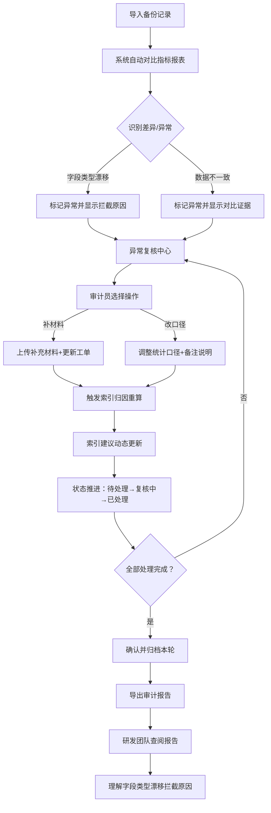

## 1. 产品概述

数据库容量趋势预警系统，面向安全审计员和研发团队，解决审计前备份记录与指标报表数据不一致、异常归因不清晰、处理痕迹丢失等问题。通过全流程化管理（导入→复核→状态推进→报告导出），确保数据一致性和可追溯性。

## 2. 核心功能

### 2.1 用户角色

| 角色 | 登录方式 | 核心权限 |
|------|---------|---------|
| 安全审计员 | 系统登录 | 导入数据、复核异常、推进状态、导出报告、查看历史 |
| 研发团队 | 系统登录 | 查看报告、理解异常归因、查看字段类型漂移拦截详情 |

### 2.2 功能模块

1. **仪表盘总览页**：容量趋势图、异常概览卡、状态统计、最近处理记录
2. **备份记录管理**：数据导入、记录列表、差异高亮、字段类型漂移详情
3. **异常复核中心**：异常明细、下一步操作指引（补材料/改口径）、慢查询归因更新
4. **索引建议引擎**：持续性索引建议、工单补录后归因更新、索引效果追踪
5. **历史记录追溯**：按轮次查询、处理痕迹回放、状态流转日志
6. **审计报告导出**：结构化报告生成、研发视角字段说明、PDF/Excel 导出

### 2.3 页面详情

| 页面名称 | 模块名称 | 功能描述 |
|---------|---------|---------|
| 仪表盘总览 | 容量趋势三维视图 | 多层级容量趋势展示 + 旁边明细解释面板 |
| 仪表盘总览 | 异常分类卡片 | 异常不只是红色数字，显示类别、数量、下一步动作 |
| 仪表盘总览 | 状态流转进度条 | 显示当前审计轮次各状态节点数量和推进进度 |
| 备份记录管理 | 数据导入区 | 支持 CSV/Excel 导入，校验模板，导入预览 |
| 备份记录管理 | 记录对比列表 | 备份记录 vs 指标报表逐行对比，差异高亮 |
| 备份记录管理 | 字段类型漂移面板 | 展示字段类型变更历史、被拦截原因、影响范围 |
| 异常复核中心 | 异常明细列表 | 每条异常展示：问题描述、证据、建议操作（补材料/改口径） |
| 异常复核中心 | 状态推进按钮 | 支持批量推进状态：待处理→复核中→已处理→已确认 |
| 异常复核中心 | 慢查询归因面板 | 关联工单，工单补录后自动更新归因，展示索引建议 |
| 索引建议引擎 | 索引推荐列表 | 持续性建议，非一次性判断，显示建议级别和预期收益 |
| 索引建议引擎 | 归因联动更新 | 工单补录触发归因重算，显示归因前后对比 |
| 历史记录追溯 | 轮次选择器 | 按审计轮次筛选，显示每轮的完整处理痕迹 |
| 历史记录追溯 | 操作日志时间线 | 谁在什么时候做了什么操作，状态如何变更 |
| 审计报告导出 | 报告预览 | 结构化报告预览，含研发视角字段说明 |
| 审计报告导出 | 导出版本选择 | 支持导出给审计员版 / 研发团队版 |

## 3. 核心流程

安全审计员日常工作流：导入备份记录 → 系统自动对比指标报表识别差异 → 复核每条异常并按指引操作（补材料或改口径）→ 索引建议随工单补录动态更新 → 状态逐步推进 → 导出审计报告。研发团队通过导出报告即可理解字段类型漂移被拦截的原因。

## 4. 用户界面设计

### 4.1 设计风格

- **主色调**：深邃蓝 `#1e3a5f`（专业可信），强调色：琥珀橙 `#f59e0b`（预警提醒）、翠绿 `#10b981`（正常状态）
- **辅助色**：石板灰系列作为中性色，确保信息层次清晰
- **按钮风格**：微圆角（6px），弱阴影，悬停时轻微上浮+色阶加深
- **字体**：标题用 Noto Serif SC（衬线，审计专业感），正文用 JetBrains Mono（等宽，数据对齐友好）
- **布局风格**：左右分栏主布局，左侧导航 + 右侧内容区，卡片式信息承载
- **图标**：Lucide 线性图标，异常状态搭配微型 badge 指示

### 4.2 页面设计概览

| 页面名称 | 模块名称 | UI 元素 |
|---------|---------|--------|
| 仪表盘总览 | 容量趋势三维视图 | 深色背景画布，多层面积图叠加，右侧固定明细面板实时显示 hover 数据点解释 |
| 仪表盘总览 | 异常分类卡片 | 四色卡片网格，每张卡片下方显示"下一步"建议标签 |
| 备份记录管理 | 记录对比列表 | 斑马纹表格，差异单元格琥珀色背景闪烁动画，旁边展开箭头显示详情 |
| 备份记录管理 | 字段类型漂移面板 | 时间线布局，每节点显示类型变更前后对比 + 拦截规则引用 |
| 异常复核中心 | 异常明细卡片 | 左侧异常描述，中间证据区，右侧操作按钮组（补材料/改口径/跳过） |
| 历史记录追溯 | 操作日志时间线 | 垂直时间线，节点可展开显示操作快照 |

### 4.3 响应式

- 桌面端优先（安全审计工作主要在桌面端完成）
- 平板端适配：卡片自适应换行，导航折叠为汉堡菜单
- 所有数据表格支持横向滚动，保证最小可读列宽

### 4.4 可视化视图规范

- 任何图表/画布/三维视图右侧必须配套"明细解释面板"
- 颜色编码必须同时配文字标签，不可仅依赖颜色传递信息
- 异常状态除红色外，必须显示具体异常类型代码和文字描述
- Hover 数据点时显示完整上下文，而不仅是数值
