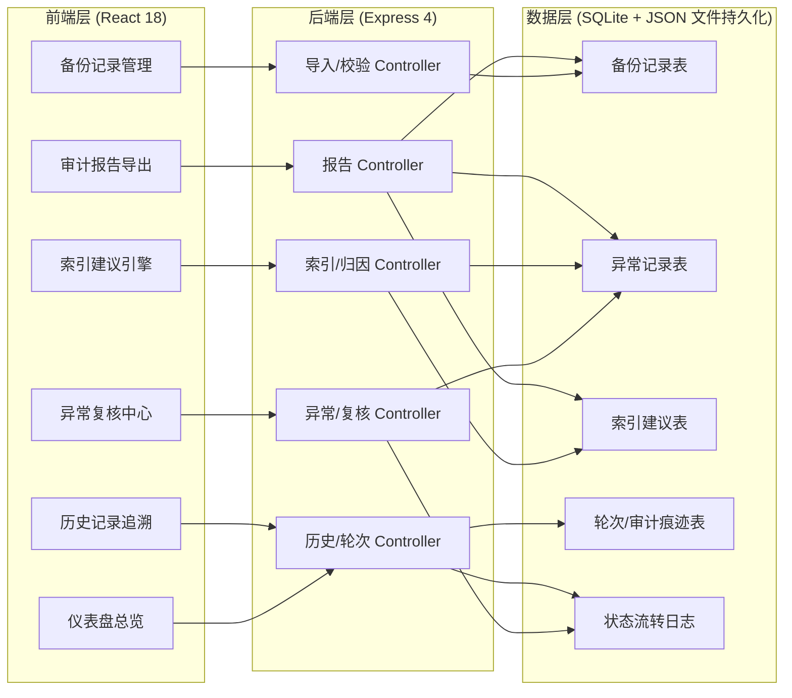
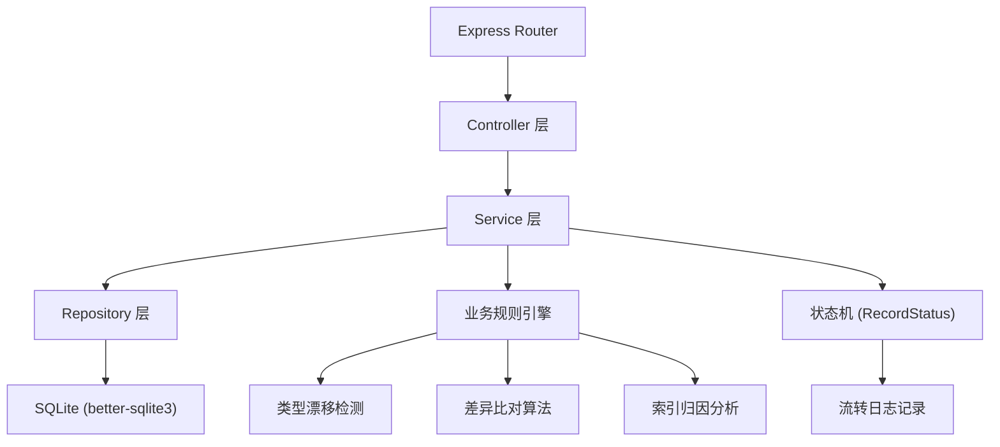
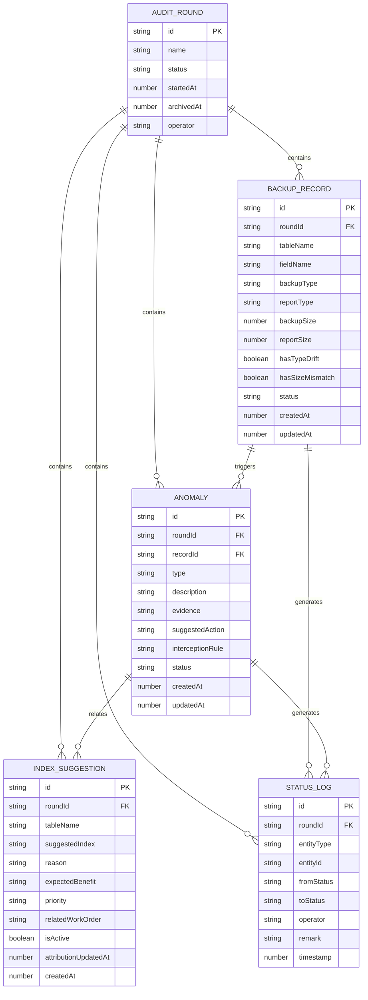

## 1. 架构设计



## 2. 技术描述

- **前端**：React@18 + TypeScript + Vite + tailwindcss@3 + zustand + lucide-react + recharts
- **初始化工具**：vite-init
- **后端**：Express@4 + TypeScript（ESM 格式）
- **数据库**：SQLite（通过 better-sqlite3），服务重启后保留完整处理痕迹
- **图表库**：recharts（2D 图表），自实现 SVG 多层视图模拟三维效果
- **报告导出**：SheetJS (xlsx) 导出 Excel，前端生成结构化 JSON 报告

## 3. 路由定义

| 路由 | 用途 |
|------|------|
| / | 仪表盘总览页 |
| /backup | 备份记录管理页 |
| /review | 异常复核中心 |
| /index | 索引建议引擎 |
| /history | 历史记录追溯 |
| /report | 审计报告导出 |

## 4. API 定义

### 4.1 类型定义

```typescript
export type AuditRoundStatus = 'active' | 'archived';

export type RecordStatus = 'pending' | 'reviewing' | 'resolved' | 'confirmed';

export type AnomalyType = 'type_drift' | 'data_mismatch' | 'missing_record' | 'slow_query';

export type NextAction = 'supply_material' | 'adjust_caliber' | 'skip';

export interface BackupRecord {
  id: string;
  roundId: string;
  tableName: string;
  fieldName: string;
  backupType: string;
  reportType: string;
  backupSize: number;
  reportSize: number;
  hasTypeDrift: boolean;
  hasSizeMismatch: boolean;
  status: RecordStatus;
  createdAt: number;
  updatedAt: number;
}

export interface Anomaly {
  id: string;
  roundId: string;
  recordId: string;
  type: AnomalyType;
  description: string;
  evidence: string;
  suggestedAction: NextAction;
  interceptionRule?: string;
  status: RecordStatus;
  createdAt: number;
  updatedAt: number;
}

export interface IndexSuggestion {
  id: string;
  roundId: string;
  tableName: string;
  suggestedIndex: string;
  reason: string;
  expectedBenefit: string;
  priority: 'high' | 'medium' | 'low';
  relatedWorkOrder?: string;
  isActive: boolean;
  attributionUpdatedAt: number;
  createdAt: number;
}

export interface AuditRound {
  id: string;
  name: string;
  status: AuditRoundStatus;
  startedAt: number;
  archivedAt?: number;
  operator: string;
}

export interface StatusLog {
  id: string;
  roundId: string;
  entityType: 'record' | 'anomaly';
  entityId: string;
  fromStatus: RecordStatus;
  toStatus: RecordStatus;
  operator: string;
  remark: string;
  timestamp: number;
}

export interface CapacityTrendPoint {
  date: string;
  totalSize: number;
  backupSize: number;
  indexSize: number;
  explanation: string;
}
```

### 4.2 接口列表

| Method | Path | 说明 |
|--------|------|------|
| GET | /api/rounds | 获取审计轮次列表 |
| POST | /api/rounds | 创建新一轮审计 |
| POST | /api/rounds/:id/archive | 归档当前轮次 |
| GET | /api/rounds/:id/trend | 获取容量趋势数据 |
| POST | /api/backup/import | 导入备份记录（CSV/JSON） |
| GET | /api/backup/records?roundId= | 获取备份记录列表（含差异对比） |
| GET | /api/backup/records/:id/type-drift | 获取字段类型漂移详情 |
| GET | /api/anomalies?roundId= | 获取异常列表 |
| PUT | /api/anomalies/:id/status | 推进异常状态 |
| POST | /api/anomalies/:id/supply-material | 补充材料并触发归因重算 |
| POST | /api/anomalies/:id/adjust-caliber | 调整统计口径 |
| GET | /api/index-suggestions?roundId= | 获取索引建议列表 |
| POST | /api/index-suggestions/:id/reattribute | 触发索引归因重算 |
| GET | /api/logs?roundId= | 获取状态流转日志 |
| GET | /api/report/:roundId/preview | 预览审计报告 |
| GET | /api/report/:roundId/export.xlsx | 导出 Excel 审计报告 |

## 5. 服务端架构图



## 6. 数据模型

### 6.1 ER 图



### 6.2 DDL 语句

```sql
CREATE TABLE IF NOT EXISTS audit_round (
  id TEXT PRIMARY KEY,
  name TEXT NOT NULL,
  status TEXT NOT NULL DEFAULT 'active',
  started_at INTEGER NOT NULL,
  archived_at INTEGER,
  operator TEXT NOT NULL
);

CREATE TABLE IF NOT EXISTS backup_record (
  id TEXT PRIMARY KEY,
  round_id TEXT NOT NULL,
  table_name TEXT NOT NULL,
  field_name TEXT NOT NULL,
  backup_type TEXT NOT NULL,
  report_type TEXT NOT NULL,
  backup_size INTEGER NOT NULL,
  report_size INTEGER NOT NULL,
  has_type_drift INTEGER NOT NULL DEFAULT 0,
  has_size_mismatch INTEGER NOT NULL DEFAULT 0,
  status TEXT NOT NULL DEFAULT 'pending',
  created_at INTEGER NOT NULL,
  updated_at INTEGER NOT NULL,
  FOREIGN KEY (round_id) REFERENCES audit_round(id)
);

CREATE TABLE IF NOT EXISTS anomaly (
  id TEXT PRIMARY KEY,
  round_id TEXT NOT NULL,
  record_id TEXT NOT NULL,
  type TEXT NOT NULL,
  description TEXT NOT NULL,
  evidence TEXT NOT NULL,
  suggested_action TEXT NOT NULL,
  interception_rule TEXT,
  status TEXT NOT NULL DEFAULT 'pending',
  created_at INTEGER NOT NULL,
  updated_at INTEGER NOT NULL,
  FOREIGN KEY (round_id) REFERENCES audit_round(id),
  FOREIGN KEY (record_id) REFERENCES backup_record(id)
);

CREATE TABLE IF NOT EXISTS index_suggestion (
  id TEXT PRIMARY KEY,
  round_id TEXT NOT NULL,
  table_name TEXT NOT NULL,
  suggested_index TEXT NOT NULL,
  reason TEXT NOT NULL,
  expected_benefit TEXT NOT NULL,
  priority TEXT NOT NULL,
  related_work_order TEXT,
  is_active INTEGER NOT NULL DEFAULT 1,
  attribution_updated_at INTEGER NOT NULL,
  created_at INTEGER NOT NULL,
  FOREIGN KEY (round_id) REFERENCES audit_round(id)
);

CREATE TABLE IF NOT EXISTS status_log (
  id TEXT PRIMARY KEY,
  round_id TEXT NOT NULL,
  entity_type TEXT NOT NULL,
  entity_id TEXT NOT NULL,
  from_status TEXT NOT NULL,
  to_status TEXT NOT NULL,
  operator TEXT NOT NULL,
  remark TEXT,
  timestamp INTEGER NOT NULL,
  FOREIGN KEY (round_id) REFERENCES audit_round(id)
);

CREATE INDEX IF NOT EXISTS idx_backup_record_round ON backup_record(round_id);
CREATE INDEX IF NOT EXISTS idx_anomaly_round ON anomaly(round_id);
CREATE INDEX IF NOT EXISTS idx_anomaly_record ON anomaly(record_id);
CREATE INDEX IF NOT EXISTS idx_index_suggestion_round ON index_suggestion(round_id);
CREATE INDEX IF NOT EXISTS idx_status_log_round ON status_log(round_id);
CREATE INDEX IF NOT EXISTS idx_status_log_entity ON status_log(entity_type, entity_id);
```
