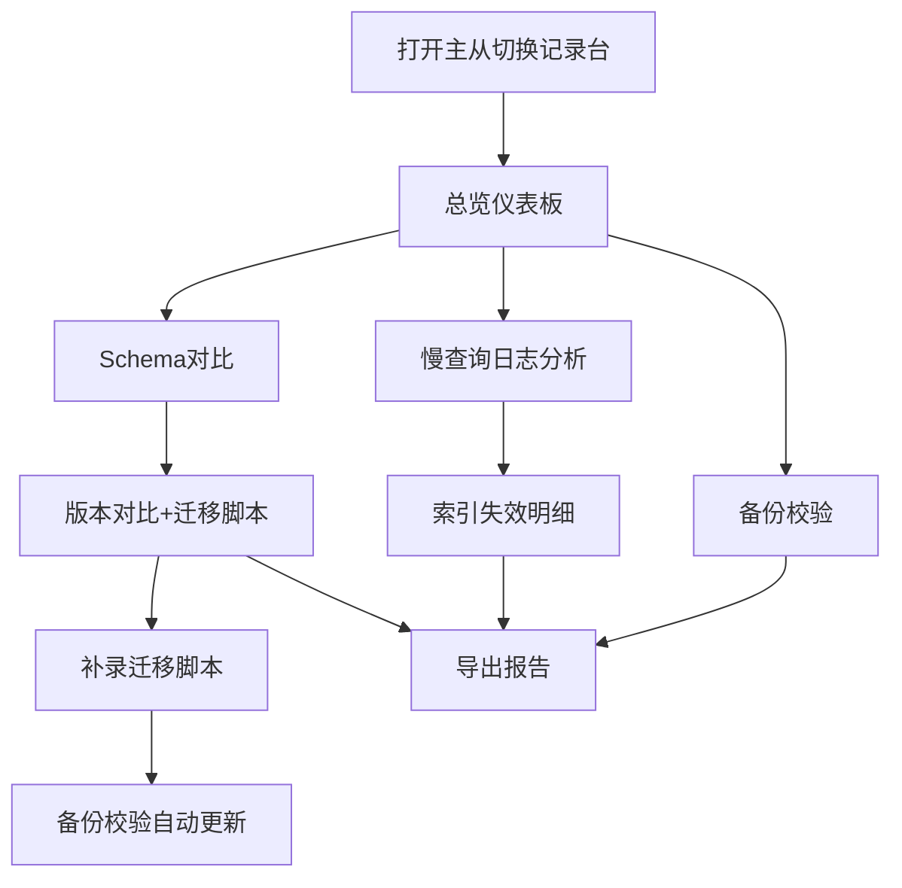

## 1. 产品概述

主从切换记录台是仓储系统工程师用于监控和分析数据库主从切换过程的工具台。第一版聚焦慢查询日志分析，让索引失效问题不再隐藏在汇总数据中，同时提供Schema对比和备份校验联动功能。

- **目标用户**：仓储系统工程师、业务同事（月底转交时）
- **核心价值**：将隐藏在汇总中的索引失效问题可视化，让业务同事也能看懂哪些记录不能用
- **第一版定位**：可复现样例、图表明细解释、导出报告、三者对得上

## 2. 核心功能

### 2.1 用户角色

| 角色 | 使用场景 | 核心关注点 |
|------|----------|------------|
| 仓储系统工程师 | 日常排查主从切换问题 | 慢查询详情、索引失效原因、Schema差异、备份校验状态 |
| 业务同事 | 月底接收转交报告 | 哪些记录不能用、为什么不能用、影响范围 |

### 2.2 功能模块

1. **慢查询日志分析**：索引失效检测、执行时间分布、查询类型统计
2. **Schema对比**：多版本历史对比、非一次性判断、迁移脚本补录
3. **备份校验**：迁移脚本补录后自动更新校验结果
4. **导出报告**：带时间戳文件名、业务友好说明、三者一致

### 2.3 页面详情

| 页面名称 | 模块名称 | 功能描述 |
|----------|----------|----------|
| 总览仪表板 | 概览卡片 | 慢查询总数、索引失效数、Schema版本、备份校验状态 |
| 总览仪表板 | 执行时间分布图 | 柱状图+明细解释，不靠颜色猜 |
| 慢查询详情 | 索引失效列表 | 单独列出，不藏在汇总里，每条有原因说明 |
| 慢查询详情 | 慢查询明细表 | 完整SQL、执行时间、扫描行数、索引使用情况 |
| Schema对比 | 版本选择器 | 支持选择任意两个版本对比 |
| Schema对比 | 差异列表 | 表结构、索引、字段差异，带迁移脚本关联 |
| 备份校验 | 校验结果 | 迁移脚本补录后自动更新校验状态 |
| 导出报告 | 报告预览 | 图、表、文字说明三者一致的HTML报告 |

## 3. 核心流程

用户打开主从切换记录台 → 查看总览仪表板（图+表+文字） → 点击索引失效查看详情 → 切换Schema版本对比 → 补录迁移脚本 → 备份校验自动更新 → 导出带时间戳的报告

## 4. 用户界面设计

### 4.1 设计风格

- **主色调**：深蓝（#1e3a5f）+ 琥珀橙（#f59e0b），专业工具感
- **辅助色**：红色（#ef4444）标记索引失效、绿色（#10b981）标记正常、黄色（#f59e0b）标记警告
- **字体**：系统等宽字体用于代码/SQL，无衬线字体用于正文
- **布局**：左侧导航 + 右侧内容区，卡片式布局
- **图标风格**：线性图标，简洁专业

### 4.2 页面设计概览

| 页面名称 | 模块名称 | UI元素 |
|----------|----------|--------|
| 总览仪表板 | 概览卡片 | 4张卡片，带数字+趋势+文字说明 |
| 总览仪表板 | 执行时间分布 | 柱状图，柱子旁有数字标注，下方有文字解释 |
| 慢查询详情 | 索引失效面板 | 红色边框，列表项带原因标签和解释文字 |
| Schema对比 | 版本对比 | 左右两列对比，差异行高亮，旁注说明 |
| 备份校验 | 状态面板 | 时间线布局，每项有状态标签和校验说明 |

### 4.3 响应式

桌面端优先，最小支持1280px宽度，表格区域支持横向滚动。

### 4.4 设计原则

1. **不靠颜色猜**：所有状态除颜色外，必须有文字标签或图标说明
2. **三者对得上**：图表数字、表格数据、文字说明必须一致
3. **业务友好**：导出报告用业务语言解释技术问题
4. **可区分**：下载文件名带时间戳，能区分本次和上次运行
