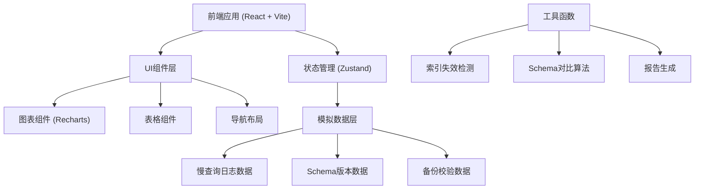
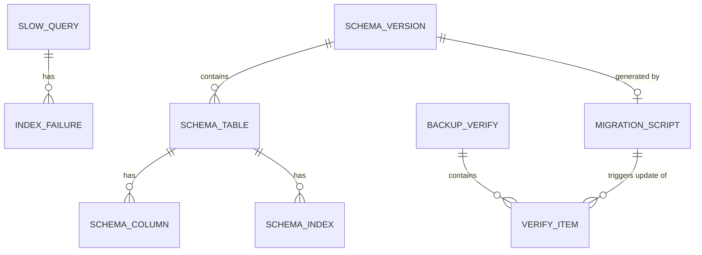

## 1. 架构设计



## 2. 技术描述

- **前端**：React 18 + TypeScript + Vite + TailwindCSS 3
- **状态管理**：Zustand
- **图表库**：Recharts
- **图标**：Lucide React
- **后端**：无（第一版纯前端，使用模拟数据）
- **数据**：Mock数据，包含可复现的慢查询样例

## 3. 路由定义

| 路由 | 页面 | 功能 |
|------|------|------|
| /dashboard | 总览仪表板 | 概览卡片、执行时间分布、索引失效摘要 |
| /slow-queries | 慢查询详情 | 索引失效列表、慢查询明细表 |
| /schema-compare | Schema对比 | 版本选择、差异对比、迁移脚本 |
| /backup-verify | 备份校验 | 校验结果、迁移脚本联动 |
| /export | 导出报告 | 报告预览、下载功能 |

## 4. 数据模型

### 4.1 慢查询日志

```typescript
interface SlowQuery {
  id: string;
  timestamp: string;
  sql: string;
  queryTime: number; // 秒
  rowsExamined: number;
  rowsSent: number;
  indexUsed: string | null;
  indexFailure: {
    detected: boolean;
    reason: string;
    type: 'full_table_scan' | 'index_ignored' | 'filesort' | 'temporary_table';
    explanation: string;
  };
  queryType: 'SELECT' | 'UPDATE' | 'DELETE' | 'INSERT';
  tableName: string;
}
```

### 4.2 Schema版本

```typescript
interface SchemaVersion {
  version: string;
  timestamp: string;
  description: string;
  migrationScript?: string;
  tables: SchemaTable[];
}

interface SchemaTable {
  name: string;
  columns: SchemaColumn[];
  indexes: SchemaIndex[];
}

interface SchemaColumn {
  name: string;
  type: string;
  nullable: boolean;
  default?: string;
}

interface SchemaIndex {
  name: string;
  columns: string[];
  type: 'PRIMARY' | 'UNIQUE' | 'NORMAL' | 'FULLTEXT';
}
```

### 4.3 备份校验

```typescript
interface BackupVerifyResult {
  id: string;
  timestamp: string;
  schemaVersion: string;
  status: 'passed' | 'failed' | 'warning';
  items: VerifyItem[];
}

interface VerifyItem {
  name: string;
  category: 'table_structure' | 'index' | 'data_integrity' | 'constraint';
  status: 'passed' | 'failed' | 'warning';
  description: string;
  detail?: string;
  relatedMigration?: string;
}
```

### 4.4 数据模型关系图



## 5. 核心算法

### 5.1 索引失效检测

检测规则：
1. **全表扫描**：indexUsed 为空且 rowsExamined > 1000
2. **索引被忽略**：indexUsed 存在但 rowsExamined / rowsSent > 10
3. **文件排序**：EXPLAIN 中出现 Using filesort
4. **临时表**：EXPLAIN 中出现 Using temporary

### 5.2 Schema对比算法

- 按表名分组对比
- 检测新增/删除/修改的列
- 检测新增/删除的索引
- 检测索引列顺序变化

### 5.3 备份校验联动

- 迁移脚本补录后，自动触发关联校验项重新计算
- 校验项状态根据最新Schema版本更新

## 6. 目录结构

```
src/
  components/       # 通用组件
    ChartWithLegend/    # 带文字说明的图表
    DataTable/          # 数据表格
    StatusBadge/        # 状态标签
  pages/            # 页面组件
    Dashboard/         # 总览仪表板
    SlowQueries/       # 慢查询详情
    SchemaCompare/     # Schema对比
    BackupVerify/      # 备份校验
    ExportReport/      # 导出报告
  store/            # 状态管理
    useAppStore.ts
  data/             # 模拟数据
    slowQueries.ts
    schemaVersions.ts
    backupVerify.ts
  utils/            # 工具函数
    indexDetection.ts
    schemaCompare.ts
    reportGenerator.ts
    formatters.ts
  types/            # 类型定义
    index.ts
  App.tsx
  main.tsx
```
