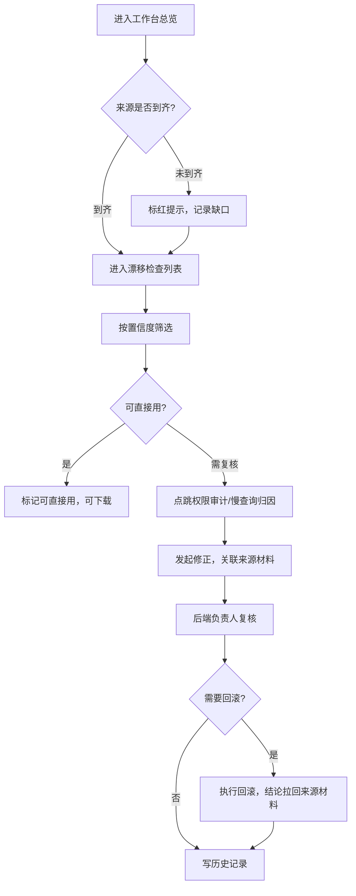

# 字段枚举值漂移检查 · 本地 Web 工作台 PRD

## 1. 产品概述

面向研发与后端负责人小组的本地化数据库字段枚举值漂移检查工作台，把业务工单、慢查询日志、迁移执行记录、表结构快照等多源材料统一收纳为可追溯的漂移检查记录，解决"工单和慢查询到不齐、负责人反复口头解释、复盘时回退人工查表"的痛点。目标是让研发拿到结果一眼分清"可直接用 / 需后端负责人复核"，并把权限审计与慢查询归因跑稳，回滚记录能把结论拉回来源材料。

- 目标用户：研发工程师（日常跑检查、看结论）、后端负责人（复核、回滚、解释来源）
- 核心问题：材料不齐、来源不可点、迁移重复执行难定位、快照脏数据（空值/重复/备注混写）干扰结论、工具"能跑但越跑越乱"
- 价值：把口头解释沉淀为可点击的记录链，降低复盘成本，提高可直接用结论的占比

## 2. 核心功能

### 2.1 用户角色

| 角色 | 进入方式 | 核心权限 |
|------|----------|----------|
| 研发工程师 | 本地启动后直接访问 | 浏览列表/详情、发起修正、下载、跑测试场景、标记"可直接用" |
| 后端负责人 | 同上（本地多用户区分通过 operator 标识） | 全部研发权限 + 复核确认、执行回滚、冻结/解冻记录 |

### 2.2 功能模块

1. **工作台总览（Dashboard）**：漂移概览、来源到齐率、可直接用占比、迁移重复执行告警、快照脏数据计数、最近回滚
2. **漂移检查列表**：多源漂移记录，按来源类型/状态/置信度筛选，一键区分可直接用 vs 需复核
3. **漂移详情**：当前枚举值 vs 期望值、来源材料卡（可点跳）、表结构快照、权限审计、慢查询归因、最终结论与结论引用链
4. **修正工作台**：对漂移记录发起修正，记录前后状态，关联来源材料
5. **历史记录**：修正/复核/回滚全量操作流水，支持回溯
6. **下载中心**：按筛选条件导出 CSV/JSON，含结论与来源引用
7. **权限审计**：权限清单与漂移结论互点追溯
8. **慢查询归因**：慢查询日志归因到表/字段，链接漂移记录
9. **回滚记录**：结论拉回来源材料，支持逐条回溯
10. **表结构快照**：脏数据（空值/重复/备注混写）识别与解析
11. **测试场景**：含重复导入场景，验证去重与幂等

### 2.3 页面详情

| 页面 | 模块 | 功能描述 |
|------|------|----------|
| 工作台总览 | 概览卡片 | 待处理数、可直接用占比、需复核数、来源到齐率、迁移重复执行告警 |
| 工作台总览 | 来源到齐率 | 业务工单/慢查询日志到齐情况可视化，未到齐标红 |
| 漂移检查列表 | 筛选与表格 | 来源类型、状态、置信度、严重程度筛选；行内可直接用/需复核色标 |
| 漂移详情 | 枚举对比 | 当前枚举值 vs 期望值 diff，新增/缺失高亮 |
| 漂移详情 | 来源材料卡 | 工单/慢查询/迁移/快照来源，点击跳转对应记录 |
| 漂移详情 | 权限审计块 | 涉及权限清单，可点回跳权限审计页 |
| 漂移详情 | 慢查询归因块 | 归因慢查询列表，可点回跳慢查询归因页 |
| 漂移详情 | 最终结论 | 结论文本 + 结论引用的来源材料（可点互跳） |
| 修正工作台 | 修正表单 | 修正期望值/备注，选择关联来源材料，提交后写历史 |
| 历史记录 | 操作流水 | 时间线展示修正/复核/回滚，前后状态对比 |
| 下载中心 | 导出面板 | 按筛选导出 CSV/JSON，含结论与来源引用字段 |
| 权限审计 | 权限清单 | 权限项、持有者、来源材料、关联漂移记录（可点互跳） |
| 慢查询归因 | 归因列表 | 慢查询、归因表/字段、关联漂移记录（可点互跳） |
| 回滚记录 | 回滚流水 | 回滚时间、结论、来源材料清单（可点互跳） |
| 表结构快照 | 快照表 | 原始值、空值/重复/备注混写标记、解析后枚举值 |
| 测试场景 | 场景列表 | 重复导入场景等，展示运行结果与去重统计 |

## 3. 核心流程

### 3.1 漂移检查主流程

研发进入总览 → 查看来源到齐率与告警 → 进入漂移列表按置信度筛选 → 打开详情查看枚举对比与来源材料 → 一眼判断可直接用 / 需复核 → 需复核时点跳权限审计或慢查询归因回溯 → 发起修正（关联来源）→ 后端负责人复核 → 必要时回滚（结论拉回来源材料）。复盘时通过结论引用链互跳，无需人工查表。

### 3.2 流程图

### 3.3 重复导入测试流程

进入测试场景 → 选择"重复导入"场景 → 工作台模拟同一来源材料重复导入两次 → 校验去重与幂等 → 展示去重前/后条数、被合并记录 → 通过则标记场景稳定，失败则提示"工具看上去能跑、实际越跑越乱"风险。

## 4. 用户界面设计

### 4.1 设计风格

- 定位：工程化的"信号监测台 / 审计账本"风格，深色为主，强调数据密度与可追溯
- 主色：近黑底 `#0c0d0f`，面层 `#16181c`，边框 `#26282e`
- 强调色（信号色）：锋利青柠 `#d4ff4d` 作为可直接用 / 信号强调；琥珀 `#ffb86b` 表示需复核；珊瑚 `#ff6b6b` 表示回滚/严重；天蓝 `#7dd3fc` 表示信息链接
- 字体：标题用 Instrument Serif（账本/审计气质），UI 用 Hanken Grotesk，数据/代码用 JetBrains Mono
- 布局：左侧主导航 + 顶部状态条，内容区数据密度高、留白克制；来源材料卡用描边卡片；可点追溯链接统一用天蓝下划线
- 状态标识：可直接用 = 青柠圆点；需复核 = 琥珀圆点；已回滚 = 珊瑚圆点；待处理 = 灰圆点

### 4.2 页面设计概览

| 页面 | 模块 | UI 元素 |
|------|------|----------|
| 工作台总览 | 概览卡片 | 大号 Instrument Serif 数字、青柠/琥珀/珊瑚色标、来源到齐率进度条 |
| 漂移检查列表 | 表格 | 等宽枚举值列、行内置信度色标、来源类型徽章 |
| 漂移详情 | 对比与来源卡 | diff 高亮、来源卡描边、结论引用链用天蓝下划线链接 |
| 表结构快照 | 快照表 | 空值/重复/备注混写用图标角标，解析后枚举值单独列 |
| 测试场景 | 场景卡 | 运行按钮、去重前后条数对比、稳定/不稳定标记 |

### 4.3 响应式

桌面优先（研发本地大屏使用为主），窄屏降级为单列堆叠，表格横向滚动，关键色标与可点链接在所有尺寸保留。

### 4.4 3D 场景

不适用（数据工作台无 3D 需求）。
