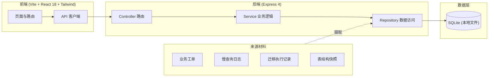
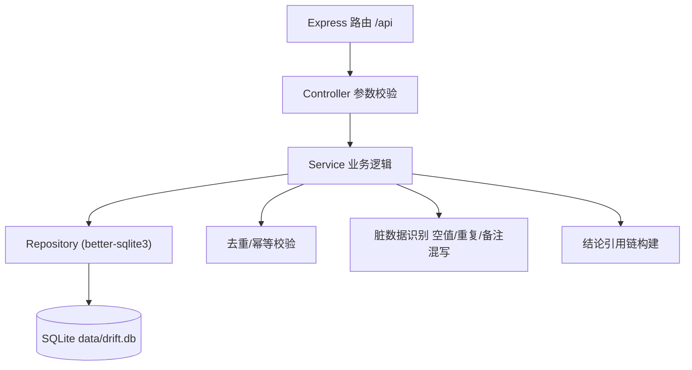
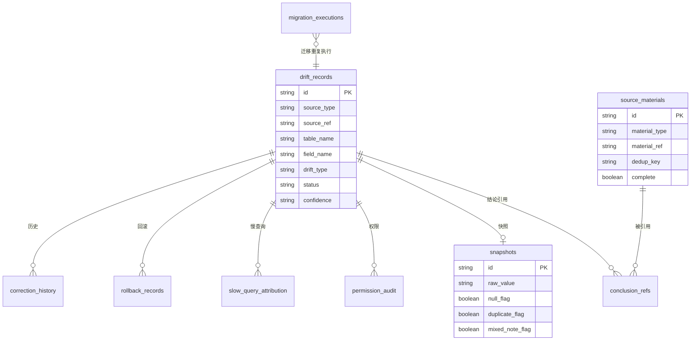

# 字段枚举值漂移检查 · 技术架构文档

## 1. 架构设计



前端为本地 Web 工作台，后端用 Express 提供 REST API 并以 SQLite 持久化记录；来源材料（工单/慢查询/迁移/快照）通过后端摄取接口写入，保证"列表、详情、修正、历史、下载连着后端记录"。

## 2. 技术说明

- 前端：React@18 + tailwindcss@3 + vite + react-router-dom@6
- 初始化工具：vite（react-ts 模板）
- 后端：Express@4 + better-sqlite3（同步、本地零配置）
- 数据库：SQLite（本地文件 `data/drift.db`），首启自动建表与种子数据
- 脚本：dev 同时起前端(5173)与后端(4173)，prod 构建后由 Express 托管静态资源
- 语言：TypeScript 全栈

## 3. 路由定义

| 路由 | 用途 |
|------|------|
| `/` | 工作台总览（概览卡片、来源到齐率、告警） |
| `/drift` | 漂移检查列表 |
| `/drift/:id` | 漂移详情（枚举对比、来源卡、权限/慢查询块、结论引用链） |
| `/drift/:id/correct` | 修正工作台 |
| `/audit` | 权限审计 |
| `/slow-query` | 慢查询归因 |
| `/rollback` | 回滚记录 |
| `/snapshot` | 表结构快照 |
| `/history` | 历史记录 |
| `/tests` | 测试场景（含重复导入） |
| `/download` | 下载中心 |

## 4. API 定义

后端所有接口前缀 `/api`，返回 `{ ok: boolean, data?: T, error?: string }`。

### 4.1 漂移记录

```ts
GET    /api/drift?status=&confidence=&sourceType=&q=
GET    /api/drift/:id
POST   /api/drift/:id/correct      // body: { expectedEnum, note, materialIds, operator }
POST   /api/drift/:id/review       // body: { reviewed, operator }
POST   /api/drift/:id/rollback     // body: { operator, note }
GET    /api/drift/:id/conclusion   // 返回结论 + 结论引用的来源材料
```

### 4.2 来源材料

```ts
GET    /api/materials?type=&complete=
POST   /api/materials/ingest       // 摄取来源材料（含去重键）
POST   /api/materials/ingest-batch // 批量导入（重复导入测试用）
```

### 4.3 权限审计 / 慢查询归因 / 回滚 / 快照

```ts
GET    /api/audit?driftId=
GET    /api/slow-query?driftId=
GET    /api/rollback?driftId=
GET    /api/snapshot?dirtyFlag=
POST   /api/snapshot/ingest        // 摄取快照，自动识别空值/重复/备注混写
```

### 4.4 历史 / 下载 / 测试

```ts
GET    /api/history?driftId=&action=
GET    /api/download?format=csv|json&...filters   // 流式导出
GET    /api/tests
POST   /api/tests/:scenario/run   // 运行测试场景，重复导入场景返回去重统计
```

### 4.5 核心响应类型

```ts
type DriftRecord = {
  id: string;
  createdAt: string;
  sourceType: 'ticket' | 'slow_query' | 'migration' | 'snapshot';
  sourceRef: string;
  tableName: string;
  fieldName: string;
  currentEnum: string[];
  expectedEnum: string[];
  driftType: 'added' | 'missing' | 'duplicate_exec' | 'null_value' | 'mixed_note';
  status: 'pending' | 'corrected' | 'reviewed' | 'rolled_back';
  confidence: 'direct_use' | 'needs_review';
  severity: 'low' | 'medium' | 'high' | 'critical';
  snapshotId: string | null;
  conclusion: string | null;
  operator: string | null;
};

type SourceMaterial = {
  id: string;
  materialType: 'ticket' | 'slow_query' | 'migration' | 'snapshot' | 'permission';
  materialRef: string;     // 外部引用/链接
  title: string;
  summary: string;
  rawPayload: unknown;
  fetchedAt: string;
  complete: boolean;       // 是否到齐
  dedupKey: string;         // 去重键，支持重复导入幂等
};

type ConclusionRef = {
  driftId: string;
  materialId: string;
  refRole: 'evidence' | 'permission' | 'slow_query' | 'snapshot';
};

type Snapshot = {
  id: string;
  snapshotAt: string;
  tableName: string;
  fieldName: string;
  rawValue: string;
  nullFlag: boolean;
  duplicateFlag: boolean;
  mixedNoteFlag: boolean;
  parsedEnum: string[];
  notes: string | null;
};
```

## 5. 服务端架构图



## 6. 数据模型

### 6.1 ER 图



### 6.2 数据定义语言

```sql
CREATE TABLE IF NOT EXISTS source_materials (
  id TEXT PRIMARY KEY,
  material_type TEXT NOT NULL,
  material_ref TEXT NOT NULL,
  title TEXT,
  summary TEXT,
  raw_payload TEXT,
  fetched_at TEXT NOT NULL,
  complete INTEGER NOT NULL DEFAULT 1,
  dedup_key TEXT NOT NULL
);
CREATE UNIQUE INDEX IF NOT EXISTS idx_material_dedup ON source_materials(dedup_key);

CREATE TABLE IF NOT EXISTS snapshots (
  id TEXT PRIMARY KEY,
  snapshot_at TEXT NOT NULL,
  table_name TEXT NOT NULL,
  field_name TEXT NOT NULL,
  raw_value TEXT,
  null_flag INTEGER NOT NULL DEFAULT 0,
  duplicate_flag INTEGER NOT NULL DEFAULT 0,
  mixed_note_flag INTEGER NOT NULL DEFAULT 0,
  parsed_enum TEXT,
  notes TEXT
);

CREATE TABLE IF NOT EXISTS drift_records (
  id TEXT PRIMARY KEY,
  created_at TEXT NOT NULL,
  updated_at TEXT NOT NULL,
  source_type TEXT NOT NULL,
  source_ref TEXT NOT NULL,
  table_name TEXT NOT NULL,
  field_name TEXT NOT NULL,
  current_enum TEXT NOT NULL,
  expected_enum TEXT NOT NULL,
  drift_type TEXT NOT NULL,
  status TEXT NOT NULL DEFAULT 'pending',
  confidence TEXT NOT NULL DEFAULT 'needs_review',
  severity TEXT NOT NULL DEFAULT 'medium',
  snapshot_id TEXT,
  conclusion TEXT,
  operator TEXT,
  FOREIGN KEY (snapshot_id) REFERENCES snapshots(id)
);
CREATE INDEX IF NOT EXISTS idx_drift_status ON drift_records(status);
CREATE INDEX IF NOT EXISTS idx_drift_confidence ON drift_records(confidence);

CREATE TABLE IF NOT EXISTS conclusion_refs (
  id TEXT PRIMARY KEY,
  drift_id TEXT NOT NULL,
  material_id TEXT NOT NULL,
  ref_role TEXT NOT NULL,
  FOREIGN KEY (drift_id) REFERENCES drift_records(id) ON DELETE CASCADE,
  FOREIGN KEY (material_id) REFERENCES source_materials(id) ON DELETE CASCADE
);

CREATE TABLE IF NOT EXISTS permission_audit (
  id TEXT PRIMARY KEY,
  audit_at TEXT NOT NULL,
  permission_key TEXT NOT NULL,
  holder TEXT,
  material_id TEXT,
  drift_id TEXT,
  status TEXT NOT NULL DEFAULT 'open',
  FOREIGN KEY (material_id) REFERENCES source_materials(id),
  FOREIGN KEY (drift_id) REFERENCES drift_records(id)
);

CREATE TABLE IF NOT EXISTS slow_query_attribution (
  id TEXT PRIMARY KEY,
  query_id TEXT NOT NULL,
  query_text TEXT,
  query_time_ms INTEGER,
  attributed_table TEXT,
  attributed_field TEXT,
  material_id TEXT,
  drift_id TEXT,
  FOREIGN KEY (material_id) REFERENCES source_materials(id),
  FOREIGN KEY (drift_id) REFERENCES drift_records(id)
);

CREATE TABLE IF NOT EXISTS rollback_records (
  id TEXT PRIMARY KEY,
  rollback_at TEXT NOT NULL,
  drift_id TEXT NOT NULL,
  conclusion TEXT,
  operator TEXT,
  source_material_ids TEXT,
  FOREIGN KEY (drift_id) REFERENCES drift_records(id) ON DELETE CASCADE
);

CREATE TABLE IF NOT EXISTS migration_executions (
  id TEXT PRIMARY KEY,
  migration_id TEXT NOT NULL,
  executed_at TEXT NOT NULL,
  duplicate_flag INTEGER NOT NULL DEFAULT 0,
  affected_table TEXT,
  affected_field TEXT,
  drift_id TEXT,
  FOREIGN KEY (drift_id) REFERENCES drift_records(id)
);

CREATE TABLE IF NOT EXISTS correction_history (
  id TEXT PRIMARY KEY,
  drift_id TEXT NOT NULL,
  action TEXT NOT NULL,
  before_state TEXT,
  after_state TEXT,
  operator TEXT,
  action_at TEXT NOT NULL,
  note TEXT,
  FOREIGN KEY (drift_id) REFERENCES drift_records(id) ON DELETE CASCADE
);

CREATE TABLE IF NOT EXISTS test_runs (
  id TEXT PRIMARY KEY,
  scenario TEXT NOT NULL,
  run_at TEXT NOT NULL,
  passed INTEGER NOT NULL,
  before_count INTEGER,
  after_count INTEGER,
  detail TEXT
);
```
