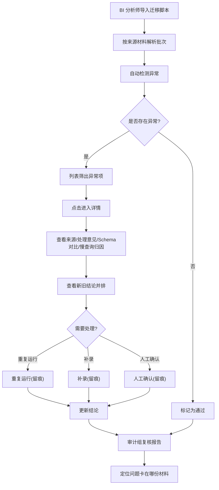

# 数据库变更审批台 PRD

## 1. 产品概述

数据库变更审批台是一个面向 BI 分析师与审计组的内部审批工具，用于导入真实数据库迁移脚本后自动筛出异常，并支持在详情中追溯来源、查看处理意见、对比 Schema 与慢查询前后差异、并排查看新旧结论。

目标用户：BI 分析师（导入与复核）、审计组（只看最终报告也能定位问题卡在哪份材料）。核心价值是把"分页顺序不稳定、备份缺口、Schema 漂移、慢查询归因"这类日常小麻烦在审批前暴露并留痕。

## 2. 核心功能

### 2.1 用户角色

| 角色 | 使用方式 | 核心权限 |
|------|----------|----------|
| BI 分析师 | 导入迁移脚本、复核异常、执行操作 | 导入、筛选、查看详情、重复运行/补录/人工确认 |
| 审计组 | 复核审批台、查看最终报告 | 查看列表与详情、查看操作日志与结论对比 |

### 2.2 功能模块

1. **审批台首页**：导入区、异常统计、筛选条、脚本列表
2. **详情页**：来源脚本、异常清单（含来源材料与处理意见）、Schema 对比、慢查询归因、新旧结论并排、操作面板、操作日志

### 2.3 页面详情

| 页面名称 | 模块名称 | 功能描述 |
|----------|----------|----------|
| 审批台首页 | 导入区 | 粘贴/拖入迁移脚本，按批次解析，标注来源材料 |
| 审批台首页 | 异常统计 | 按严重度汇总（严重/警告/通过）与异常类型计数 |
| 审批台首页 | 筛选条 | 按异常类型、状态、来源材料、严重度筛选异常项 |
| 审批台首页 | 脚本列表 | 卡片/行展示文件名、来源、异常徽标、状态，可点击进详情 |
| 详情页 | 来源脚本查看器 | 带行号的 SQL 展示，高亮异常行，标注来源材料 |
| 详情页 | 异常清单 | 列出每个异常的类型、严重度、来源材料、行范围、处理意见 |
| 详情页 | Schema 对比 | 前后并排对比，标注是否改变判断 |
| 详情页 | 慢查询归因 | 前后耗时对比、根因、前后差别说明 |
| 详情页 | 新旧结论并排 | 迁移脚本改动后旧结论 vs 新结论左右对照 |
| 详情页 | 操作面板 | 重复运行、补录、人工确认三个动作，留痕到操作日志 |
| 详情页 | 操作日志 | 记录所有操作的时间、操作人、动作、备注、结果 |

## 3. 核心流程

BI 分析师导入迁移脚本 → 审批台解析并按来源材料分组 → 自动检测异常（分页不稳、备份缺口、Schema 漂移、慢查询风险等）→ 列表筛出异常项 → 点击进入详情 → 查看来源脚本与处理意见 → 对比 Schema 与慢查询前后差异 → 查看新旧结论并排 → 执行重复运行/补录/人工确认 → 操作留痕 → 审计组复核最终报告，可定位问题卡在哪份材料。

## 4. 用户界面设计

### 4.1 设计风格

- **定位**：审计案卷 / 工程台账风格，重信息密度、轻装饰，页面克制不花哨
- **主色**：暖石色中性底（stone 系），深炭灰文字；强调色为深赭橙（terracotta）用于主操作
- **严重度配色**：红色（严重）、琥珀色（警告）、翠绿色（通过）、天蓝色（信息）
- **字体**：UI 使用 IBM Plex Sans；代码/SQL/标识符使用 JetBrains Mono；数字使用等宽对齐
- **布局**：顶部窄导航条 + 内容区；列表采用紧凑行；详情采用分节卡片
- **图标**：lucide-react 线性图标，与文字等高对齐

### 4.2 页面设计概览

| 页面名称 | 模块名称 | UI 要素 |
|----------|----------|--------|
| 审批台首页 | 导入区 | 虚线拖拽框 + 粘贴区，导入后面包屑显示批次与来源 |
| 审批台首页 | 异常统计 | 三色统计卡 + 异常类型 chip 计数 |
| 审批台首页 | 筛选条 | 下拉/多选筛选，异常类型用色块徽标 |
| 审批台首页 | 脚本列表 | 紧凑行，左严重度色条，右异常徽标与状态标签 |
| 详情页 | 来源脚本查看器 | 等宽字体 + 行号 + 行高亮 + 来源材料角标 |
| 详情页 | 异常清单 | 分组卡片，含来源材料与处理意见引用块 |
| 详情页 | Schema 对比 | 左右双栏 diff，判断改变用高亮提示 |
| 详情页 | 慢查询归因 | 前后耗时数字对比 + 根因条目 |
| 详情页 | 新旧结论并排 | 左右对照，版本号与时间戳 |
| 详情页 | 操作面板 | 三按钮区 + 备注输入 + 确认 |
| 详情页 | 操作日志 | 时间线列表，动作色标 |

### 4.3 响应式

桌面优先（审计与 BI 工作站宽屏），平板可用；移动端仅做基本可读降级。

### 4.4 3D 场景

不适用。
