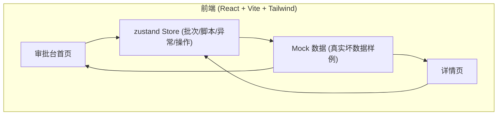
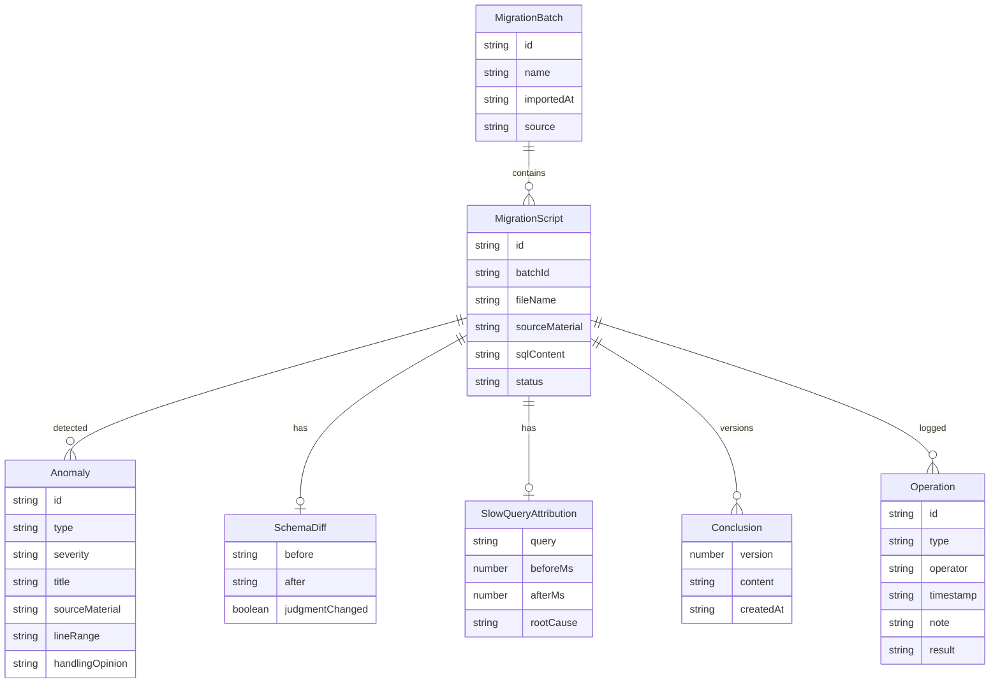

# 数据库变更审批台 技术架构文档

## 1. 架构设计

纯前端单页应用，数据使用内置 mock（真实坏数据样例），状态由 zustand 管理。无后端、无数据库，所有审批数据驻留在内存 store 中，刷新即重置（符合审批台试运行场景）。



## 2. 技术说明

- 前端：React@18 + tailwindcss@3 + vite
- 初始化工具：vite-init（模板 react-ts）
- 状态管理：zustand
- 路由：react-router-dom
- 图标：lucide-react
- 字体：IBM Plex Sans / JetBrains Mono（Google Fonts）
- 后端：无
- 数据库：无（mock 数据驻留内存）

## 3. 路由定义

| 路由 | 用途 |
|------|------|
| `/` | 审批台首页：导入 + 异常筛选 + 脚本列表 |
| `/detail/:id` | 详情页：来源/处理意见/Schema对比/慢查询归因/新旧结论/操作面板/日志 |

## 4. API 定义

无后端 API。所有数据通过 zustand store 提供，store 初始化时载入 mock 数据。

## 5. 服务端架构

不适用（纯前端）。

## 6. 数据模型

### 6.1 数据模型定义



### 6.2 数据定义

核心 TypeScript 类型定义（位于 `src/types`）：

```typescript
type AnomalyType =
  | 'pagination_unstable'   // 分页顺序不稳定
  | 'backup_gap'            // 备份缺口
  | 'schema_drift'          // Schema 漂移
  | 'slow_query_risk'       // 慢查询风险
  | 'breaking_change';      // 破坏性变更

type Severity = 'critical' | 'warning' | 'info';

interface Anomaly {
  id: string;
  type: AnomalyType;
  severity: Severity;
  title: string;
  description: string;
  sourceMaterial: string;   // 卡在哪份材料上
  lineRange?: string;
  handlingOpinion: string;  // 处理意见
}

interface SchemaDiff {
  before: string;
  after: string;
  changes: string[];
  judgmentChanged: boolean; // 是否改变了判断
}

interface SlowQueryAttribution {
  query: string;
  beforeMs: number;
  afterMs: number;
  rootCause: string;
  beforeAfterDiff: string;
}

interface Conclusion {
  version: number;
  content: string;
  createdAt: string;
}

type OperationType = 'rerun' | 'supplement' | 'manual_confirm';

interface Operation {
  id: string;
  type: OperationType;
  label: string;
  operator: string;
  timestamp: string;
  note: string;
  result: string;
}

interface MigrationScript {
  id: string;
  batchId: string;
  fileName: string;
  sourceMaterial: string;
  sqlContent: string;
  anomalies: Anomaly[];
  schemaDiff?: SchemaDiff;
  slowQueryAttribution?: SlowQueryAttribution;
  conclusions: Conclusion[];     // 多版本，用于新旧并排
  operations: Operation[];
  status: 'pending' | 'confirmed' | 'supplemented' | 'rerun' | 'manual_review';
}
```

初始 mock 数据包含 5 份真实坏数据样例：
1. ODS 订单明细加列，分页查询缺 ORDER BY（分页不稳）
2. DWD 用户事件删索引且无 BACKUP（备份缺口）
3. DWS 日报表改索引触发 Schema 漂移，慢查询归因前后对比
4. ADM 用户画像表名拼写错误（adm_user_profie，真实小麻烦）
5. ODS 支付域删仍被视图引用的列（破坏性变更）
