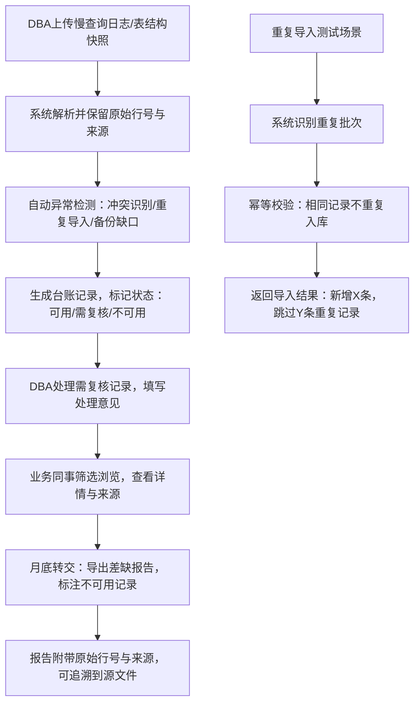

## 1. 产品概述

队列消费幂等台账系统是面向数据库管理员（DBA）和业务同事的数据质量管理平台，解决慢查询日志与表结构快照冲突后的可追溯性问题，确保数据迁移与备份的完整性。

- 核心价值：建立从数据导入到异常检测、从冲突解释到报告导出的完整闭环，让每条记录可追溯、每个异常有解释、每份报告有依据
- 目标用户：数据库管理员（日常运维、冲突处理）、业务同事（数据使用、月底转交）

## 2. 核心特性

### 2.1 用户角色

| 角色 | 登录方式 | 核心权限 |
|------|----------|----------|
| 数据库管理员 | 系统账号 | 数据导入、异常处理、迁移状态管理、备份校验、配置管理 |
| 业务同事 | 系统账号 | 台账浏览、异常筛选、详情查看、报告导出、可用/不可用标识 |

### 2.2 功能模块

1. **数据导入页**：支持慢查询日志、表结构快照两种格式上传，自动解析并保留原始行号与来源
2. **台账列表页**：多维度筛选，状态一目了然（可用/需复核/不可用）
3. **详情查看页**：展示冲突来源、数据对比、处理意见、可追溯信息
4. **迁移与备份页**：迁移状态仪表盘、备份校验结果、缺口告警
5. **报告导出页**：按批次/时间范围导出报告，附带来源材料引用

### 2.3 页面详情

| 页面名称 | 模块名称 | 功能描述 |
|----------|----------|----------|
| 数据导入页 | 上传区域 | 拖拽上传慢查询日志/表结构快照，显示解析进度 |
| 数据导入页 | 导入预览 | 展示即将导入的记录数、检测到的潜在冲突数 |
| 数据导入页 | 重复导入测试 | 专项测试入口，模拟相同文件重复导入场景 |
| 台账列表页 | 筛选区域 | 按状态（可用/需复核/不可用）、异常类型、来源文件、时间范围筛选 |
| 台账列表页 | 数据表格 | 带状态色标的记录列表，核心字段：记录编号、异常类型、来源文件、原始行号、状态标签 |
| 台账列表页 | 批量操作 | 批量标记需复核、批量导出选中记录 |
| 详情查看页 | 基本信息 | 记录编号、导入批次、来源文件、原始行号、创建时间 |
| 详情查看页 | 冲突对比 | 慢查询SQL vs 表结构快照字段差异对比 |
| 详情查看页 | 处理意见 | DBA填写的处理建议、业务备注、时间线 |
| 详情查看页 | 来源追溯 | 原始数据片段、图片名/来源备注链接 |
| 迁移与备份页 | 迁移状态卡 | 各表迁移进度、成功/失败/待处理数量 |
| 迁移与备份页 | 备份校验仪表盘 | 备份完成率、校验通过率、缺口数量告警 |
| 迁移与备份页 | 缺口记录列表 | 备份缺口记录高亮，标注"不可用"供月底转交 |
| 报告导出页 | 导出配置 | 选择导出范围（批次/时间/状态）、导出格式（Excel/PDF） |
| 报告导出页 | 预览下载 | 报告预览、一键下载、来源材料清单 |

## 3. 核心流程

主要流程说明：
1. DBA导入数据 → 系统自动解析检测 → 生成带状态标签的台账
2. DBA处理"需复核"记录，填写处理意见和冲突解释
3. 业务同事通过筛选器快速定位"可用"记录，避开"不可用"
4. 月底转交时导出报告，明确标识哪些记录不可用及原因
5. 所有记录保留原始行号、来源文件名、导入批次号，确保可追溯

## 4. 用户界面设计

### 4.1 设计风格

**设计基调：工业实用主义（Industrial Utility）**
- 面向专业数据运维场景，拒绝花哨装饰，追求信息密度与可读性
- 主色调：深灰蓝（#1e293b）作为背景，营造专业严肃氛围
- 状态色（核心识别元素）：
  - 绿色（#10b981）= 可用 ✅
  - 琥珀黄（#f59e0b）= 需DBA复核 ⚠️
  - 红色（#ef4444）= 不可用 ❌
- 辅助色：靛蓝（#3b82f6）用于链接和操作按钮
- 字体：等宽字体（JetBrains Mono）用于代码和行号显示，无衬线字体（Noto Sans SC）用于正文
- 布局：高密度信息表格，固定表头，可滚动内容区
- 图标风格：Lucide线性图标，简约不花哨

### 4.2 页面设计概要

| 页面名称 | 模块名称 | UI元素 |
|----------|----------|--------|
| 台账列表页 | 状态筛选区 | 三色状态按钮组（绿/黄/红），点击即筛选 |
| 台账列表页 | 数据表格 | 斑马纹行，状态色标左对齐，行号等宽字体 |
| 台账列表页 | 行悬停 | 浅灰背景高亮，操作按钮淡入 |
| 详情查看页 | 冲突对比 | 左右双栏布局，差异行红色背景高亮 |
| 详情查看页 | 来源追溯区 | 卡片式，显示原始行号、文件名，带复制按钮 |
| 迁移与备份页 | 仪表盘 | 大号数字卡片，缺口数字红色脉冲动画 |
| 数据导入页 | 上传区 | 虚线边框，拖入后变色，进度条显示解析进度 |

### 4.3 响应式

- 桌面端优先（1280px+）：高密度表格展示，多列并排
- 平板端（768-1279px）：表格横向滚动，次要列可隐藏
- 移动端（<768px）：卡片式列表，核心信息垂直堆叠
- 所有操作按钮触控目标≥44×44px

### 4.4 动效设计

- 页面加载：内容区从上到下渐入，表格行依次淡入（stagger 50ms）
- 状态变更：状态标签颜色渐变过渡（300ms）
- 缺口告警：红色数字轻微脉冲动画（2s循环）
- 悬停反馈：按钮背景色过渡、表格行背景色过渡（150ms）
- 导入进度：进度条平滑增长，完成时绿色勾选动画
