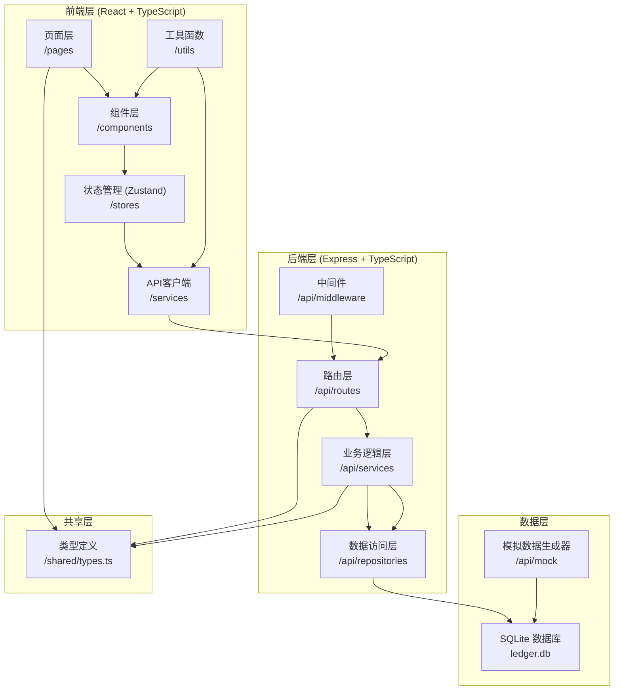
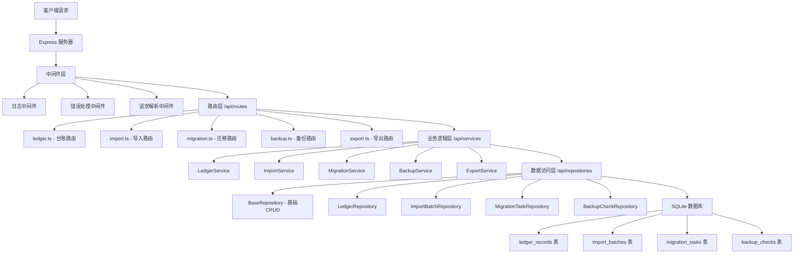
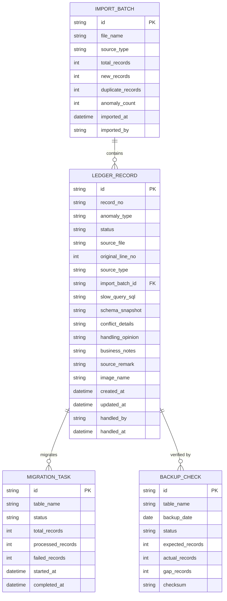

## 1. 架构设计



## 2. 技术描述

- **前端框架**: React 18 + TypeScript
- **构建工具**: Vite 5
- **样式方案**: Tailwind CSS 3
- **状态管理**: Zustand 4
- **路由**: React Router DOM 6
- **图标库**: Lucide React
- **后端框架**: Express 4 + TypeScript
- **数据库**: SQLite 3（文件型，无需额外服务）
- **ORM**: 原生 SQL + 参数化查询
- **包管理器**: npm（优先检测 pnpm，若无则使用 npm）

## 3. 路由定义

| 路由路径 | 页面名称 | 功能说明 |
|----------|----------|----------|
| `/` | 台账列表页 | 主入口，展示台账记录列表与筛选器 |
| `/ledger/:id` | 详情查看页 | 单条记录的完整信息与冲突对比 |
| `/import` | 数据导入页 | 文件上传、解析预览、重复导入测试 |
| `/migration` | 迁移与备份页 | 迁移状态、备份校验仪表盘 |
| `/export` | 报告导出页 | 配置导出范围、预览与下载 |

## 4. API 定义

### 4.1 类型定义

```typescript
// shared/types.ts

export type RecordStatus = 'AVAILABLE' | 'NEEDS_REVIEW' | 'UNAVAILABLE';
export type AnomalyType = 'SLOW_QUERY_CONFLICT' | 'SCHEMA_CONFLICT' | 'BACKUP_GAP' | 'DUPLICATE_IMPORT' | 'NONE';
export type SourceType = 'SLOW_QUERY_LOG' | 'SCHEMA_SNAPSHOT';
export type MigrationStatus = 'PENDING' | 'IN_PROGRESS' | 'COMPLETED' | 'FAILED';
export type BackupStatus = 'VERIFIED' | 'MISSING' | 'CORRUPTED';

export interface LedgerRecord {
  id: string;
  recordNo: string;
  anomalyType: AnomalyType;
  status: RecordStatus;
  sourceFile: string;
  originalLineNo: number;
  sourceType: SourceType;
  importBatchId: string;
  slowQuerySql?: string;
  schemaSnapshot?: string;
  conflictDetails?: string;
  handlingOpinion?: string;
  businessNotes?: string;
  sourceRemark?: string;
  imageName?: string;
  createdAt: string;
  updatedAt: string;
  handledBy?: string;
  handledAt?: string;
}

export interface ImportBatch {
  id: string;
  fileName: string;
  sourceType: SourceType;
  totalRecords: number;
  newRecords: number;
  duplicateRecords: number;
  anomalyCount: number;
  importedAt: string;
  importedBy: string;
}

export interface MigrationTask {
  id: string;
  tableName: string;
  status: MigrationStatus;
  totalRecords: number;
  processedRecords: number;
  failedRecords: number;
  startedAt?: string;
  completedAt?: string;
}

export interface BackupCheck {
  id: string;
  tableName: string;
  backupDate: string;
  status: BackupStatus;
  expectedRecords: number;
  actualRecords: number;
  gapRecords: number;
  checksum?: string;
}
```

### 4.2 API 接口列表

| 方法 | 路径 | 功能描述 |
|------|------|----------|
| GET | `/api/ledger` | 获取台账列表，支持筛选、分页 |
| GET | `/api/ledger/:id` | 获取单条记录详情 |
| PUT | `/api/ledger/:id` | 更新记录状态、处理意见、备注 |
| POST | `/api/import` | 上传并导入数据文件 |
| GET | `/api/import/batches` | 获取导入批次列表 |
| POST | `/api/import/test-duplicate` | 执行重复导入测试 |
| GET | `/api/migration/tasks` | 获取迁移任务列表 |
| GET | `/api/migration/summary` | 获取迁移状态汇总 |
| GET | `/api/backup/checks` | 获取备份校验结果 |
| GET | `/api/backup/summary` | 获取备份校验仪表盘数据 |
| GET | `/api/backup/gaps` | 获取备份缺口记录列表 |
| POST | `/api/export` | 生成导出报告 |
| GET | `/api/export/:id/download` | 下载报告文件 |

### 4.3 请求/响应示例

**获取台账列表 (GET /api/ledger)**
```typescript
// Query Params
interface GetLedgerParams {
  page?: number;
  pageSize?: number;
  status?: RecordStatus;
  anomalyType?: AnomalyType;
  sourceFile?: string;
  startDate?: string;
  endDate?: string;
}

// Response
interface PaginatedResponse<T> {
  data: T[];
  total: number;
  page: number;
  pageSize: number;
}

// 响应示例
{
  data: [
    {
      id: "rec_001",
      recordNo: "LED-2026-00001",
      anomalyType: "SCHEMA_CONFLICT",
      status: "NEEDS_REVIEW",
      sourceFile: "schema_20260618.sql",
      originalLineNo: 1247,
      sourceType: "SCHEMA_SNAPSHOT",
      importBatchId: "batch_001",
      createdAt: "2026-06-18T10:30:00Z"
    }
  ],
  total: 156,
  page: 1,
  pageSize: 20
}
```

## 5. 服务端架构图



## 6. 数据模型

### 6.1 ER 图



### 6.2 DDL 语句

```sql
-- 导入批次表
CREATE TABLE IF NOT EXISTS import_batches (
  id TEXT PRIMARY KEY,
  file_name TEXT NOT NULL,
  source_type TEXT NOT NULL CHECK (source_type IN ('SLOW_QUERY_LOG', 'SCHEMA_SNAPSHOT')),
  total_records INTEGER NOT NULL DEFAULT 0,
  new_records INTEGER NOT NULL DEFAULT 0,
  duplicate_records INTEGER NOT NULL DEFAULT 0,
  anomaly_count INTEGER NOT NULL DEFAULT 0,
  imported_at DATETIME NOT NULL DEFAULT CURRENT_TIMESTAMP,
  imported_by TEXT NOT NULL DEFAULT 'system'
);

-- 台账记录表
CREATE TABLE IF NOT EXISTS ledger_records (
  id TEXT PRIMARY KEY,
  record_no TEXT NOT NULL UNIQUE,
  anomaly_type TEXT NOT NULL CHECK (anomaly_type IN ('SLOW_QUERY_CONFLICT', 'SCHEMA_CONFLICT', 'BACKUP_GAP', 'DUPLICATE_IMPORT', 'NONE')),
  status TEXT NOT NULL CHECK (status IN ('AVAILABLE', 'NEEDS_REVIEW', 'UNAVAILABLE')),
  source_file TEXT NOT NULL,
  original_line_no INTEGER NOT NULL,
  source_type TEXT NOT NULL CHECK (source_type IN ('SLOW_QUERY_LOG', 'SCHEMA_SNAPSHOT')),
  import_batch_id TEXT NOT NULL,
  slow_query_sql TEXT,
  schema_snapshot TEXT,
  conflict_details TEXT,
  handling_opinion TEXT,
  business_notes TEXT,
  source_remark TEXT,
  image_name TEXT,
  created_at DATETIME NOT NULL DEFAULT CURRENT_TIMESTAMP,
  updated_at DATETIME NOT NULL DEFAULT CURRENT_TIMESTAMP,
  handled_by TEXT,
  handled_at DATETIME,
  FOREIGN KEY (import_batch_id) REFERENCES import_batches(id)
);

-- 迁移任务表
CREATE TABLE IF NOT EXISTS migration_tasks (
  id TEXT PRIMARY KEY,
  table_name TEXT NOT NULL UNIQUE,
  status TEXT NOT NULL CHECK (status IN ('PENDING', 'IN_PROGRESS', 'COMPLETED', 'FAILED')),
  total_records INTEGER NOT NULL DEFAULT 0,
  processed_records INTEGER NOT NULL DEFAULT 0,
  failed_records INTEGER NOT NULL DEFAULT 0,
  started_at DATETIME,
  completed_at DATETIME
);

-- 备份校验表
CREATE TABLE IF NOT EXISTS backup_checks (
  id TEXT PRIMARY KEY,
  table_name TEXT NOT NULL,
  backup_date DATE NOT NULL,
  status TEXT NOT NULL CHECK (status IN ('VERIFIED', 'MISSING', 'CORRUPTED')),
  expected_records INTEGER NOT NULL,
  actual_records INTEGER NOT NULL,
  gap_records INTEGER NOT NULL DEFAULT 0,
  checksum TEXT,
  UNIQUE(table_name, backup_date)
);

-- 索引
CREATE INDEX IF NOT EXISTS idx_ledger_status ON ledger_records(status);
CREATE INDEX IF NOT EXISTS idx_ledger_anomaly ON ledger_records(anomaly_type);
CREATE INDEX IF NOT EXISTS idx_ledger_batch ON ledger_records(import_batch_id);
CREATE INDEX IF NOT EXISTS idx_ledger_source ON ledger_records(source_file);
CREATE INDEX IF NOT EXISTS idx_ledger_created ON ledger_records(created_at);
CREATE INDEX IF NOT EXISTS idx_backup_status ON backup_checks(status);
CREATE INDEX IF NOT EXISTS idx_migration_status ON migration_tasks(status);
```

### 6.3 初始模拟数据

系统启动时自动生成以下模拟数据，覆盖所有异常场景：
- 3 个导入批次，包含慢查询日志和表结构快照
- 50 条台账记录，状态分布：30% 可用、50% 需复核、20% 不可用
- 异常类型分布：慢查询冲突 25%、表结构冲突 25%、备份缺口 20%、重复导入 10%、无异常 20%
- 8 个迁移任务，状态各异
- 14 条备份校验记录，包含 3 条备份缺口记录
- 保留原始行号、来源文件名、图片名等可追溯字段
