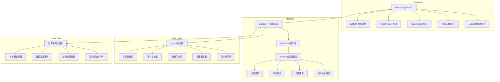
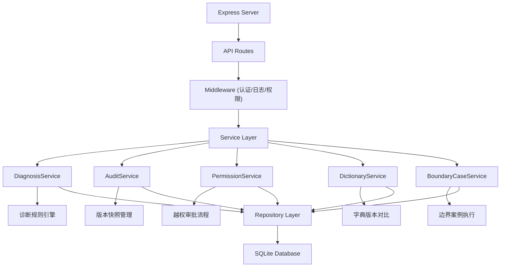
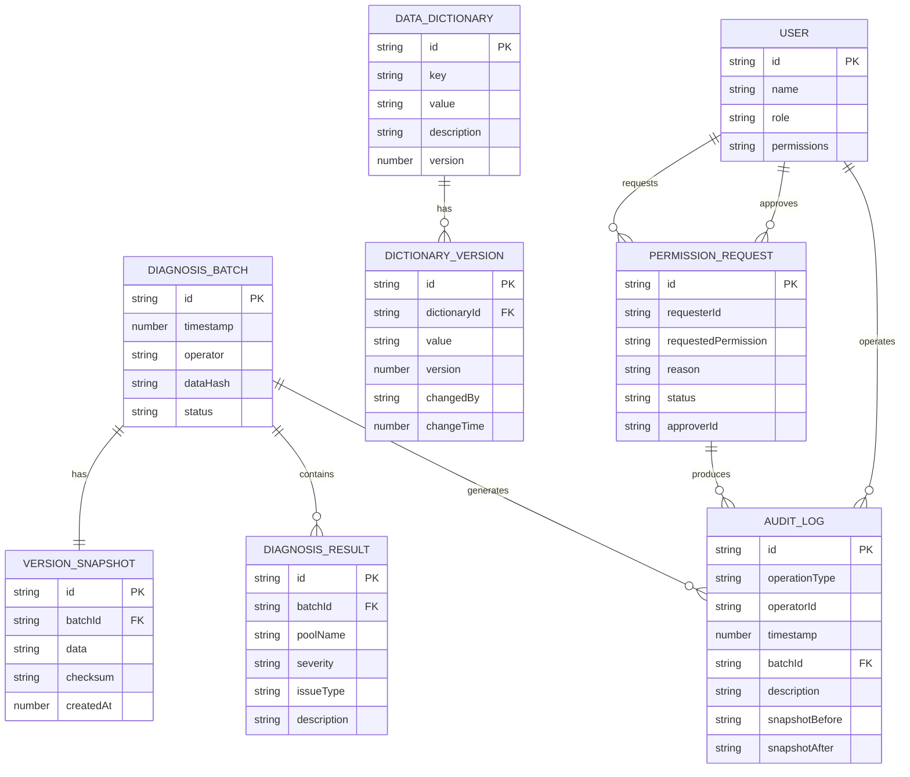

## 1. 架构设计



## 2. 技术描述

- **前端**：React@18 + TypeScript + Vite + TailwindCSS@3 + Zustand + React Router + Recharts + Lucide React
- **后端**：Express@4 + TypeScript + better-sqlite3
- **数据库**：SQLite（嵌入式，无需额外部署）
- **初始化工具**：vite-init（react-express-ts 模板）
- **数据策略**：内置丰富的Mock数据，包含真实边界案例和坏数据样例

## 3. 路由定义

| Route | Purpose |
|-------|---------|
| / | 诊断看板首页，展示连接池概览和问题列表 |
| /audit | 审计历史页面，操作流水和版本对比 |
| /dictionary | 数据字典管理，字段配置和版本对比 |
| /permissions | 权限管理，越权审批流程 |
| /boundary | 边界案例库，测试样例展示和执行 |

## 4. API Definitions

```typescript
// 诊断数据类型
interface ConnectionPoolData {
  id: string;
  timestamp: number;
  poolName: string;
  activeConnections: number;
  idleConnections: number;
  waitingRequests: number;
  totalConnections: number;
  maxConnections: number;
  timeoutCount: number;
  errorRate: number;
  avgWaitTime: number;
}

interface DiagnosisResult {
  id: string;
  batchId: string;
  timestamp: number;
  poolName: string;
  severity: 'normal' | 'warning' | 'critical';
  issueType: string;
  description: string;
  affectedConnections: number[];
  suggestions: string[];
}

interface AuditLog {
  id: string;
  operationType: 'import' | 'diagnose' | 'modify' | 'confirm' | 'rollback' | 'permission';
  operator: string;
  operatorId: string;
  timestamp: number;
  batchId?: string;
  description: string;
  reason?: string;
  snapshotBefore?: string;
  snapshotAfter?: string;
  approver?: string;
  approverId?: string;
}

interface DataDictionary {
  id: string;
  key: string;
  value: any;
  description: string;
  version: number;
  createdAt: number;
  createdBy: string;
}

interface PermissionRequest {
  id: string;
  requester: string;
  requesterId: string;
  requestedPermission: string;
  reason: string;
  status: 'pending' | 'approved' | 'rejected';
  approver?: string;
  approverId?: string;
  approvedAt?: number;
  rejectReason?: string;
  createdAt: number;
}

// API Endpoints
GET    /api/diagnosis/batches              // 获取诊断批次列表
GET    /api/diagnosis/:batchId             // 获取指定批次诊断结果
POST   /api/diagnosis/import               // 导入连接池数据
POST   /api/diagnosis/run                  // 执行诊断
GET    /api/diagnosis/:batchId/download    // 下载诊断报告
GET    /api/audit/logs                     // 获取审计日志
GET    /api/audit/compare/:id1/:id2        // 对比两个版本
POST   /api/audit/rollback/:id             // 回滚到指定版本
GET    /api/dictionary                     // 获取数据字典
PUT    /api/dictionary/:id                 // 更新数据字典
GET    /api/dictionary/compare/:v1/:v2     // 对比字典版本
GET    /api/permissions/requests           // 获取权限申请列表
POST   /api/permissions/request            // 提交权限申请
POST   /api/permissions/approve/:id        // 审批权限申请
GET    /api/boundary/cases                 // 获取边界案例列表
POST   /api/boundary/run/:caseId           // 运行边界案例
```

## 5. 后端架构图



## 6. 数据模型

### 6.1 数据模型定义



### 6.2 数据定义语言

```sql
-- 诊断批次表
CREATE TABLE diagnosis_batch (
  id TEXT PRIMARY KEY,
  timestamp INTEGER NOT NULL,
  operator TEXT NOT NULL,
  data_hash TEXT NOT NULL,
  status TEXT NOT NULL DEFAULT 'pending',
  raw_data TEXT NOT NULL
);

-- 诊断结果表
CREATE TABLE diagnosis_result (
  id TEXT PRIMARY KEY,
  batch_id TEXT NOT NULL,
  pool_name TEXT NOT NULL,
  severity TEXT NOT NULL,
  issue_type TEXT NOT NULL,
  description TEXT NOT NULL,
  affected_connections TEXT,
  suggestions TEXT,
  FOREIGN KEY (batch_id) REFERENCES diagnosis_batch(id)
);

-- 审计日志表
CREATE TABLE audit_log (
  id TEXT PRIMARY KEY,
  operation_type TEXT NOT NULL,
  operator_id TEXT NOT NULL,
  operator_name TEXT NOT NULL,
  timestamp INTEGER NOT NULL,
  batch_id TEXT,
  description TEXT NOT NULL,
  reason TEXT,
  snapshot_before TEXT,
  snapshot_after TEXT,
  approver_id TEXT,
  approver_name TEXT,
  FOREIGN KEY (batch_id) REFERENCES diagnosis_batch(id)
);

-- 版本快照表
CREATE TABLE version_snapshot (
  id TEXT PRIMARY KEY,
  batch_id TEXT NOT NULL,
  data TEXT NOT NULL,
  checksum TEXT NOT NULL,
  created_at INTEGER NOT NULL,
  FOREIGN KEY (batch_id) REFERENCES diagnosis_batch(id)
);

-- 数据字典表
CREATE TABLE data_dictionary (
  id TEXT PRIMARY KEY,
  key TEXT NOT NULL UNIQUE,
  value TEXT NOT NULL,
  description TEXT NOT NULL,
  version INTEGER NOT NULL DEFAULT 1,
  created_by TEXT NOT NULL,
  created_at INTEGER NOT NULL
);

-- 字典版本历史表
CREATE TABLE dictionary_version (
  id TEXT PRIMARY KEY,
  dictionary_id TEXT NOT NULL,
  old_value TEXT NOT NULL,
  new_value TEXT NOT NULL,
  version INTEGER NOT NULL,
  changed_by TEXT NOT NULL,
  change_time INTEGER NOT NULL,
  change_reason TEXT,
  FOREIGN KEY (dictionary_id) REFERENCES data_dictionary(id)
);

-- 权限申请表
CREATE TABLE permission_request (
  id TEXT PRIMARY KEY,
  requester_id TEXT NOT NULL,
  requester_name TEXT NOT NULL,
  requested_permission TEXT NOT NULL,
  reason TEXT NOT NULL,
  status TEXT NOT NULL DEFAULT 'pending',
  approver_id TEXT,
  approver_name TEXT,
  approved_at INTEGER,
  reject_reason TEXT,
  created_at INTEGER NOT NULL
);

-- 用户表
CREATE TABLE user (
  id TEXT PRIMARY KEY,
  name TEXT NOT NULL,
  role TEXT NOT NULL,
  permissions TEXT NOT NULL
);

-- 边界案例表
CREATE TABLE boundary_case (
  id TEXT PRIMARY KEY,
  name TEXT NOT NULL,
  description TEXT NOT NULL,
  type TEXT NOT NULL,
  test_data TEXT NOT NULL,
  expected_result TEXT NOT NULL,
  is_active INTEGER NOT NULL DEFAULT 1
);

-- 初始化用户数据
INSERT INTO user (id, name, role, permissions) VALUES 
('u001', '张明', 'sre_oncall', 'import,diagnose,download'),
('u002', '李华', 'sre_reviewer', 'import,diagnose,download,approve,audit'),
('u003', '王芳', 'admin', 'all');

-- 初始化数据字典
INSERT INTO data_dictionary (id, key, value, description, version, created_by, created_at) VALUES 
('d001', 'pool.max_connections_warning', '80', '连接池使用率告警阈值(%)', 1, 'u003', strftime('%s','now')),
('d002', 'pool.max_connections_critical', '95', '连接池使用率危险阈值(%)', 1, 'u003', strftime('%s','now')),
('d003', 'pool.waiting_warning', '5', '等待队列告警阈值', 1, 'u003', strftime('%s','now')),
('d004', 'pool.timeout_warning', '10', '超时次数告警阈值', 1, 'u003', strftime('%s','now')),
('d005', 'pool.error_rate_warning', '5', '错误率告警阈值(%)', 1, 'u003', strftime('%s','now'));

-- 初始化边界案例
INSERT INTO boundary_case (id, name, description, type, test_data, expected_result, is_active) VALUES 
('c001', '外键断链', '连接池配置指向不存在的数据库实例，导致连接建立失败', 'foreign_key', '...', '{"severity":"critical","issueType":"connection_failure"}', 1),
('c002', '连接泄漏', '应用未正确释放连接，导致连接池耗尽', 'leak', '...', '{"severity":"critical","issueType":"connection_leak"}', 1),
('c003', '超时重置', '网络波动导致连接被重置，应用未正确处理', 'timeout', '...', '{"severity":"warning","issueType":"connection_reset"}', 1),
('c004', '坏数据样例', '包含乱码、格式错误、异常值的真实导入数据', 'bad_data', '...', '{"severity":"warning","issueType":"data_anomaly"}', 1);
```
