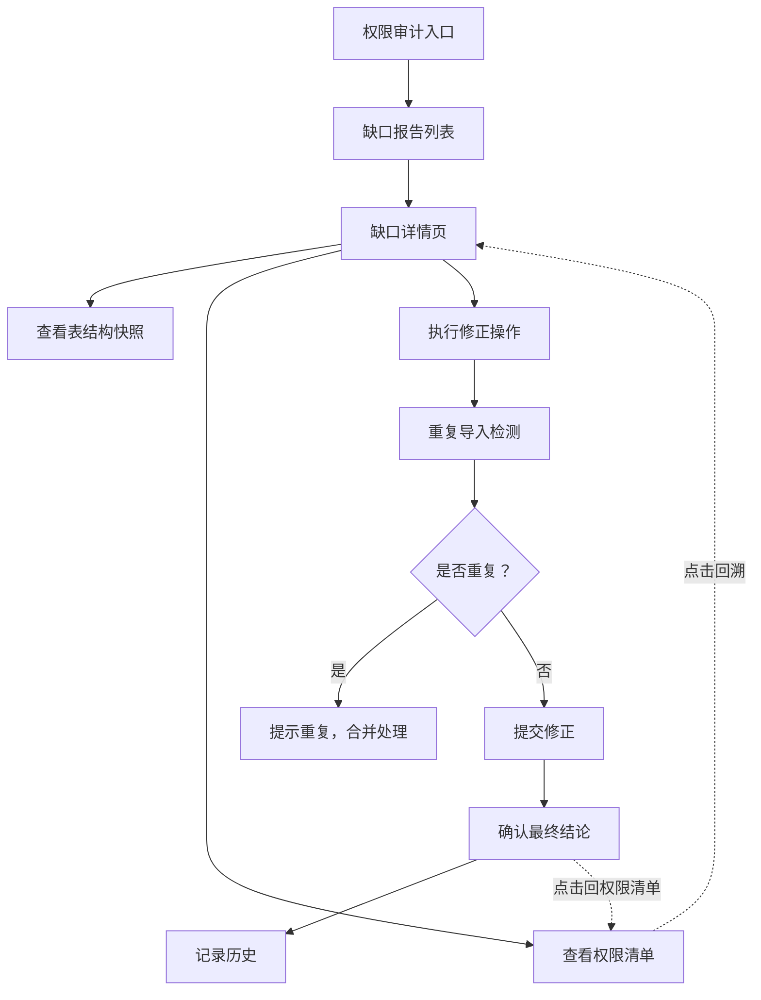
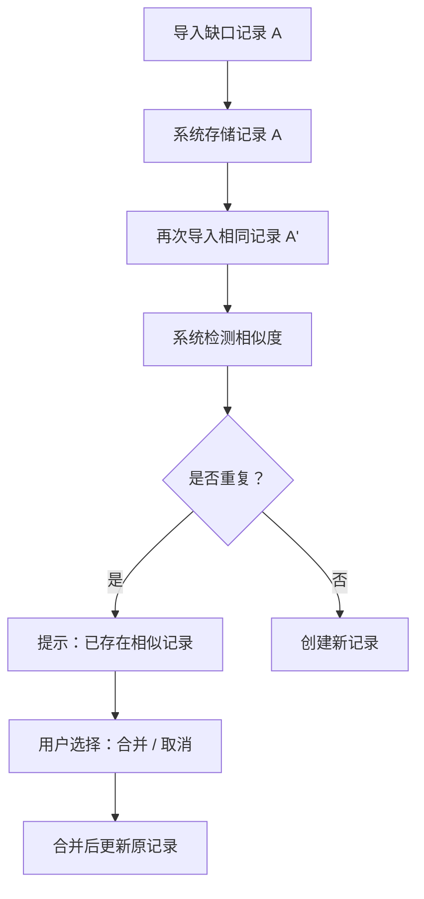

## 1. 产品概述

时序库采样缺口报告工作台是面向后端负责人的本地 Web 管理工具，用于管理时序数据库采样缺口的检测、记录、修正与审计追踪。日常用于整理表结构快照，出问题时可回看业务工单，支持迁移重复执行等异常场景的闭环处理。

- 核心目标：提供可靠的缺口报告处理入口，确保采样数据一致性，避免重复导入导致的混乱
- 目标用户：后端负责人、运维审计人员
- 产品价值：将分散的采样缺口管理流程系统化，支持历史追溯和权限审计

## 2. 核心特性

### 2.1 用户角色

| 角色 | 注册方式 | 核心权限 |
|------|----------|----------|
| 后端负责人 | 本地登录 | 全功能访问：缺口列表、详情查看、修正操作、历史回溯、数据下载、表结构快照管理 |
| 审计人员 | 本地登录 | 只读访问：缺口列表、详情查看、历史记录、权限审计清单 |

### 2.2 功能模块

1. **工作台首页**：缺口总览、统计卡片、快速入口、最近活动
2. **缺口报告列表**：分页列表、筛选搜索、状态标签、批量操作
3. **缺口详情页**：基本信息、表结构快照、权限清单、修正记录、关联工单
4. **修正操作**：缺口修正表单、重复导入检测、补录确认、最终结论
5. **历史记录**：操作日志、状态变更时间线、版本对比
6. **数据下载**：报告导出、快照导出、审计日志导出
7. **权限审计**：权限清单查看、审计入口、结论回溯跳转
8. **测试路径**：重复导入模拟场景、数据一致性校验

### 2.3 页面详情

| 页面名称 | 模块名称 | 功能描述 |
|----------|----------|----------|
| 工作台首页 | 统计概览 | 缺口总数、待处理数、已修正数、本月新增数统计卡片 |
| 工作台首页 | 快速入口 | 新建报告、查看快照、权限审计、下载中心快捷按钮 |
| 工作台首页 | 最近活动 | 最近 10 条操作记录时间线展示 |
| 缺口列表页 | 筛选搜索 | 按状态、时间范围、表名、业务线筛选 |
| 缺口列表页 | 数据表格 | 分页表格展示，支持排序、批量选择 |
| 缺口列表页 | 状态标签 | 待处理/处理中/已修正/已忽略 四种状态 |
| 缺口详情页 | 基本信息 | 缺口 ID、发现时间、影响表、缺口类型、严重程度 |
| 缺口详情页 | 表结构快照 | 快照版本对比、字段变更高亮、快照下载 |
| 缺口详情页 | 权限清单 | 关联权限列表、可点击跳转到权限审计详情 |
| 缺口详情页 | 修正记录 | 修正操作历史、操作人、操作时间、备注 |
| 缺口详情页 | 最终结论 | 结论内容、确认人、确认时间、可跳转回权限清单 |
| 修正操作页 | 修正表单 | 修正类型、修正方案、补录数据、备注 |
| 修正操作页 | 重复检测 | 自动检测是否存在重复导入记录，防重校验 |
| 修正操作页 | 结论确认 | 最终结论输入、二次确认机制 |
| 历史记录页 | 时间线 | 状态变更时间线、操作人、操作详情 |
| 历史记录页 | 版本对比 | 表结构快照版本对比、字段差异高亮 |
| 权限审计页 | 权限清单 | 全量权限列表、按角色/用户筛选 |
| 权限审计页 | 结论回溯 | 从结论反向跳转回缺口报告详情 |
| 测试路径页 | 重复导入模拟 | 模拟重复导入场景，验证防重逻辑 |
| 测试路径页 | 数据一致性 | 校验补录后的数据一致性 |

## 3. 核心流程

### 3.1 缺口处理主流程

用户从权限审计入口进入工作台，查看待处理缺口列表，选择某条缺口查看详情（含表结构快照和权限清单），执行修正操作（系统自动检测重复导入），确认最终结论，整个过程记录可追溯。

### 3.2 重复导入场景流程

测试路径模拟重复导入同一缺口记录，验证系统能否正确识别并提示，避免同一事件产生两份结论。

## 4. 用户界面设计

### 4.1 设计风格

**设计方向：工业级数据控制台风格（Industrial Data Console）**

- **主色调**：深蓝灰（#0F172A）作为主背景，搭配钢蓝（#3B82F6）作为主色调，琥珀色（#F59E0B）作为警示强调
- **辅助色**：翠绿（#10B981）表示正常/已修正，赤红（#EF4444）表示严重/错误，靛蓝（#6366F1）表示信息
- **按钮风格**：直角轻微圆角（4px），实心填充主按钮，描边次要按钮，悬停有微妙亮度变化
- **字体**：JetBrains Mono 等宽字体用于数据展示，Inter 作为界面字体，营造技术感
- **布局风格**：左侧导航 + 主内容区，卡片式模块，网格布局，强调信息密度
- **图标风格**：线性图标，统一 2px 线宽，技术感强
- **整体氛围**：专业、严谨、高信息密度、类似运维控制台的信任感

### 4.2 页面设计概览

| 页面名称 | 模块名称 | UI 元素 |
|----------|----------|---------|
| 工作台首页 | 统计概览 | 深色卡片网格，等宽数字字体，微动画数字增长，状态色指示 |
| 工作台首页 | 快速入口 | 图标 + 文字按钮，悬停上浮效果，快捷键提示 |
| 工作台首页 | 最近活动 | 时间线布局，彩色状态点，操作人头像 |
| 缺口列表页 | 筛选搜索 | 顶部筛选栏，下拉选择器，日期范围选择器，搜索框 |
| 缺口列表页 | 数据表格 | 斑马纹表格，状态标签，操作列按钮，行悬停高亮 |
| 缺口详情页 | 布局 | 左右两栏布局，左栏基本信息，右栏详情 Tab |
| 缺口详情页 | 表结构快照 | 代码块风格展示，字段变更行高亮，版本切换器 |
| 缺口详情页 | 权限清单 | 可点击列表项，悬停下划线，跳转箭头指示 |
| 修正操作页 | 表单 | 分组表单，必填项红星标记，错误提示红色边框 |
| 修正操作页 | 重复检测 | 黄色警告卡片，相似度百分比，合并建议 |
| 历史记录页 | 时间线 | 垂直时间线，状态节点，展开/收起详情 |
| 权限审计页 | 列表 | 树形结构权限列表，搜索过滤，回溯入口 |
| 测试路径页 | 场景卡片 | 卡片式场景列表，执行按钮，结果预览区 |

### 4.3 响应式

- 桌面端优先设计（1440px 基准）
- 平板端（≥768px）：左侧导航收起为图标模式，主内容区自适应
- 移动端（<768px）：顶部导航栏，内容单列堆叠，表格支持横向滚动
- 触摸优化：按钮最小高度 44px，点击区域充足

### 4.4 动效与交互

- 页面加载：内容区域淡入 + 轻微上移，元素错峰出现
- 状态变更：状态标签颜色渐变过渡，时间线节点脉冲动画
- 表格交互：行悬停背景色微妙变化，选中行高亮边框
- 表单验证：错误提示抖动动画 + 红色边框渐显
- 数据刷新：数字滚动动画，进度条平滑过渡
- 模态框：背景模糊 + 缩放弹入效果
