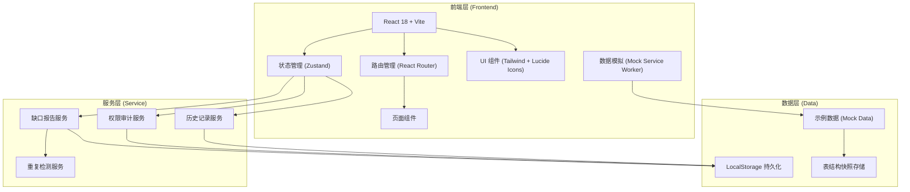
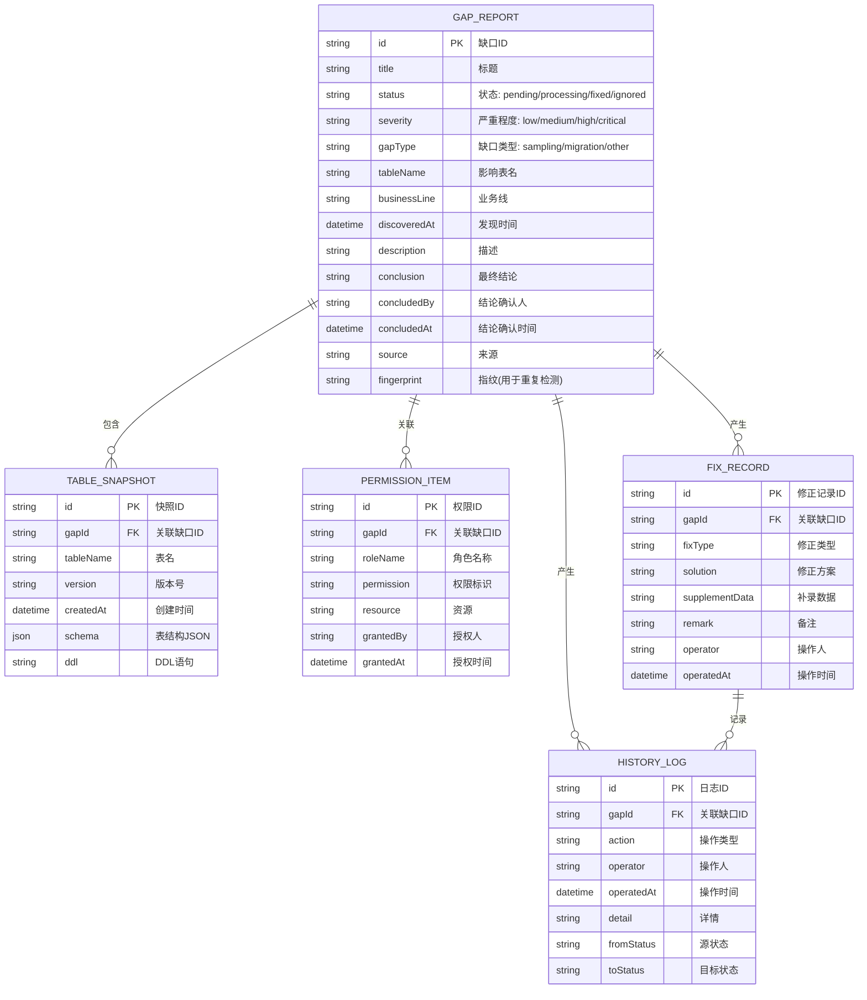

## 1. 架构设计



## 2. 技术描述

- **前端**: React@18 + TypeScript + Vite@5
- **样式**: Tailwind CSS@3 + CSS 变量主题系统
- **路由**: React Router@6
- **状态管理**: Zustand
- **图标**: Lucide React
- **数据持久化**: LocalStorage (本地单用户场景)
- **数据模拟**: 内置 Mock 数据，无需后端服务
- **构建工具**: Vite

## 3. 路由定义

| 路由路径 | 页面名称 | 用途 |
|----------|----------|------|
| /dashboard | 工作台首页 | 缺口总览统计、快速入口、最近活动 |
| /gaps | 缺口报告列表 | 缺口列表展示、筛选搜索、批量操作 |
| /gaps/:id | 缺口详情页 | 缺口详情、表结构快照、权限清单、修正记录 |
| /gaps/:id/fix | 缺口修正页 | 修正操作、重复检测、结论确认 |
| /gaps/:id/history | 历史记录页 | 操作时间线、版本对比 |
| /audit | 权限审计页 | 权限清单、结论回溯 |
| /test | 测试路径页 | 重复导入模拟、数据一致性校验 |
| /snapshots | 表结构快照 | 快照列表、快照管理 |

## 4. 数据模型

### 4.1 数据模型定义



### 4.2 状态枚举

```typescript
// 缺口状态
type GapStatus = 'pending' | 'processing' | 'fixed' | 'ignored';

// 严重程度
type Severity = 'low' | 'medium' | 'high' | 'critical';

// 缺口类型
type GapType = 'sampling' | 'migration' | 'other';

// 操作类型
type HistoryAction = 'created' | 'status_changed' | 'fixed' | 'concluded' | 'snapshot_added' | 'permission_added';
```

## 5. 核心服务设计

### 5.1 缺口报告服务

```typescript
interface GapReportService {
  list(params: ListParams): Promise<PagedResult<GapReport>>;
  get(id: string): Promise<GapReport | null>;
  create(data: CreateGapData): Promise<GapReport>;
  update(id: string, data: UpdateGapData): Promise<GapReport>;
  updateStatus(id: string, status: GapStatus): Promise<GapReport>;
  conclude(id: string, conclusion: string, operator: string): Promise<GapReport>;
  detectDuplicates(data: CreateGapData): Promise<GapReport[]>;
  mergeDuplicates(targetId: string, sourceIds: string[]): Promise<GapReport>;
}
```

### 5.2 重复检测服务

```typescript
interface DuplicateDetectionService {
  generateFingerprint(data: CreateGapData): string;
  calculateSimilarity(gap1: GapReport, gap2: GapReport): number;
  findSimilar(gap: GapReport, threshold: number): Promise<GapReport[]>;
}
```

### 5.3 历史记录服务

```typescript
interface HistoryService {
  listByGapId(gapId: string): Promise<HistoryLog[]>;
  add(log: Omit<HistoryLog, 'id' | 'operatedAt'>): Promise<HistoryLog>;
}
```

## 6. 目录结构

```
src/
├── assets/          # 静态资源
├── components/      # 公共组件
│   ├── Layout/      # 布局组件
│   ├── Status/      # 状态标签组件
│   ├── Table/       # 表格组件
│   ├── Timeline/    # 时间线组件
│   ├── Modal/       # 弹窗组件
│   └── ...
├── pages/           # 页面组件
│   ├── Dashboard/   # 工作台首页
│   ├── GapList/     # 缺口列表
│   ├── GapDetail/   # 缺口详情
│   ├── GapFix/      # 缺口修正
│   ├── History/     # 历史记录
│   ├── Audit/       # 权限审计
│   ├── TestPath/    # 测试路径
│   └── Snapshots/   # 表结构快照
├── stores/          # 状态管理 (Zustand)
│   ├── gapStore.ts
│   ├── auditStore.ts
│   └── historyStore.ts
├── services/        # 业务服务
│   ├── gapService.ts
│   ├── duplicateService.ts
│   ├── auditService.ts
│   └── historyService.ts
├── types/           # TypeScript 类型定义
│   └── index.ts
├── mock/            # Mock 数据
│   ├── gaps.ts
│   ├── snapshots.ts
│   ├── permissions.ts
│   └── history.ts
├── utils/           # 工具函数
│   ├── storage.ts
│   ├── fingerprint.ts
│   └── format.ts
├── hooks/           # 自定义 Hooks
│   └── ...
├── App.tsx
├── main.tsx
└── index.css
```

## 7. 示例数据初始化

首次打开应用时自动注入示例数据，包括：

- **5 条缺口报告记录**：涵盖不同状态、类型、严重程度
- **3 份表结构快照**：展示字段变更对比
- **8 条权限记录**：关联不同缺口报告
- **15 条历史操作记录**：展示完整的操作时间线
- **1 条重复导入场景测试数据**：用于验证防重逻辑

数据使用 LocalStorage 持久化，刷新页面不丢失，支持重置为初始示例数据。
