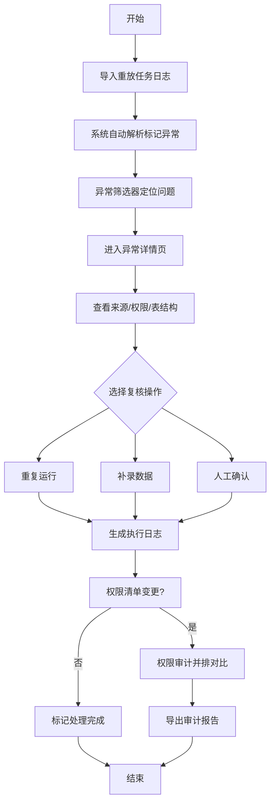

## 1. 产品概述
面向数据平台工程师的事件溯源重放 API 审计工具，解决权限清单、表结构快照和处理意见分散的问题，减少临时沟通群。工具核心价值在于：导入即筛异常、详情追溯来源、权限变更前后对比、复核操作全覆盖。

## 2. 核心功能

### 2.1 用户角色
| 角色 | 注册方式 | 核心权限 |
|------|----------|----------|
| 数据平台工程师 | 内部 SSO | 导入数据、异常筛选、详情查看、复核操作（重复运行/补录/人工确认）、权限对比、报告导出 |

### 2.2 功能模块
1. **重放任务列表页**：任务导入、异常筛选器、任务状态概览、异常记录统计
2. **异常详情页**：来源链路、权限清单快照、表结构快照、处理意见、变更前后对比
3. **权限审计页**：权限变更历史、新旧结论并排对比、影响范围可视化、导出报告

### 2.3 页面详情
| 页面名称 | 模块名称 | 功能描述 |
|----------|----------|----------|
| 重放任务列表页 | 顶部工具栏 | 导入按钮（JSON/CSV）、全局搜索、按任务名/时间筛选 |
| 重放任务列表页 | 异常筛选器 | 异常类型下拉（索引失效/权限缺失/表结构变更/数据不一致）、严重程度（高/中/低）、处理状态（待处理/复核中/已确认） |
| 重放任务列表页 | 任务卡片网格 | 展示任务ID、导入时间、总记录数、异常数、处理进度条、快捷操作按钮 |
| 重放任务列表页 | 异常记录表格 | 记录ID、异常类型、所属表、严重程度、处理状态、操作（详情/复核/标记） |
| 异常详情页 | 来源追溯面板 | 事件ID、产生时间、来源服务、调用链（上游→下游）、原始请求/响应体 |
| 异常详情页 | 权限清单快照 | 快照版本号、取数时间、权限矩阵（用户/角色→操作→资源）、与基线版本差异高亮 |
| 异常详情页 | 表结构快照 | 表名、字段清单（名称/类型/约束/索引）、索引状态标记（正常/失效/缺失）、DDL语句对比 |
| 异常详情页 | 处理意见区 | 处理建议自动生成、人工编辑、历史处理记录时间线、附件上传 |
| 异常详情页 | 复核操作区 | 三个操作按钮：重复运行（重放校验）、补录（补充数据后再次校验）、人工确认（终审标记），每个操作有执行日志 |
| 权限审计页 | 变更时间线 | 权限版本节点、变更人、变更摘要、可点击跳转对比 |
| 权限审计页 | 并排对比视图 | 左栏旧权限+旧结论，右栏新权限+新结论，中间差异列标记增/删/改 |
| 权限审计页 | 影响范围分析 | 受影响任务数、异常类型分布、关联表清单 |
| 权限审计页 | 报告导出 | 导出PDF/Excel，包含对比结论、影响清单、复核记录 |

## 3. 核心流程
数据平台工程师导入重放日志后，系统自动解析并标记异常记录。工程师通过筛选器定位问题，点击详情查看来源链路、权限快照和表结构。根据异常类型选择复核操作：重复运行验证可复现性、补录缺失数据后再次校验、人工确认给出终审结论。当权限清单发生变更时，在权限审计页并排查看前后差异和结论变化，最终导出审计报告。

## 4. 用户界面设计

### 4.1 设计风格
- **主色**：深蓝 #1E3A5F（专业感），辅色：琥珀橙 #D97706（异常标记）、翠绿 #059669（正常/确认）、赤红 #DC2626（严重异常）
- **按钮风格**：直角矩形，2px边框，hover时轻微上移1px+阴影加深
- **字体**：JetBrains Mono（代码/数据展示） + Noto Sans SC（中文正文），数据表格等宽对齐
- **布局风格**：三栏式（左侧筛选器 / 中间主内容 / 右侧详情抽屉），采用高密度信息布局，减少不必要留白
- **图标风格**：线性图标 + 状态色块组合，数据工程师熟悉的运维监控风格

### 4.2 页面设计概述
| 页面名称 | 模块名称 | UI元素 |
|----------|----------|--------|
| 重放任务列表页 | 顶部工具栏 | 深蓝色工具栏背景，导入按钮配上传图标+橙色强调角标，搜索框采用代码编辑器风格 |
| 重放任务列表页 | 异常筛选器 | 左侧固定宽度280px面板，每项筛选配状态色块徽章，支持多选折叠 |
| 重放任务列表页 | 任务卡片 | 卡片顶部任务ID+状态条，四象限布局（总记录/异常/已复核/待处理），底部操作按钮组 |
| 重放任务列表页 | 异常记录表格 | 斑马纹行，异常类型列配彩色标签，严重程度用进度条色块（红/黄/绿） |
| 异常详情页 | 来源追溯面板 | 时间线布局，每个节点配服务图标，调用链用箭头连接，请求/响应体可折叠代码块 |
| 异常详情页 | 权限清单快照 | 矩阵表格，差异单元格背景色标记（新增浅绿/删除浅红/修改浅黄），版本切换下拉 |
| 异常详情页 | 表结构快照 | 字段表格配索引状态图标（✓正常/⚠失效/✕缺失），DDL对比左右分栏语法高亮 |
| 异常详情页 | 处理意见区 | 时间线+卡片混合，建议内容代码编辑器风格，操作记录配时间戳和用户头像 |
| 异常详情页 | 复核操作区 | 三个大按钮横向排列，每个按钮下方实时日志区域（终端风格黑底绿字） |
| 权限审计页 | 并排对比视图 | 50-50分栏，中间0.5px分割线+差异标记徽章，滚动同步 |
| 权限审计页 | 影响范围分析 | 环形图（异常分布）+ 横向条形图（关联表）+ 数字统计卡片 |

### 4.3 响应性
桌面端优先设计（最小宽度1440px），中等屏幕（1024-1439px）自动调整栏宽比例，不支持移动端（内部工具，仅桌面使用）。

### 4.4 交互细节
- 筛选条件变更时，结果区域显示骨架屏加载动画
- 复核操作执行时，按钮进入loading态，日志区域实时输出行（打字机效果）
- 并排对比视图滚动时，左右栏Y轴同步滚动
- 索引失效样例数据：在异常详情页表结构快照中，标记一条"idx_order_created_at"索引状态为"失效"，对应SQL执行计划显示"全表扫描"，原因模拟真实场景：统计信息过旧导致优化器弃用索引
