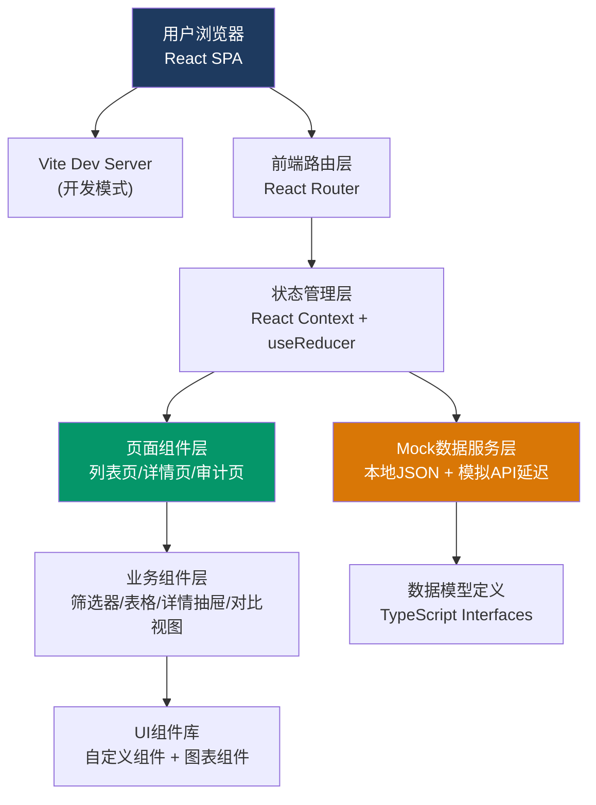
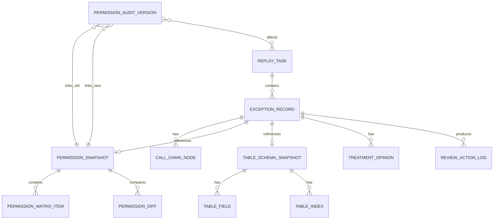

## 1. 架构设计



## 2. 技术描述
- **前端框架**：React@18.2 + TypeScript@5
- **构建工具**：Vite@5
- **样式方案**：TailwindCSS@3（原子化CSS）+ 自定义CSS变量
- **路由管理**：React Router DOM@6
- **图表可视化**：Recharts（轻量级React图表库）
- **图标方案**：Lucide React（线性图标库，与设计风格匹配）
- **语法高亮**：Prism.js（代码/DDL语句展示）
- **Mock数据**：本地JSON文件 + 自定义延迟模拟真实API
- **状态管理**：React Context + useReducer（轻量方案，避免Redux过度工程化）

## 3. 路由定义
| 路由 | 页面名称 | 核心功能 |
|------|----------|----------|
| `/` | 重放任务列表页 | 任务概览、异常筛选、记录列表、快捷导入 |
| `/task/:taskId/record/:recordId` | 异常详情页 | 来源追溯、权限快照、表结构、处理意见、复核操作 |
| `/audit` | 权限审计页 | 变更时间线、并排对比、影响分析、报告导出 |

## 4. 类型定义与数据模型

```typescript
// 重放任务
interface ReplayTask {
  id: string;
  name: string;
  importTime: string;
  totalRecords: number;
  exceptionCount: number;
  reviewedCount: number;
  status: 'processing' | 'completed' | 'pending';
  progress: number;
}

// 异常记录
interface ExceptionRecord {
  id: string;
  taskId: string;
  eventId: string;
  type: 'index_invalid' | 'permission_missing' | 'schema_changed' | 'data_inconsistent';
  severity: 'high' | 'medium' | 'low';
  status: 'pending' | 'reviewing' | 'confirmed';
  tableName: string;
  sourceService: string;
  eventTime: string;
  assignee?: string;
}

// 调用链路节点
interface CallChainNode {
  serviceName: string;
  serviceType: 'gateway' | 'api' | 'database' | 'cache' | 'mq';
  timestamp: string;
  requestBody?: string;
  responseBody?: string;
  status: 'success' | 'error' | 'timeout';
}

// 权限清单
interface PermissionSnapshot {
  version: string;
  snapshotTime: string;
  isBaseline: boolean;
  matrix: PermissionMatrixItem[];
  diffFromBaseline?: PermissionDiff[];
}

interface PermissionMatrixItem {
  role: string;
  user?: string;
  resource: string;
  operations: string[];
  granted: boolean;
}

interface PermissionDiff {
  field: 'role' | 'resource' | 'operations' | 'granted';
  oldValue: any;
  newValue: any;
  changeType: 'add' | 'remove' | 'modify';
}

// 表结构快照
interface TableSchemaSnapshot {
  tableName: string;
  snapshotTime: string;
  fields: TableField[];
  indexes: TableIndex[];
  ddlStatement: string;
  previousDdl?: string;
}

interface TableField {
  name: string;
  dataType: string;
  nullable: boolean;
  primaryKey: boolean;
  defaultValue?: string;
  comment?: string;
}

interface TableIndex {
  name: string;
  fields: string[];
  indexType: 'PRIMARY' | 'UNIQUE' | 'NORMAL' | 'FULLTEXT';
  status: 'valid' | 'invalid' | 'missing';
  invalidReason?: string;
  executionPlanHint?: string;
}

// 处理意见
interface TreatmentOpinion {
  id: string;
  recordId: string;
  author: string;
  authorRole: string;
  createTime: string;
  content: string;
  autoGenerated: boolean;
  attachments?: Attachment[];
}

interface Attachment {
  name: string;
  size: number;
  uploadTime: string;
}

// 复核操作日志
interface ReviewActionLog {
  id: string;
  recordId: string;
  actionType: 'rerun' | 'backfill' | 'manual_confirm';
  operator: string;
  startTime: string;
  endTime?: string;
  status: 'running' | 'success' | 'failed';
  logLines: LogLine[];
  resultSummary?: string;
}

interface LogLine {
  timestamp: string;
  level: 'INFO' | 'WARN' | 'ERROR' | 'SUCCESS';
  message: string;
}

// 权限审计版本
interface PermissionAuditVersion {
  version: string;
  publishTime: string;
  operator: string;
  changeSummary: string;
  affectedTasks: string[];
  conclusionBefore: string;
  conclusionAfter: string;
}
```

## 5. 数据模型 ER 图



## 6. 前端项目结构

```
src/
├── assets/                 # 静态资源
│   └── fonts/              # JetBrains Mono 字体文件
├── components/             # 通用UI组件
│   ├── ui/                 # 基础组件（Button/Tag/Modal/...）
│   ├── layout/             # 布局组件（Header/Sidebar/Drawer）
│   └── charts/             # 图表组件
├── pages/                  # 页面级组件
│   ├── TaskList/           # 重放任务列表页
│   │   ├── components/     # 页内子组件
│   │   │   ├── TaskCard.tsx
│   │   │   ├── ExceptionFilter.tsx
│   │   │   └── ExceptionTable.tsx
│   │   └── index.tsx
│   ├── ExceptionDetail/    # 异常详情页
│   │   ├── components/
│   │   │   ├── SourceTracePanel.tsx
│   │   │   ├── PermissionSnapshot.tsx
│   │   │   ├── SchemaSnapshot.tsx
│   │   │   ├── TreatmentOpinion.tsx
│   │   │   ├── ReviewActions.tsx
│   │   │   └── SyncScrollDiff.tsx
│   │   └── index.tsx
│   └── PermissionAudit/    # 权限审计页
│       ├── components/
│       │   ├── VersionTimeline.tsx
│       │   ├── SideBySideCompare.tsx
│       │   ├── ImpactAnalysis.tsx
│       │   └── ReportExport.tsx
│       └── index.tsx
├── context/                # 全局状态管理
│   └── AppContext.tsx
├── hooks/                  # 自定义hooks
│   ├── useReviewAction.ts
│   ├── useSyncScroll.ts
│   └── useTypewriterLog.ts
├── mock/                   # Mock数据
│   ├── tasks.json
│   ├── exceptions.json
│   ├── callChains.json
│   ├── permissions.json
│   ├── schemas.json
│   ├── opinions.json
│   ├── reviewLogs.json
│   └── auditVersions.json
├── services/               # 数据服务层
│   ├── api.ts              # 统一API封装
│   └── delay.ts            # 延迟模拟工具
├── types/                  # 类型定义
│   └── index.ts
├── utils/                  # 工具函数
│   ├── format.ts
│   ├── diff.ts
│   └── export.ts
├── styles/                 # 全局样式
│   ├── globals.css
│   └── variables.css
├── App.tsx
├── main.tsx
└── vite-env.d.ts
```

## 7. 核心技术实现要点

### 7.1 并排对比同步滚动
使用自定义 `useSyncScroll` hook，监听左右两栏滚动事件，通过 `scrollTop` 比例同步实现双向联动，避免递归触发。

### 7.2 复核操作打字机日志效果
`useTypewriterLog` hook 模拟日志逐行输出，每条 LogLine 按字符逐个渲染，配合 20-50ms 随机间隔模拟真实终端输出。

### 7.3 权限矩阵差异高亮
使用 Map 结构对比新旧权限矩阵，对每个单元格计算 changeType（add/remove/modify/none），通过 Tailwind class 动态绑定背景色。

### 7.4 索引失效样例数据（真实场景）
```json
{
  "name": "idx_order_created_at",
  "fields": ["created_at", "status"],
  "indexType": "NORMAL",
  "status": "invalid",
  "invalidReason": "统计信息过旧（最后更新：2026-04-01），优化器估算行数偏差 87%，弃用索引选择全表扫描",
  "executionPlanHint": "type=ALL, rows=2,847,392, filtered=11.34%, Extra=Using where"
}
```

### 7.5 报告导出
前端实现 Excel 导出（SheetJS CDN）和 PDF 打印样式（`@media print` 专用样式类），无需后端服务。
