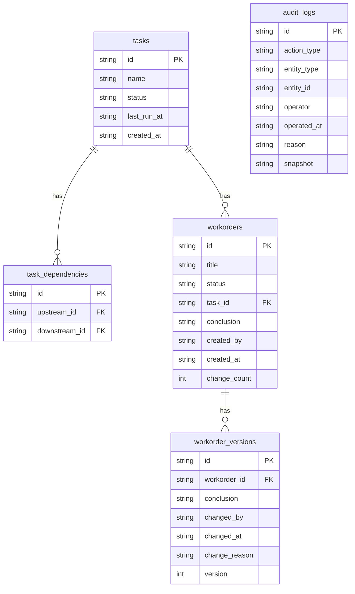

## 1. 架构设计

```mermaid
graph TB
    "前端 React" --> "Express API"
    "Express API" --> "SQLite 数据库"
    "Express API" --> "审计日志服务"
    "审计日志服务" --> "SQLite 数据库"
```

三层架构：前端 React SPA → Express REST API → SQLite 持久化。审计日志作为独立服务层，权限审计与备份校验共用同一张 `audit_logs` 表，确保界面和报告数据同源。

## 2. 技术说明

- 前端：React@18 + Tailwind CSS@3 + Vite
- 初始化工具：vite-init（react-express-ts 模板）
- 后端：Express@4 + TypeScript (ESM)
- 数据库：SQLite（本地文件存储，无需外部服务）
- 状态管理：Zustand
- 拓扑可视化：@xyflow/react（React Flow）
- 图标：lucide-react

## 3. 路由定义

| 路由 | 用途 |
|------|------|
| `/` | 拓扑看板页，展示 ETL 任务依赖 DAG |
| `/workorders` | 业务工单列表页，稳定分页 |
| `/workorders/:id` | 工单详情页，含变更历史与版本对比 |
| `/audit` | 审计日志页，操作记录筛选与导出 |
| `/guide` | 操作指南页，启动/导入/异常/导出步骤 |

## 4. API 定义

### 4.1 任务与拓扑

```typescript
interface TaskNode {
  id: string;
  name: string;
  status: "success" | "failed" | "running" | "pending";
  upstream: string[];
  downstream: string[];
  workorderId: string | null;
  lastRunAt: string;
}

// GET /api/tasks - 获取全部任务及依赖关系（图表/明细/导出共用）
// GET /api/tasks/:id - 获取单个任务详情
```

### 4.2 业务工单

```typescript
interface Workorder {
  id: string;
  title: string;
  status: "open" | "in_progress" | "resolved" | "closed";
  taskId: string;
  conclusion: string;
  createdAt: string;
  createdBy: string;
  changeCount: number;
}

interface WorkorderVersion {
  id: string;
  workorderId: string;
  conclusion: string;
  changedBy: string;
  changedAt: string;
  changeReason: string;
  version: number;
}

// GET /api/workorders?page=1&pageSize=20 - 工单列表（按 createdAt DESC 固定排序）
// GET /api/workorders/:id - 工单详情（含最新结论与变更次数）
// GET /api/workorders/:id/versions - 工单变更历史（含全部版本）
// POST /api/workorders - 创建工单
// PUT /api/workorders/:id - 更新工单（必须提供 changeReason）
```

### 4.3 审计日志

```typescript
interface AuditLog {
  id: string;
  actionType: "create" | "update" | "delete" | "approve" | "reject";
  entityType: "workorder" | "task" | "user";
  entityId: string;
  operator: string;
  operatedAt: string;
  reason: string;
  snapshot: Record<string, unknown>;
}

// GET /api/audit-logs?actionType=&entityType=&operator=&startDate=&endDate=&page=1&pageSize=20
// GET /api/audit-logs/export - 导出审计日志 CSV（与列表同源查询）
```

### 4.4 操作指南

```typescript
// GET /api/guide - 获取操作指南内容（Markdown 格式）
```

## 5. 数据模型

### 5.1 数据模型定义



### 5.2 数据定义语言

```sql
CREATE TABLE tasks (
  id TEXT PRIMARY KEY,
  name TEXT NOT NULL,
  status TEXT NOT NULL DEFAULT 'pending',
  last_run_at TEXT,
  created_at TEXT NOT NULL DEFAULT (datetime('now'))
);

CREATE TABLE task_dependencies (
  id TEXT PRIMARY KEY,
  upstream_id TEXT NOT NULL REFERENCES tasks(id),
  downstream_id TEXT NOT NULL REFERENCES tasks(id),
  UNIQUE(upstream_id, downstream_id)
);

CREATE TABLE workorders (
  id TEXT PRIMARY KEY,
  title TEXT NOT NULL,
  status TEXT NOT NULL DEFAULT 'open',
  task_id TEXT REFERENCES tasks(id),
  conclusion TEXT DEFAULT '',
  created_by TEXT NOT NULL,
  created_at TEXT NOT NULL DEFAULT (datetime('now')),
  change_count INTEGER NOT NULL DEFAULT 0
);

CREATE TABLE workorder_versions (
  id TEXT PRIMARY KEY,
  workorder_id TEXT NOT NULL REFERENCES workorders(id),
  conclusion TEXT NOT NULL,
  changed_by TEXT NOT NULL,
  changed_at TEXT NOT NULL DEFAULT (datetime('now')),
  change_reason TEXT NOT NULL,
  version INTEGER NOT NULL
);

CREATE TABLE audit_logs (
  id TEXT PRIMARY KEY,
  action_type TEXT NOT NULL,
  entity_type TEXT NOT NULL,
  entity_id TEXT NOT NULL,
  operator TEXT NOT NULL,
  operated_at TEXT NOT NULL DEFAULT (datetime('now')),
  reason TEXT NOT NULL DEFAULT '',
  snapshot TEXT DEFAULT '{}'
);

CREATE INDEX idx_workorders_created_at ON workorders(created_at DESC);
CREATE INDEX idx_workorder_versions_workorder_id ON workorder_versions(workorder_id, version DESC);
CREATE INDEX idx_audit_logs_operated_at ON audit_logs(operated_at DESC);
CREATE INDEX idx_audit_logs_entity ON audit_logs(entity_type, entity_id);
CREATE INDEX idx_audit_logs_action_type ON audit_logs(action_type);
```

## 6. 关键设计约束

### 6.1 单一数据源

- 图表渲染、明细列表、CSV 导出全部调用同一 API 端点，前端不缓存、不二次加工
- 审计日志的界面展示和报告导出共用 `GET /api/audit-logs` 端点，仅响应格式不同（JSON vs CSV）

### 6.2 分页稳定性

- 工单列表固定排序 `created_at DESC`，不可由前端自定义排序
- 使用 keyset 分页（基于 `created_at + id`）避免分页漂移

### 6.3 版本对比机制

- 每次工单更新自动写入 `workorder_versions` 表，版本号递增
- 版本对比接口返回任意两个版本的结论字段，前端并排渲染，差异高亮

### 6.4 审计留痕

- 所有写操作（创建/更新/删除/审批/驳回）均写入 `audit_logs`
- 更新操作必须填写 `changeReason`，否则接口返回 400
- `audit_logs.snapshot` 存储变更前数据快照，支持完整回溯
