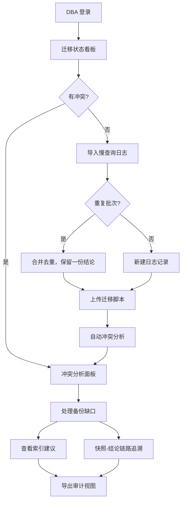

## 1. 产品概述

数据权限申请工作台是面向数据库管理员的自动化审查与追踪平台，解决慢查询日志与迁移脚本冲突、备份缺口追溯、重复导入产生冲突结论等核心痛点。目标用户为数据库管理员（DBA）和审计组人员，核心价值在于消除人工查表对账、确保图/表/文字三者一致、实现快照与结论之间的可追溯链路。

## 2. 核心功能

### 2.1 用户角色

| 角色 | 入口方式 | 核心权限 |
|------|----------|----------|
| 数据库管理员（DBA） | 默认登录 | 导入日志/脚本、查看分析结论、执行迁移、查看索引建议 |
| 审计组 | 只读链接 | 查看分析结论、快照与结论链路追溯、导出报告 |

### 2.2 功能模块

1. **迁移状态看板**：日常入口，展示当前所有迁移任务的执行状态、慢查询冲突标记
2. **慢查询日志管理**：导入、去重、冲突检测，确保同一批日志二次导入不产生两份冲突结论
3. **迁移脚本管理**：上传、版本追踪、与慢查询日志的冲突分析
4. **冲突分析面板**：图（趋势图/对比图）、表（冲突明细表）、文字说明三者联动展示
5. **备份缺口追溯**：记录原始行号、图片名/来源备注，支持从结论回溯到原始记录
6. **快照-结论链路**：表结构快照与最终结论之间可互相点击跳转
7. **索引建议**：基于慢查询分析生成索引建议，附带可读性解释
8. **审计视图**：面向审计组的只读视图，结论不可篡改，全链路可追溯

### 2.3 页面详情

| 页面名称 | 模块名称 | 功能描述 |
|----------|----------|----------|
| 迁移状态看板 | 状态总览卡片 | 展示迁移任务总数、进行中/已完成/冲突数量统计 |
| 迁移状态看板 | 迁移任务列表 | 每行显示任务名、状态、关联慢查询数、冲突标记 |
| 迁移状态看板 | 索引建议入口 | 月底/课前查看索引建议的快速入口 |
| 慢查询日志管理 | 日志导入区 | 支持文件上传导入，自动去重和冲突检测 |
| 慢查询日志管理 | 日志列表 | 展示已导入日志，标注重复导入标记 |
| 慢查询日志管理 | 冲突标记面板 | 同一批日志二次导入时高亮冲突项，不生成重复结论 |
| 迁移脚本管理 | 脚本上传区 | 上传迁移脚本，自动关联已有慢查询日志 |
| 迁移脚本管理 | 脚本版本列表 | 展示脚本版本历史，标注与哪些慢查询有冲突 |
| 冲突分析面板 | 趋势对比图 | 慢查询与迁移脚本冲突趋势的可视化图表 |
| 冲突分析面板 | 冲突明细表 | 逐条列出冲突项，图/表/文字联动高亮 |
| 冲突分析面板 | 文字说明区 | 自动生成的冲突分析文字说明，与图表对应 |
| 备份缺口追溯 | 缺口记录列表 | 展示备份缺口，保留原始行号、图片名、来源备注 |
| 备份缺口追溯 | 来源回溯面板 | 点击记录可跳转回原始表/原始记录 |
| 快照-结论链路 | 表结构快照 | 展示某时刻的表结构快照，可点击跳转到对应结论 |
| 快照-结论链路 | 结论详情 | 展示最终分析结论，可点击跳转回表结构快照 |
| 索引建议 | 建议列表 | 基于慢查询生成的索引建议，附带可读性解释 |
| 索引建议 | 建议详情 | 每条索引建议的详细解释和影响分析 |
| 审计视图 | 只读总览 | 审计组可见的全局只读视图，结论不可篡改 |
| 审计视图 | 全链路追溯 | 从结论到快照到原始记录的完整追溯链路 |

## 3. 核心流程

**主流程**：DBA 登录 → 进入迁移状态看板（日常入口）→ 查看当前迁移状态和冲突 → 导入慢查询日志（自动去重）→ 上传迁移脚本 → 系统自动分析冲突 → 查看冲突分析面板（图/表/文字联动）→ 处理备份缺口（保留原始追溯信息）→ 查看索引建议 → 导出审计视图

**重复导入流程**：导入慢查询日志 → 系统检测是否为重复批次 → 若重复则合并而非新建 → 只保留一份结论，标注补录标记

**快照-结论跳转流程**：查看表结构快照 → 点击"查看相关结论" → 跳转到结论详情 → 点击"返回快照" → 跳转回表结构快照

## 4. 用户界面设计

### 4.1 设计风格

- 主色调：深靛蓝（#1e293b）搭配琥珀色强调（#f59e0b），传达专业与警觉感
- 辅助色：石板灰（#64748b）用于中性元素，翠绿（#10b981）用于成功状态，玫瑰红（#f43f5e）用于冲突/错误标记
- 按钮风格：圆角（rounded-lg），主要按钮带微妙阴影，危险操作按钮带红色调
- 字体：标题使用 Noto Sans SC Bold，正文使用 Noto Sans SC Regular，代码/数据使用 JetBrains Mono
- 布局：左侧导航栏 + 右侧内容区，卡片式模块布局，表格行可点击展开详情
- 图标：Lucide 图标库，风格统一

### 4.2 页面设计概览

| 页面名称 | 模块名称 | UI 元素 |
|----------|----------|---------|
| 迁移状态看板 | 状态总览卡片 | 深色卡片，数字大字+标签小字，hover 微抬升动画 |
| 迁移状态看板 | 迁移任务列表 | 表格布局，状态彩色标签，冲突行红色左边框 |
| 慢查询日志管理 | 日志导入区 | 虚线拖拽区，上传进度条，重复导入时黄色警告横幅 |
| 冲突分析面板 | 趋势对比图 | 折线图+柱状图组合，hover 显示详情 tooltip |
| 冲突分析面板 | 冲突明细表 | 条纹表格，冲突行高亮，行号可点击联动图表 |
| 备份缺口追溯 | 缺口记录列表 | 表格保留原始行号列，来源备注列为可展开标签 |
| 快照-结论链路 | 链路导航 | 面包屑式导航，快照↔结论双向跳转按钮 |
| 审计视图 | 只读总览 | 灰色只读标记，时间线式展示分析链路 |

### 4.3 响应式设计

- 桌面优先设计，最小支持 1280px 宽度
- 表格在窄屏时水平滚动
- 图表自适应容器宽度
- 触摸优化：按钮最小 44px 触摸区域
