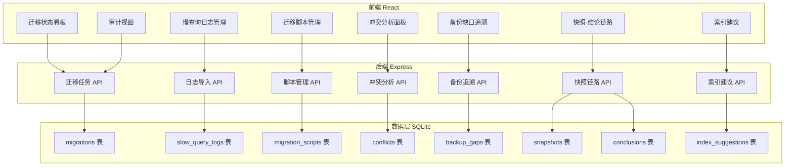
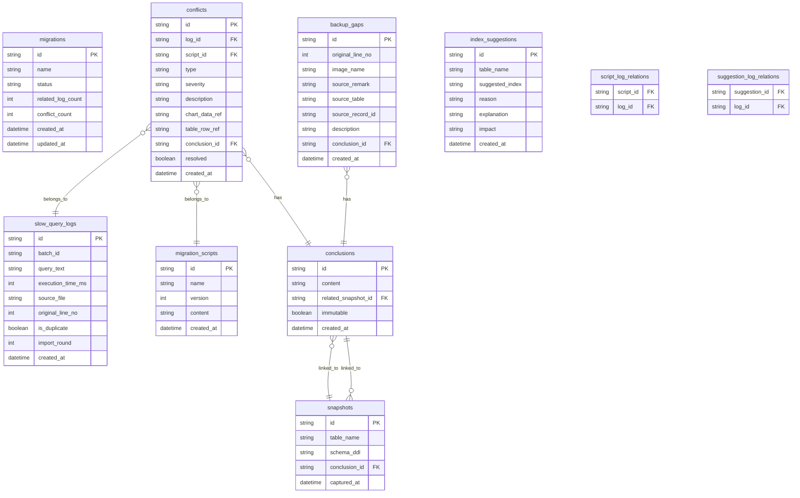

## 1. 架构设计



## 2. 技术说明

- 前端：React@18 + Tailwind CSS@3 + Vite
- 初始化工具：vite-init
- 后端：Express@4 + TypeScript (ESM)
- 数据库：SQLite（better-sqlite3），开发阶段使用 Mock 数据
- 状态管理：Zustand
- 图表库：Recharts
- 路由：React Router DOM v6

## 3. 路由定义

| 路由 | 用途 |
|------|------|
| / | 重定向到 /migration-status |
| /migration-status | 迁移状态看板（日常入口） |
| /slow-query-logs | 慢查询日志管理 |
| /migration-scripts | 迁移脚本管理 |
| /conflict-analysis/:id | 冲突分析面板（某次分析详情） |
| /backup-gaps | 备份缺口追溯 |
| /snapshot-conclusion | 快照-结论链路 |
| /index-suggestions | 索引建议 |
| /audit-view | 审计视图（只读） |

## 4. API 定义

### 4.1 迁移任务

```typescript
interface Migration {
  id: string;
  name: string;
  status: "pending" | "running" | "completed" | "conflict";
  relatedLogCount: number;
  conflictCount: number;
  createdAt: string;
  updatedAt: string;
}

// GET /api/migrations
// POST /api/migrations
// GET /api/migrations/:id
```

### 4.2 慢查询日志

```typescript
interface SlowQueryLog {
  id: string;
  batchId: string;
  queryText: string;
  executionTimeMs: number;
  sourceFile: string;
  originalLineNo: number;
  isDuplicate: boolean;
  importRound: number;
  createdAt: string;
}

interface LogImportResult {
  batchId: string;
  totalImported: number;
  duplicatesSkipped: number;
  conflicts: Conflict[];
}

// POST /api/slow-query-logs/import
// GET /api/slow-query-logs
// GET /api/slow-query-logs/batch/:batchId
```

### 4.3 迁移脚本

```typescript
interface MigrationScript {
  id: string;
  name: string;
  version: number;
  content: string;
  relatedLogIds: string[];
  conflictIds: string[];
  createdAt: string;
}

// POST /api/migration-scripts
// GET /api/migration-scripts
// GET /api/migration-scripts/:id
```

### 4.4 冲突分析

```typescript
interface Conflict {
  id: string;
  logId: string;
  scriptId: string;
  type: "schema_mismatch" | "index_conflict" | "performance_degradation";
  severity: "low" | "medium" | "high";
  description: string;
  chartDataRef: string;
  tableRowRef: string;
  conclusionId: string;
  resolved: boolean;
}

// GET /api/conflicts
// GET /api/conflicts/:id
// GET /api/conflicts/analysis/:analysisId
```

### 4.5 备份缺口

```typescript
interface BackupGap {
  id: string;
  originalLineNo: number;
  imageName: string;
  sourceRemark: string;
  sourceTable: string;
  sourceRecordId: string;
  description: string;
  conclusionId: string;
  createdAt: string;
}

// GET /api/backup-gaps
// GET /api/backup-gaps/:id
```

### 4.6 快照-结论链路

```typescript
interface TableSnapshot {
  id: string;
  tableName: string;
  schemaDdl: string;
  capturedAt: string;
  conclusionId: string;
}

interface Conclusion {
  id: string;
  content: string;
  relatedSnapshotId: string;
  relatedConflictIds: string[];
  relatedBackupGapIds: string[];
  createdAt: string;
  immutable: boolean;
}

// GET /api/snapshots
// GET /api/snapshots/:id
// GET /api/conclusions
// GET /api/conclusions/:id
```

### 4.7 索引建议

```typescript
interface IndexSuggestion {
  id: string;
  tableName: string;
  suggestedIndex: string;
  reason: string;
  explanation: string;
  basedOnLogIds: string[];
  impact: "low" | "medium" | "high";
  createdAt: string;
}

// GET /api/index-suggestions
// GET /api/index-suggestions/:id
```

## 5. 数据模型

### 5.1 数据模型定义



### 5.2 数据定义语言

```sql
CREATE TABLE migrations (
  id TEXT PRIMARY KEY,
  name TEXT NOT NULL,
  status TEXT NOT NULL CHECK(status IN ('pending', 'running', 'completed', 'conflict')),
  related_log_count INTEGER NOT NULL DEFAULT 0,
  conflict_count INTEGER NOT NULL DEFAULT 0,
  created_at TEXT NOT NULL DEFAULT (datetime('now')),
  updated_at TEXT NOT NULL DEFAULT (datetime('now'))
);

CREATE TABLE slow_query_logs (
  id TEXT PRIMARY KEY,
  batch_id TEXT NOT NULL,
  query_text TEXT NOT NULL,
  execution_time_ms INTEGER NOT NULL,
  source_file TEXT NOT NULL,
  original_line_no INTEGER NOT NULL,
  is_duplicate INTEGER NOT NULL DEFAULT 0,
  import_round INTEGER NOT NULL DEFAULT 1,
  created_at TEXT NOT NULL DEFAULT (datetime('now'))
);

CREATE INDEX idx_slow_query_logs_batch ON slow_query_logs(batch_id);

CREATE TABLE migration_scripts (
  id TEXT PRIMARY KEY,
  name TEXT NOT NULL,
  version INTEGER NOT NULL DEFAULT 1,
  content TEXT NOT NULL,
  created_at TEXT NOT NULL DEFAULT (datetime('now'))
);

CREATE TABLE conflicts (
  id TEXT PRIMARY KEY,
  log_id TEXT NOT NULL REFERENCES slow_query_logs(id),
  script_id TEXT NOT NULL REFERENCES migration_scripts(id),
  type TEXT NOT NULL CHECK(type IN ('schema_mismatch', 'index_conflict', 'performance_degradation')),
  severity TEXT NOT NULL CHECK(severity IN ('low', 'medium', 'high')),
  description TEXT NOT NULL,
  chart_data_ref TEXT,
  table_row_ref TEXT,
  conclusion_id TEXT REFERENCES conclusions(id),
  resolved INTEGER NOT NULL DEFAULT 0,
  created_at TEXT NOT NULL DEFAULT (datetime('now'))
);

CREATE INDEX idx_conflicts_log ON conflicts(log_id);
CREATE INDEX idx_conflicts_script ON conflicts(script_id);

CREATE TABLE backup_gaps (
  id TEXT PRIMARY KEY,
  original_line_no INTEGER NOT NULL,
  image_name TEXT,
  source_remark TEXT,
  source_table TEXT NOT NULL,
  source_record_id TEXT NOT NULL,
  description TEXT NOT NULL,
  conclusion_id TEXT REFERENCES conclusions(id),
  created_at TEXT NOT NULL DEFAULT (datetime('now'))
);

CREATE TABLE conclusions (
  id TEXT PRIMARY KEY,
  content TEXT NOT NULL,
  related_snapshot_id TEXT REFERENCES snapshots(id),
  immutable INTEGER NOT NULL DEFAULT 0,
  created_at TEXT NOT NULL DEFAULT (datetime('now'))
);

CREATE TABLE snapshots (
  id TEXT PRIMARY KEY,
  table_name TEXT NOT NULL,
  schema_ddl TEXT NOT NULL,
  conclusion_id TEXT REFERENCES conclusions(id),
  captured_at TEXT NOT NULL DEFAULT (datetime('now'))
);

CREATE TABLE index_suggestions (
  id TEXT PRIMARY KEY,
  table_name TEXT NOT NULL,
  suggested_index TEXT NOT NULL,
  reason TEXT NOT NULL,
  explanation TEXT NOT NULL,
  impact TEXT NOT NULL CHECK(impact IN ('low', 'medium', 'high')),
  created_at TEXT NOT NULL DEFAULT (datetime('now'))
);

CREATE TABLE script_log_relations (
  script_id TEXT NOT NULL REFERENCES migration_scripts(id),
  log_id TEXT NOT NULL REFERENCES slow_query_logs(id),
  PRIMARY KEY (script_id, log_id)
);

CREATE TABLE suggestion_log_relations (
  suggestion_id TEXT NOT NULL REFERENCES index_suggestions(id),
  log_id TEXT NOT NULL REFERENCES slow_query_logs(id),
  PRIMARY KEY (suggestion_id, log_id)
);
```
