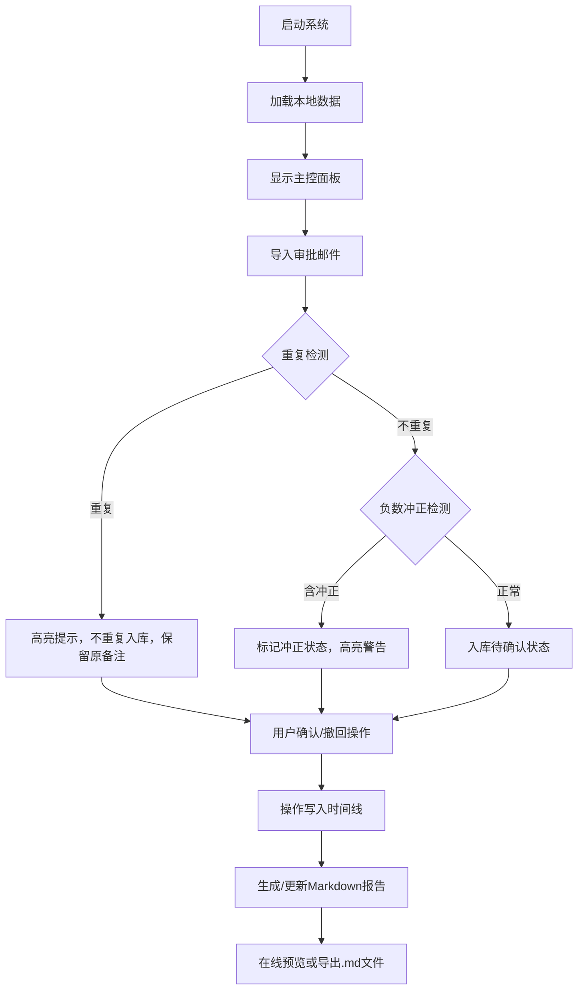

## 1. 产品概述

ABS现金流风险预警系统，用于产品财务人员对ABS现金流审批材料进行导入、核对与风险预警。解决当前依赖手工核对审批邮件、后补凭证改动导致结论反复的问题。

- 目标用户：产品财务岗（如小周）
- 核心价值：统一数据源、材料变更留痕、风险预警可追溯

## 2. 核心功能

### 2.1 用户角色

| 角色 | 注册方式 | 核心权限 |
|------|----------|----------|
| 财务操作员 | 本地直接使用 | 导入数据、确认/撤回记录、导出报告 |

### 2.2 功能模块

1. **主控面板**：数据总览、导入入口、报告入口、操作记录时间线
2. **现金流记录**：列表展示、状态标识、人工备注、负数冲正高亮
3. **审批邮件导入**：分批导入、重复检测、历史版本对比
4. **Markdown报告**：在线预览、一键导出、状态与文件内容同步

### 2.3 页面详情

| 页面名称 | 模块名称 | 功能描述 |
|-----------|-------------|---------------------|
| 主控面板 | 数据摘要 | 显示总记录数、已确认数、待确认数、冲正数、预警数 |
| 主控面板 | 操作时间线 | 按时间倒序展示导入/确认/撤回操作记录 |
| 主控面板 | 快捷操作区 | 导入按钮、重跑按钮、导出报告按钮 |
| 现金流列表 | 记录表格 | 显示批次号、金额、状态、来源邮件、导入时间、备注 |
| 现金流列表 | 状态标记 | 待确认/已确认/已撤回/负数冲正 四种状态标签 |
| 现金流列表 | 行操作 | 单条确认、单条撤回、编辑备注 |
| 导入弹窗 | 文件/文本导入 | 支持粘贴审批邮件文本或上传文件 |
| 导入弹窗 | 冲突提示 | 重复记录高亮、与已有记录差异对比 |
| 报告预览 | Markdown预览 | 实时渲染报告内容，与页面状态一致 |
| 报告预览 | 导出按钮 | 下载.md文件到本地 |

## 3. 核心流程

用户打开系统 → 查看当前数据总览 → 导入审批邮件（分批）→ 系统检测重复/冲正记录 → 用户逐批确认 → 可撤回已确认记录 → 生成Markdown报告 → 导出或在线查看

## 4. 用户界面设计

### 4.1 设计风格

- **主色**：深墨蓝 `#1e3a5f`，传递金融专业感与可信度
- **辅助色**：警告橙 `#e67e22`（冲正/待确认）、危险红 `#c0392b`（异常）、成功绿 `#27ae60`（已确认）、中性灰 `#7f8c8d`（已撤回）
- **按钮风格**：直角微圆角（4px），扁平化，按压有下沉反馈
- **字体**：标题使用"思源宋体"增强稳重感，正文使用"思源黑体"保证可读性
- **布局**：顶部导航 + 左侧状态统计 + 右侧主内容区（卡片式）
- **图标**：Lucide 线性图标，统一 16px/20px 尺寸

### 4.2 页面设计概述

| 页面名称 | 模块名称 | UI Elements |
|-----------|-------------|-------------|
| 主控面板 | 数据摘要 | 4个统计卡片，数字大号加粗，底部小字说明，各自对应状态色左边缘色条 |
| 主控面板 | 操作时间线 | 左侧垂直时间轴，右侧操作卡片，含操作类型、时间、操作人、记录摘要 |
| 现金流列表 | 记录表格 | 斑马纹行，状态列用彩色标签，负数金额红色显示，悬停行出现操作按钮 |
| 导入弹窗 | 冲突提示 | 冲突记录用黄色底纹，左右对比展示已有值与新值 |
| 报告预览 | Markdown预览 | 白色背景卡片，标题层级清晰，表格对齐，状态标签与列表页一致 |

### 4.3 响应性

桌面端优先设计（1280px起），次要信息在窄屏下折叠为可展开区域。触控目标不小于44px。
