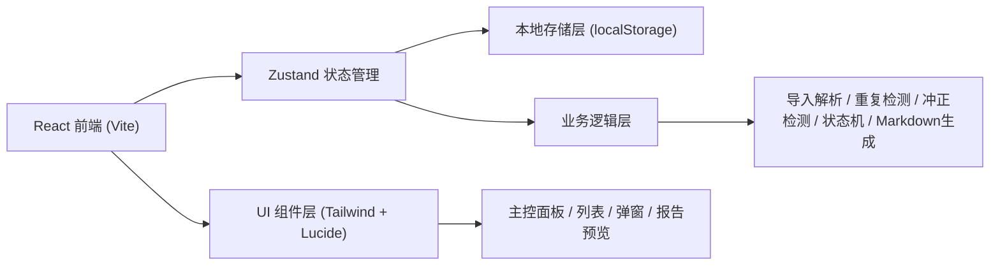
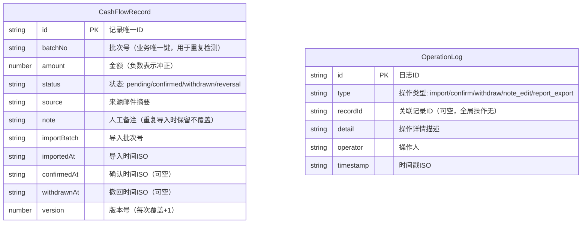

## 1. 架构设计



## 2. 技术描述

- **前端**：React@18 + TypeScript + TailwindCSS@3 + Vite
- **初始化工具**：vite-init（react-ts 模板）
- **状态管理**：Zustand
- **后端**：无（纯前端，localStorage 作为本地数据库）
- **数据存储**：localStorage（JSON 序列化）
- **图标**：lucide-react
- **Markdown渲染**：react-markdown

## 3. 路由定义

| Route | 用途 |
|-------|------|
| / | 主控面板（数据总览 + 现金流列表 + 操作时间线） |
| /report | Markdown报告预览与导出 |

## 4. 数据模型

### 4.1 数据模型定义



### 4.2 本地数据结构（localStorage key）

| Key | 类型 | 说明 |
|-----|------|------|
| abs-cashflow:records | CashFlowRecord[] | 现金流记录数组 |
| abs-cashflow:logs | OperationLog[] | 操作日志数组 |
| abs-cashflow:meta | { lastReportAt, importCounter } | 元数据 |

## 5. 核心业务规则

### 5.1 重复导入检测
- 以 `batchNo` 为业务唯一键
- 新导入记录若 `batchNo` 已存在：**不重复入库**，金额不翻倍
- 已有记录的 `note`（人工备注）**绝不被覆盖**
- 若新金额与原金额不同，写入 OperationLog 记录差异，弹出提示

### 5.2 负数冲正处理
- `amount < 0` 时，自动标记 `status = reversal`
- 列表中红色高亮显示，金额前加「冲正」标签
- 报告中单独列出冲正记录并标注风险提示

### 5.3 状态机
```
pending (待确认) → confirmed (已确认) → withdrawn (已撤回)
                        ↑                    ↓
                        └────────────────────┘
```
- reversal 状态可与 pending/confirmed/withdrawn 叠加显示

### 5.4 Markdown报告一致性
- 报告生成时直接读取 Zustand 状态（即页面当前显示的数据源）
- 状态标签文字/颜色与页面保持一致映射
- 导出前再次校验当前状态快照写入报告头部时间戳
