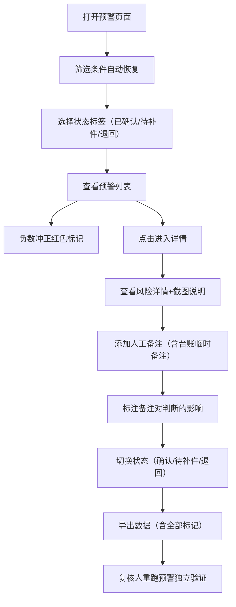

## 1. 产品概述

票据池质押风险预警系统，用于托管对接岗月底复核票据池质押业务的风险预警记录。解决手工核账效率低、人工备注易丢失、负数冲正易混淆、状态分类不清等问题。

- 目标用户：托管对接岗（老许）、复核人、业务台账管理人员
- 核心价值：刷新不丢筛选条件与备注、负数冲正全程标记、三态（已确认/待补件/退回）清晰区分、交付顺畅可独立复核

## 2. 核心功能

### 2.1 用户角色

| 角色 | 核心权限 |
|------|----------|
| 托管对接岗 | 查看预警、添加人工备注、确认/退回记录、导出数据 |
| 复核人 | 独立运行预警、查看所有记录与截图说明、复核状态 |
| 台账管理员 | 临时补充业务台账备注、标注备注对判断的影响 |

### 2.2 功能模块

1. **预警主页面**：筛选区、状态分类标签、预警列表、导出按钮、预警说明
2. **预警详情页**：风险详情、负数冲正标记、人工备注历史、截图说明查看
3. **备注与状态管理**：人工备注（含台账临时备注）、状态流转、备注影响说明
4. **预警重跑与样例**：一键重跑预警、放样例数据、截图说明快速查看

### 2.3 页面详情

| 页面名称 | 模块名称 | 功能描述 |
|-----------|-------------|---------------------|
| 预警主页面 | 筛选区 | 多条件筛选（票据号、客户、日期、负数冲正标记、状态），刷新后筛选条件自动恢复 |
| 预警主页面 | 状态分类标签 | 已确认/待补件/退回 三态切换，各标签显示数量计数 |
| 预警主页面 | 预警列表 | 显示预警记录，含负数冲正红色标记、人工备注摘要、状态徽标 |
| 预警主页面 | 导出功能 | 导出 Excel/CSV，包含负数冲正标记列、状态列、人工备注列 |
| 预警主页面 | 预警说明浮层 | 简洁说明：放样例、重跑、查看截图说明（3件事） |
| 预警详情页 | 风险详情 | 展示预警完整信息，负数冲正显著标识 |
| 预警详情页 | 人工备注区 | 历史备注时间线，含临时台账备注及其对判断的影响说明 |
| 预警详情页 | 截图说明 | 上传/查看业务凭证截图，与记录绑定 |
| 预警详情页 | 状态操作 | 确认/待补件/退回 状态切换，操作留痕 |

## 3. 核心流程

### 3.1 月底复核流程

托管对接岗登录系统 → 打开预警主页面（筛选条件自动恢复上次状态）→ 按已确认/待补件/退回分类查看 → 点击进入详情 → 查看负数冲正标记、人工备注、截图说明 → 补充备注或调整状态 → 导出复核结果

### 3.2 社区公示前临时补备注流程

台账管理员进入详情 → 添加临时业务台账备注 → 标注该备注改变了哪些风险判断 → 保存后备注与预警记录永久绑定

### 3.3 复核人独立复核流程

复核人打开系统 → 点击"重跑预警" → 查看预警说明（放样例/重跑/截图说明）→ 按分类浏览记录 → 如需查看材料直接点击截图说明

## 4. 用户界面设计

### 4.1 设计风格

- **主色调**：深海蓝 (#1e3a5f) 作为主色，体现金融专业感
- **强调色**：警示红 (#dc2626) 用于负数冲正标记、琥珀黄 (#f59e0b) 用于待补件、翠绿 (#10b981) 用于已确认、灰蓝 (#64748b) 用于退回
- **按钮风格**：圆角 6px，轻微阴影，hover 时背景加深
- **字体**：思源黑体（中文）+ JetBrains Mono（数字/票据号），正文 14px，标题 16-18px
- **布局风格**：顶部导航 + 左侧筛选 + 右侧内容区，卡片式列表
- **图标风格**：Lucide 线性图标，尺寸 16-18px

### 4.2 页面设计概要

| 页面名称 | 模块名称 | UI 元素 |
|-----------|-------------|-------------|
| 预警主页面 | 筛选区 | 折叠面板式布局，标签式多条件，条件间 8px 间距，底部"重置/应用"按钮 |
| 预警主页面 | 状态标签栏 | 胶囊式标签，带数量徽标，活跃态深海蓝底白字 |
| 预警主页面 | 预警列表 | 卡片列表，每张卡左侧状态色条，右上角负数冲正红标，右下角操作按钮 |
| 预警主页面 | 预警说明 | 右上角问号图标，点击弹出简洁三列浮层（放样例/重跑/截图说明） |
| 预警详情页 | 顶部信息栏 | 票据号大字号显示，状态徽章，负数冲正醒目横幅 |
| 预警详情页 | 备注时间线 | 左侧竖线时间轴，每条备注含操作人、时间、影响说明标签 |
| 预警详情页 | 截图区 | 缩略图网格，点击放大灯箱查看 |

### 4.3 响应式

桌面端优先设计（1280px+），筛选区左侧固定 280px；平板端筛选区改为顶部折叠；移动端单列布局。

### 4.4 交互动效

- 页面加载：卡片列表 80ms 间隔错峰淡入
- 状态切换：标签切换时内容区 200ms 交叉淡入淡出
- 负数冲正标记：呼吸式红色微光动画（2s 循环）
- 备注添加：新备注从底部滑入并高亮闪烁 1 次
