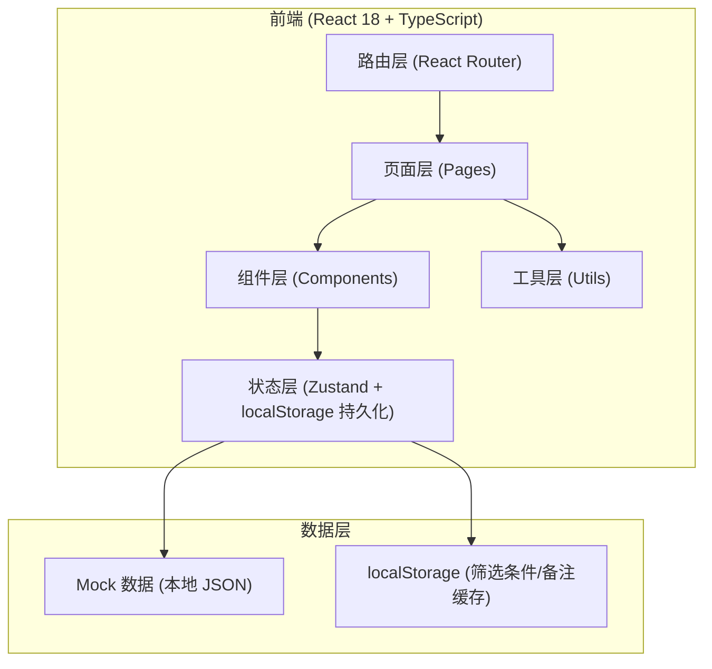

## 1. 架构设计



## 2. 技术选型说明

- **前端框架**：React 18 + TypeScript
- **构建工具**：Vite 5
- **样式方案**：TailwindCSS 3
- **状态管理**：Zustand（轻量，支持中间件做 localStorage 持久化）
- **路由**：React Router DOM 6
- **图标**：Lucide React
- **后端**：无后端，使用本地 Mock 数据模拟
- **数据持久化**：localStorage（保存筛选条件、人工备注、状态变更）

## 3. 路由定义

| 路由 | 用途 |
|-------|---------|
| `/` | 预警主页面（筛选 + 列表 + 状态分类） |
| `/warning/:id` | 预警详情页面 |

## 4. 数据模型

### 4.1 预警记录 (WarningRecord)

```typescript
interface WarningRecord {
  id: string;
  billNo: string;           // 票据号
  customerName: string;     // 客户名称
  amount: number;           // 金额
  isNegativeCorrection: boolean; // 负数冲正标记
  status: 'confirmed' | 'pending' | 'returned'; // 已确认/待补件/退回
  riskType: string;         // 风险类型
  riskLevel: 'high' | 'medium' | 'low';
  createDate: string;       // 预警日期
  confirmDate?: string;     // 确认日期
  operator?: string;        // 操作人
  remarks: Remark[];        // 人工备注列表
  screenshots: Screenshot[]; // 截图说明列表
  description: string;      // 风险描述
}
```

### 4.2 备注 (Remark)

```typescript
interface Remark {
  id: string;
  content: string;          // 备注内容
  author: string;           // 操作人
  createdAt: string;        // 创建时间
  isTemporaryLedger: boolean; // 是否临时台账备注
  judgmentImpact?: string;  // 对判断的影响说明（临时备注必填）
}
```

### 4.3 截图说明 (Screenshot)

```typescript
interface Screenshot {
  id: string;
  url: string;              // 图片地址
  name: string;             // 图片名称
  uploadAt: string;         // 上传时间
  uploadBy: string;         // 上传人
}
```

### 4.4 筛选条件 (FilterCriteria)

```typescript
interface FilterCriteria {
  billNo?: string;          // 票据号
  customerName?: string;    // 客户名称
  dateFrom?: string;        // 开始日期
  dateTo?: string;          // 结束日期
  isNegativeCorrection?: boolean | null; // 负数冲正
  riskLevel?: string;       // 风险等级
  status?: string;          // 状态
}
```

## 5. 状态管理设计

### 5.1 Zustand Store 划分

```typescript
// useWarningStore - 预警数据与操作
{
  warnings: WarningRecord[];
  filters: FilterCriteria;
  activeStatusTab: 'all' | 'confirmed' | 'pending' | 'returned';
  setFilters: (filters: Partial<FilterCriteria>) => void;
  resetFilters: () => void;
  setActiveStatusTab: (tab: string) => void;
  addRemark: (warningId: string, remark: Omit<Remark, 'id' | 'createdAt'>) => void;
  updateStatus: (warningId: string, status: WarningRecord['status']) => void;
  rerunWarnings: () => void;
  loadSampleData: () => void;
  getFilteredWarnings: () => WarningRecord[];
}
```

### 5.2 持久化策略

使用 `zustand/middleware` 的 `persist` 中间件：
- `filters`（筛选条件）→ localStorage key: `warning_filters`
- `activeStatusTab` → localStorage key: `warning_status_tab`
- `warnings`（含备注和状态变更）→ localStorage key: `warning_records`

## 6. 目录结构

```
src/
├── components/
│   ├── FilterPanel.tsx        # 筛选面板
│   ├── StatusTabs.tsx         # 状态分类标签
│   ├── WarningCard.tsx        # 预警卡片
│   ├── WarningList.tsx        # 预警列表
│   ├── RemarkTimeline.tsx     # 备注时间线
│   ├── ScreenshotGrid.tsx     # 截图网格
│   ├── HelpModal.tsx          # 预警说明浮层
│   └── StatusBadge.tsx        # 状态徽章
├── pages/
│   ├── WarningHome.tsx        # 预警主页面
│   └── WarningDetail.tsx      # 预警详情页
├── store/
│   └── useWarningStore.ts     # Zustand 状态管理
├── types/
│   └── index.ts               # TypeScript 类型定义
├── utils/
│   ├── export.ts              # 导出工具（CSV）
│   └── mockData.ts            # Mock 数据生成
├── App.tsx
├── main.tsx
└── index.css
```

## 7. 关键实现要点

1. **刷新页面状态同步**：Zustand persist 中间件自动保存/恢复筛选条件、备注、状态
2. **负数冲正标记**：数据模型 `isNegativeCorrection` 字段，列表/详情/导出三处统一渲染红色标记
3. **三态分类**：`status` 字段 + StatusTabs 组件，列表按 activeStatusTab 过滤
4. **临时台账备注影响说明**：Remark 模型增加 `isTemporaryLedger` 和 `judgmentImpact` 字段
5. **预警说明简洁化**：HelpModal 仅展示 3 项：放样例按钮、重跑按钮、截图说明跳转
6. **导出完整性**：export 工具将负数冲正、状态、备注全部写入导出文件
