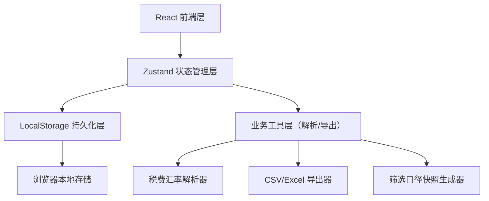
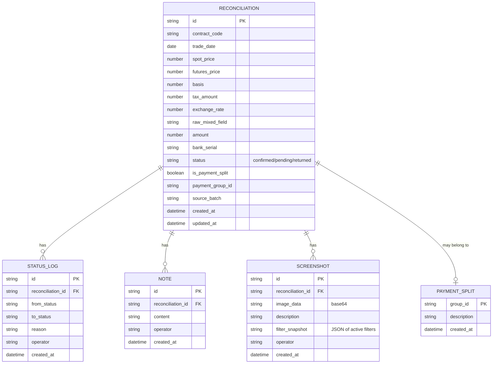

## 1. 架构设计



纯前端架构，无需后端服务。所有数据通过 Zustand 管理，自动同步到 LocalStorage 实现重启后数据一致性。

## 2. 技术描述

- **前端框架**：React@18 + TypeScript
- **构建工具**：Vite@5
- **样式方案**：Tailwind CSS@3
- **状态管理**：Zustand@4
- **路由**：React Router DOM@6
- **图标**：Lucide React
- **文件解析**：PapaParse（CSV）、SheetJS/xlsx（Excel）
- **数据持久化**：LocalStorage + Zustand persist 中间件

## 3. 路由定义

| 路由 | 用途 |
|------|------|
| `/` | 对账列表页（首页） |
| `/reconciliation/:id` | 对账详情页 |
| `/import` | 材料导入页 |
| `/export` | 导出中心 |

## 4. 数据模型

### 4.1 ER 图



### 4.2 TypeScript 类型定义

```typescript
type ReconciliationStatus = 'confirmed' | 'pending' | 'returned';

interface Reconciliation {
  id: string;
  contractCode: string;
  tradeDate: string;
  spotPrice: number;
  futuresPrice: number;
  basis: number;
  taxAmount: number | null;
  exchangeRate: number | null;
  rawMixedField: string;
  amount: number;
  bankSerial: string;
  status: ReconciliationStatus;
  isPaymentSplit: boolean;
  paymentGroupId: string | null;
  sourceBatch: string;
  createdAt: string;
  updatedAt: string;
}

interface StatusLog {
  id: string;
  reconciliationId: string;
  fromStatus: ReconciliationStatus | null;
  toStatus: ReconciliationStatus;
  reason: string;
  operator: string;
  createdAt: string;
}

interface Note {
  id: string;
  reconciliationId: string;
  content: string;
  operator: string;
  createdAt: string;
}

interface Screenshot {
  id: string;
  reconciliationId: string;
  imageData: string;
  description: string;
  filterSnapshot: Record<string, unknown>;
  operator: string;
  createdAt: string;
}

interface FilterState {
  status: ReconciliationStatus[];
  dateFrom: string | null;
  dateTo: string | null;
  contractCode: string;
  isPaymentSplit: boolean | null;
}
```

## 5. 核心模块设计

### 5.1 税费汇率解析器

```
输入: 混列字符串 (如: "税费123.45/汇率7.2345" 或 "TAX:88.50 RATE:6.9876")
输出: { taxAmount: number | null, exchangeRate: number | null }
策略: 正则多模式匹配，兼容常见银行格式，匹配失败返回 null 并标记需人工确认
```

### 5.2 Zustand Store 结构

```
store/
  ├── useReconciliationStore  (对账数据 CRUD + 状态流转 + 持久化)
  ├── useFilterStore          (筛选条件管理 + 快照生成)
  └── useImportStore          (导入流程状态 + 解析预览)
```

### 5.3 持久化策略

- Zustand persist 中间件自动将 store 数据写入 LocalStorage
- Key 前缀：`futures-basis-recon::`
- 每次变更触发持久化，页面加载时自动恢复
- 截图 base64 数据单独分片存储，避免 LocalStorage 超限
