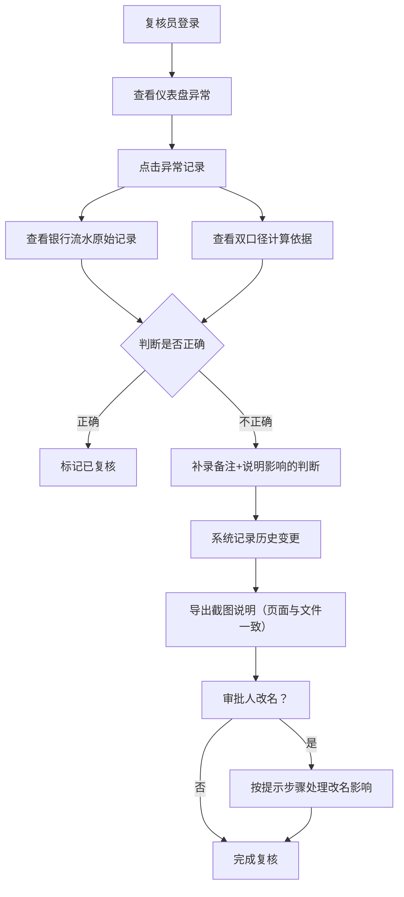

## 1. 产品概述

供应链预付款口径对账系统，为风控复核人员解决银行流水记录被两个口径重复认领的问题。系统以复核为核心，提供异常定位、口径追溯、备注补录、历史留痕与导出说明的一站式工作台。

- 目标用户：风控复核岗（小林等）、审批人
- 核心价值：消除重复认领、每笔判断可追溯、变更有记录、导出与页面一致

## 2. 核心功能

### 2.1 用户角色

| 角色 | 登录方式 | 核心权限 |
|------|----------|----------|
| 复核员 | 工号登录 | 查看对账、补录备注、查看历史、导出说明 |
| 审批人 | 工号登录 | 复核确认、改名同步、查看对账结果 |

### 2.2 功能模块

1. **对账仪表盘**：异常统计卡片、口径分布图表、异常流水列表
2. **银行流水明细**：原始流水、两个口径的认领记录、冲突标记
3. **口径计算说明**：当前判断依据、变更对比、影响范围
4. **备注补录**：临时补录备注、说明改变了哪些判断
5. **历史变更记录**：旧材料、新备注、改判原因、时间线
6. **导出说明**：页面截图+状态文字说明，与页面状态一致
7. **审批人改名提示**：可操作的下一步指引

### 2.3 页面详情

| 页面名称 | 模块名称 | 功能描述 |
|----------|----------|----------|
| 对账仪表盘 | 统计卡片 | 异常笔数、涉及金额、双口径认领笔数 |
| 对账仪表盘 | 口径分布图 | 饼图展示正常/单口径/双口径认领占比 |
| 对账仪表盘 | 异常流水列表 | 支持点击异常跳转到对应流水和口径 |
| 流水详情页 | 原始流水信息 | 银行流水号、金额、时间、对手方 |
| 流水详情页 | 双口径认领对比 | 口径A判断、口径B判断、冲突点高亮 |
| 流水详情页 | 口径计算说明 | 规则命中详情、可追溯到每条判断逻辑 |
| 流水详情页 | 备注补录区 | 输入备注、标记影响的判断项、保存 |
| 流水详情页 | 历史变更时间线 | 旧结论→新备注→改判原因，完整链路 |
| 流水详情页 | 改名提示区 | 当审批人改名时，显示"下一步怎么处理"的操作指引 |
| 导出弹窗 | 预览区 | 实时预览页面状态与导出说明文字一致性 |
| 导出弹窗 | 下载按钮 | 生成含截图和文字说明的文件 |

## 3. 核心流程

复核员进入系统 → 查看仪表盘异常 → 点击某笔异常 → 系统同时展示银行流水原始记录和两个口径的计算依据 → 如判断有误，补录备注并说明改变了哪些判断 → 系统记录历史变更（旧材料+新备注+改判原因） → 如需汇报，导出截图说明（页面状态与文件一致） → 遇到审批人改名，按提示步骤处理

## 4. 用户界面设计

### 4.1 设计风格

- **主色调**：深海军蓝 `#0B2545`（专业风控感），辅助色为琥珀橙 `#E8833A`（异常警示）、翡翠绿 `#2E933C`（正常通过）
- **按钮风格**：直角切角微边框，2px 圆角，按下有轻微下沉效果
- **字体**：标题用 Noto Serif SC（稳重衬线），正文用 JetBrains Mono（数据对齐清晰）
- **布局风格**：左右分栏工作台，左侧导航+主内容区，卡片式信息块
- **图标**：lucide-react，线性风格，异常用实心三角标记

### 4.2 页面设计概览

| 页面名称 | 模块名称 | UI 元素 |
|----------|----------|---------|
| 对账仪表盘 | 顶部标题区 | 系统名+日期+用户角色标签，左侧有回纹装饰线 |
| 对账仪表盘 | 统计卡片 | 三张横排卡片，数字大号衬线字体，底部有变化趋势小箭头 |
| 对账仪表盘 | 图表区 | 左侧饼图（口径分布），右侧异常流水列表（可点击） |
| 流水详情页 | 顶部面包屑 | 仪表盘 > 流水详情，显示流水号 |
| 流水详情页 | 双栏对比 | 左：银行流水原始信息，右：双口径计算依据并排对比 |
| 流水详情页 | 冲突高亮 | 黄色背景+左侧琥珀色竖条标记冲突项 |
| 流水详情页 | 备注补录 | 输入框+影响判断多选+保存按钮 |
| 流水详情页 | 历史时间线 | 左侧竖线时间轴，每条记录含旧结论/新备注/改判原因 |
| 流水详情页 | 改名提示 | 蓝色信息卡，含步骤编号和复选框确认 |
| 导出弹窗 | 预览 | 顶部实时缩略图，底部状态文字，下载按钮 |

### 4.3 响应式

桌面端优先设计（1280px 起），小屏下图表与列表上下堆叠，双栏对比改为上下排布，保留核心功能操作区域。

### 4.4 动效细节

- 页面加载：卡片从下往上依次浮现（stagger 100ms）
- 异常点击：高亮边框脉冲闪烁 3 次后跳转
- 备注保存：成功打勾图标旋转出现
- 历史记录展开：时间线节点展开有下滑过渡
