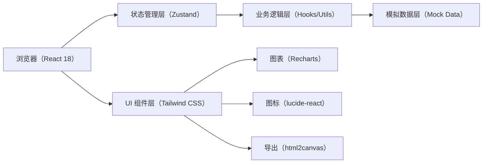
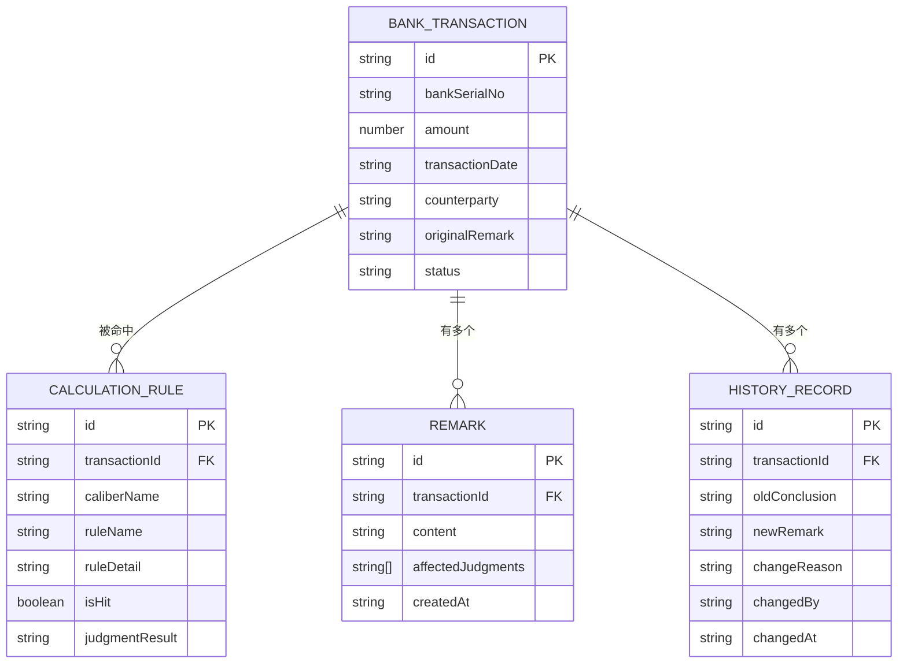

## 1. 架构设计



## 2. 技术说明

- **前端**：React@18 + TypeScript + tailwindcss@3 + vite
- **初始化工具**：vite-init
- **后端**：无后端，全部使用 Mock 数据模拟
- **状态管理**：zustand
- **图表**：recharts
- **图标**：lucide-react
- **导出截图**：html2canvas
- **路由**：react-router-dom

## 3. 路由定义

| 路由 | 用途 |
|------|------|
| / | 对账仪表盘首页（异常统计+图表+异常列表） |
| /transaction/:id | 流水详情页（原始流水+双口径对比+备注+历史+改名提示） |

## 4. 数据模型

### 4.1 数据模型定义



### 4.2 数据结构定义（TypeScript）

```typescript
type CaliberName = 'supply_chain_prepayment' | 'operating_expense';

interface BankTransaction {
  id: string;
  bankSerialNo: string;
  amount: number;
  transactionDate: string;
  counterparty: string;
  originalRemark: string;
  supplementRemark?: string;
  status: 'normal' | 'single_caliber' | 'double_caliber';
  approverName: string;
  approverNameChanged?: boolean;
}

interface CalculationRule {
  id: string;
  transactionId: string;
  caliberName: CaliberName;
  caliberDisplayName: string;
  ruleName: string;
  ruleDetail: string;
  isHit: boolean;
  judgmentResult: 'matched' | 'unmatched';
}

interface RemarkRecord {
  id: string;
  transactionId: string;
  content: string;
  affectedJudgments: string[];
  createdAt: string;
}

interface HistoryRecord {
  id: string;
  transactionId: string;
  oldConclusion: string;
  newRemark: string;
  changeReason: string;
  changedBy: string;
  changedAt: string;
  oldMaterials?: string[];
}
```

## 5. 模块划分

| 模块 | 路径 | 职责 |
|------|------|------|
| 类型定义 | src/types/index.ts | 所有 TypeScript 类型 |
| Mock 数据 | src/data/mockData.ts | 银行流水、规则、历史等模拟数据 |
| 状态管理 | src/store/useReconciliationStore.ts | 全局对账状态 |
| 对账逻辑 | src/utils/reconciliation.ts | 双口径判断、冲突检测 |
| 导出工具 | src/utils/export.ts | 截图生成、文件导出 |
| 组件-仪表盘 | src/components/Dashboard/*.tsx | 统计卡片、图表、异常列表 |
| 组件-详情 | src/components/Transaction/*.tsx | 流水信息、口径对比、备注、历史、改名提示 |
| 页面-仪表盘 | src/pages/Dashboard.tsx | 首页整合 |
| 页面-详情 | src/pages/TransactionDetail.tsx | 详情页整合 |
| 布局 | src/components/Layout/AppLayout.tsx | 全局布局框架 |
