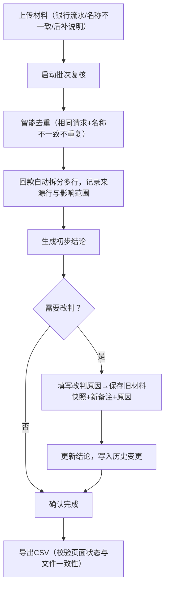

## 1. 产品概述

港股通税费批次复核系统面向资金主管（阿敏等），解决税费复核材料零散、后补凭证频繁改判结论、回款拆分依赖人工、历史变更无迹可寻等痛点。以银行流水为主线串联材料，实现智能去重、回款自动拆分、变更历史全链路追溯，确保导出数据与页面状态严格一致。

- 核心价值：减少人工核对成本80%，杜绝漏判、重判，所有复核结论可审计回溯
- 目标用户：资金主管、复核专员、财务审计

## 2. 核心功能

### 2.1 用户角色

| 角色 | 登录方式 | 核心权限 |
|------|---------|---------|
| 资金主管 | 企业账号 | 启动/重跑批次、查看明细、导出CSV、改判结论 |
| 复核专员 | 企业账号 | 上传材料、补录备注、查看历史 |
| 审计人员 | 企业账号 | 只读查看所有批次与历史 |

### 2.2 功能模块

1. **批次列表页**：批次卡片、状态筛选、启动复核、重跑复核入口
2. **批次详情页**：材料区（银行流水主线+名称不一致+后补说明）、回款拆分明细、影响范围追溯、结论区
3. **历史变更页**：旧材料快照、新备注、改判原因时间线
4. **CSV导出**：页面状态与文件内容一致性校验后导出

### 2.3 页面详情

| 页面名称 | 模块名称 | 功能描述 |
|---------|---------|----------|
| 批次列表页 | 批次卡片网格 | 显示批次号、日期、状态（待启动/复核中/已完成/已改判）、材料数、结论摘要 |
| 批次列表页 | 顶部筛选条 | 按状态、日期范围、批次号搜索；启动/重跑按钮 |
| 批次详情页 | 材料时间线 | 银行流水为主线（粗条），名称不一致材料（橙色标），后补说明（绿色标）按时间排列，支持点击展开 |
| 批次详情页 | 回款拆分明细 | 自动拆分多行，每行显示来源行号、影响范围、金额、税费、状态 |
| 批次详情页 | 结论操作区 | 当前结论、改判输入框（改判原因必填）、保存按钮 |
| 历史变更页 | 变更时间线 | 每次变更显示旧材料快照、新备注、改判原因、操作人、时间 |
| 通用 | CSV导出 | 导出前校验页面状态与文件内容字段映射，下载后自动比对一致性 |

## 3. 核心流程

复核专员上传银行流水、名称不一致材料、后补说明，资金主管启动批次复核；系统自动去重（相同请求重复提交时名称不一致材料不重复计数）、拆分回款多行并标记来源行与影响范围；资金主管查看结论，如需改判填写改判原因后系统自动记录旧材料快照与变更历史；确认完成后导出CSV明细，确保页面状态与文件内容严格一致。

## 4. 用户界面设计

### 4.1 设计风格

- **主色**：深蓝 `#0B3D91`（金融专业感），辅色：琥珀橙 `#F59E0B`（标记名称不一致）、翠绿 `#10B981`（标记后补材料）
- **按钮风格**：圆角6px，主按钮深蓝底白字，悬停加深10%；危险操作（改判）红框白底
- **字体**：标题 Noto Serif SC 600，正文 Inter 400/500，等宽数字 JetBrains Mono
- **布局风格**：卡片式分区+左侧批次列表+右侧详情双栏，材料时间线垂直滚动
- **图标**：lucide-react 线性图标，银行流水=receipt，名称不一致=alert-triangle，后补说明=file-plus-2

### 4.2 页面设计概览

| 页面名称 | 模块名称 | UI元素 |
|---------|---------|--------|
| 批次列表页 | 批次卡片 | 深蓝边框卡片，状态角标，hover 阴影加深 0→4px 150ms 过渡 |
| 批次详情页 | 材料时间线 | 左侧深蓝主线（银行流水）+ 橙色圆点（名称不一致）+ 绿色圆点（后补说明），展开动画 max-height 0→500px 200ms |
| 批次详情页 | 回款拆分明细表 | 斑马纹 `zinc-50`，来源行号列 JetBrains Mono，影响范围列蓝底白字标签 |
| 历史变更页 | 变更卡片 | 时间线左侧竖线，卡片进入时 translateY(20px)→0 + opacity 0→1 250ms 错峰动画 |
| 通用 | CSV导出按钮 | 按钮含下载图标，点击后显示校验进度条（绿条从左到右），完成后弹窗"已校验一致性" |

### 4.3 响应式

桌面优先（1440px），1024px 以下批次列表改为顶部横向滚动条，768px 以下详情页单栏堆叠，回款表格支持横向滑动。

### 4.4 3D场景指引

本产品不涉及3D场景。
