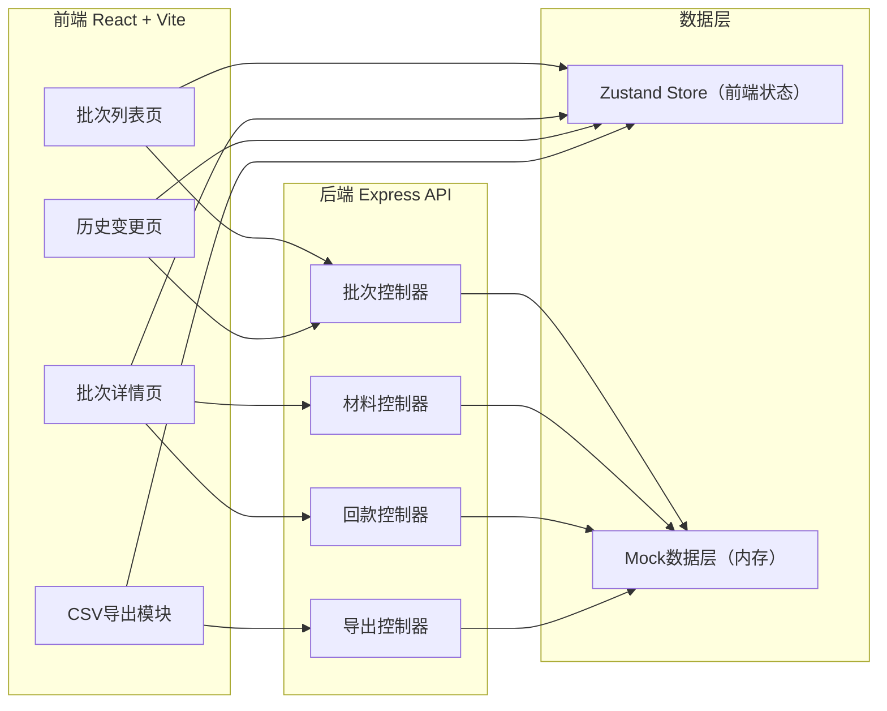
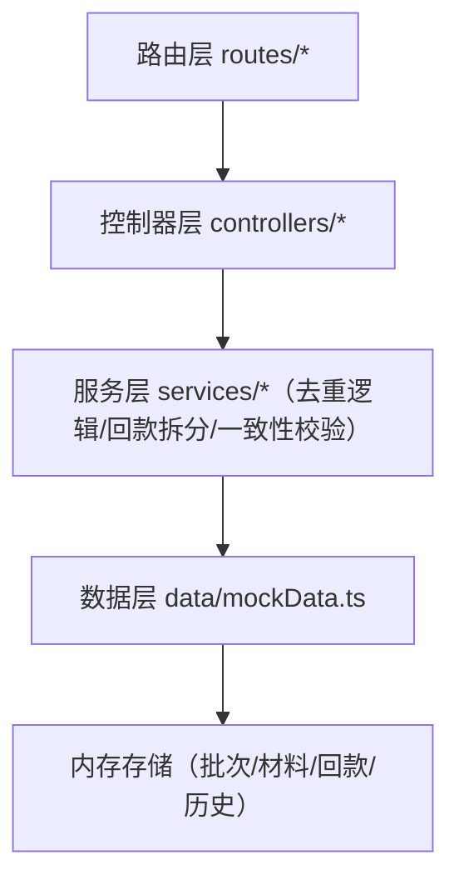
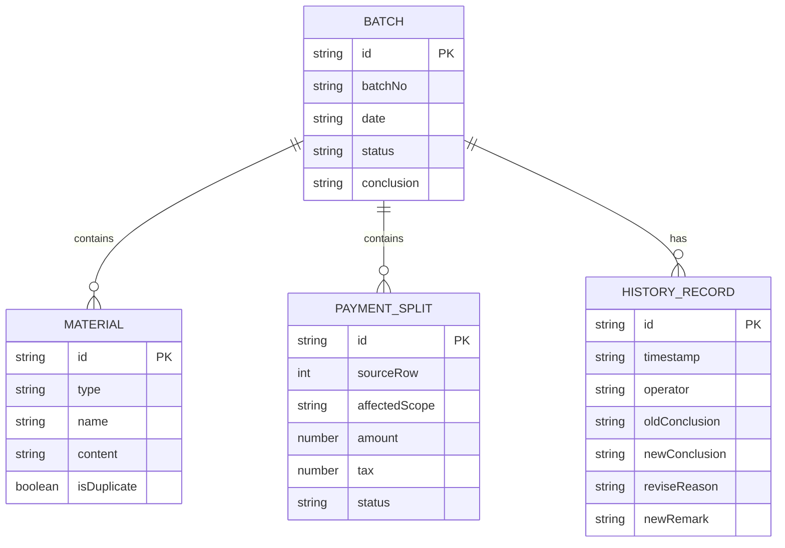

## 1. 架构设计



## 2. 技术描述

- **前端**：React@18 + TypeScript + tailwindcss@3 + Vite + zustand + lucide-react + react-router-dom
- **初始化工具**：vite-init（react-express-ts 模板）
- **后端**：Express@4 + TypeScript
- **数据库**：无独立数据库，使用内存 Mock 数据（模拟银行流水、材料、回款拆分、历史变更等业务数据）
- **状态管理**：zustand 管理批次列表、当前批次详情、筛选条件、导出进度
- **图标库**：lucide-react

## 3. 路由定义

| 路由 | 用途 |
|------|------|
| `/` | 批次列表页（默认页） |
| `/batch/:id` | 批次详情页（材料时间线、回款拆分、结论操作） |
| `/batch/:id/history` | 历史变更页（旧材料快照、改判原因时间线） |
| `/api/batches` | 获取所有批次列表 |
| `/api/batches/:id` | 获取单个批次详情 |
| `/api/batches/:id/start` | 启动批次复核 |
| `/api/batches/:id/rerun` | 重跑批次复核 |
| `/api/batches/:id/materials` | 上传/获取批次材料 |
| `/api/batches/:id/payments` | 获取回款拆分明细 |
| `/api/batches/:id/conclusion` | 更新复核结论（含改判） |
| `/api/batches/:id/history` | 获取历史变更记录 |
| `/api/batches/:id/export` | 导出CSV明细（含一致性校验） |

## 4. API 定义

```typescript
// 共享类型（shared/types.ts）
export type BatchStatus = 'pending' | 'running' | 'completed' | 'revised';
export type MaterialType = 'bank_flow' | 'name_mismatch' | 'supplementary';
export type PaymentStatus = 'matched' | 'unmatched' | 'revised';

export interface Material {
  id: string;
  type: MaterialType;
  name: string;
  uploadedAt: string;
  content: string;
  isDuplicate?: boolean;
}

export interface PaymentSplit {
  id: string;
  sourceRow: number;
  affectedScope: string[];
  amount: number;
  tax: number;
  status: PaymentStatus;
  remark?: string;
}

export interface HistoryRecord {
  id: string;
  timestamp: string;
  operator: string;
  oldMaterials: Material[];
  newRemark: string;
  reviseReason: string;
  oldConclusion: string;
  newConclusion: string;
}

export interface Batch {
  id: string;
  batchNo: string;
  date: string;
  status: BatchStatus;
  materials: Material[];
  payments: PaymentSplit[];
  conclusion: string;
  history: HistoryRecord[];
  materialCount: number;
  conclusionSummary: string;
}

// 请求/响应
export interface StartBatchReq { force?: boolean; }
export interface ReviseConclusionReq {
  newConclusion: string;
  reviseReason: string;
  newRemark?: string;
}
export interface ExportCSVRes {
  filename: string;
  content: string; // base64
  consistencyVerified: boolean;
}
```

## 5. 服务端架构图



核心服务：
- `DedupService`：相同请求重复提交时，基于材料名称哈希去重，名称不一致材料即使重复也不计入两份
- `PaymentSplitService`：回款按规则拆分成多行，记录 sourceRow 与 affectedScope
- `HistoryService`：改判时自动快照旧材料、写入新备注与改判原因
- `ExportService`：CSV 导出前校验页面 status 字段与文件中 status 列，确保一一对应

## 6. 数据模型

### 6.1 数据模型定义



### 6.2 初始化 Mock 数据

内存初始化 3 个批次：
- `BATCH-2026-001`：已完成，含银行流水1条、名称不一致材料1条、后补说明1条，回款拆分为3行，无改判历史
- `BATCH-2026-002`：已改判，含2次历史变更，回款拆分为5行（含来源行标记）
- `BATCH-2026-003`：待启动，材料齐全未复核

所有数据使用真实感的金额（港股通税费：印花税0.1%、交易费0.005%、结算费0.002%），回款拆分来源行号随机，影响范围如 `["T+0结算", "T+1交收"]`。
