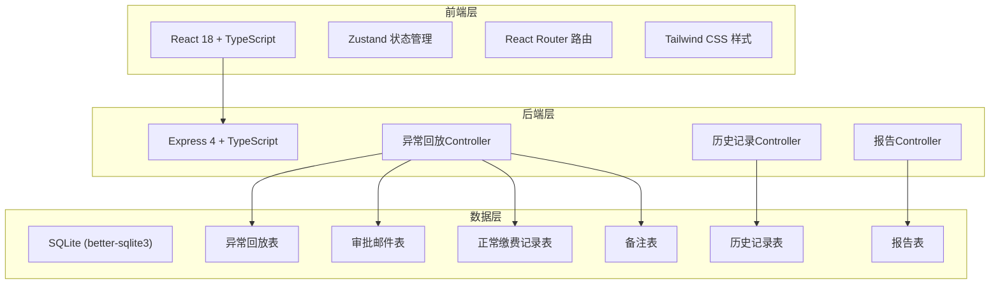
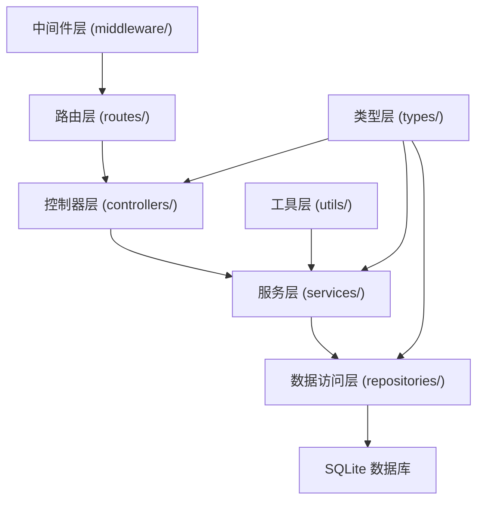
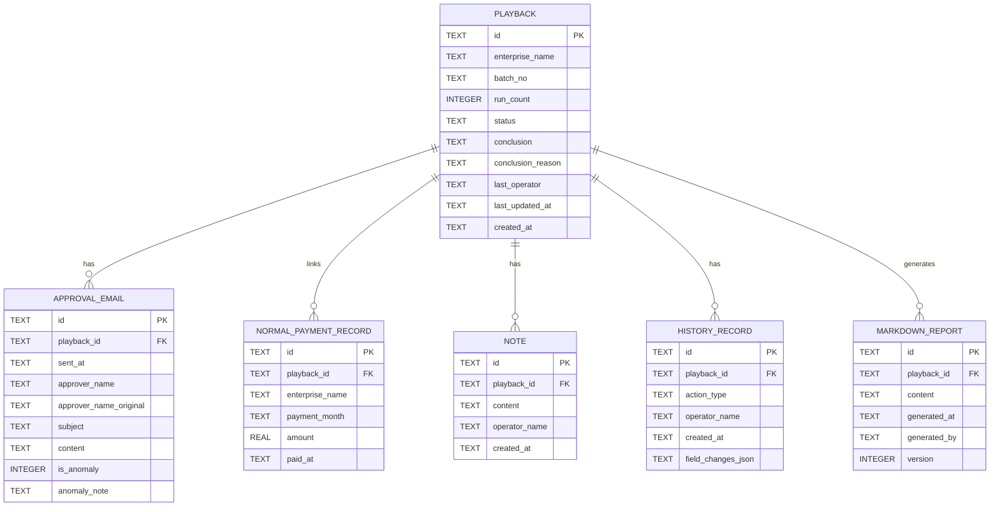

## 1. 架构设计



## 2. 技术描述
- 前端：React@18 + TypeScript + Vite + TailwindCSS@3 + Zustand + lucide-react + react-router-dom
- 后端：Express@4 + TypeScript + better-sqlite3
- 数据库：SQLite（文件存储，无需额外服务）
- 初始化工具：vite-init（react-express-ts 模板）

## 3. 路由定义
| 路由 | 用途 |
|------|------|
| / | 异常回放列表页 |
| /playback/:id | 异常回放详情页 |

## 4. API 定义

### 4.1 类型定义

```typescript
// 共享类型定义
export type PlaybackStatus = 'pending' | 'rejudged' | 'confirmed';
export type ConclusionType = 'normal' | 'abnormal' | 'pending_review';
export type HistoryActionType = 'create' | 'rejudge' | 'add_note' | 'confirm' | 'run_batch';

export interface ApprovalEmail {
  id: string;
  playbackId: string;
  sentAt: string;
  approverName: string;
  approverNameOriginal?: string; // 用于审批人改名场景
  subject: string;
  content: string;
  isAnomaly: boolean; // 是否为异常材料（如改名）
  anomalyNote?: string;
}

export interface NormalPaymentRecord {
  id: string;
  playbackId: string;
  enterpriseName: string;
  paymentMonth: string;
  amount: number;
  paidAt: string;
}

export interface Note {
  id: string;
  playbackId: string;
  content: string;
  operatorName: string;
  createdAt: string;
}

export interface HistoryRecord {
  id: string;
  playbackId: string;
  actionType: HistoryActionType;
  operatorName: string;
  createdAt: string;
  fieldChanges: Array<{
    field: string;
    oldValue: string | null;
    newValue: string | null;
  }>;
}

export interface MarkdownReport {
  id: string;
  playbackId: string;
  content: string;
  generatedAt: string;
  generatedBy: string;
  version: number;
}

export interface Playback {
  id: string;
  enterpriseName: string;
  batchNo: string;
  runCount: number;
  status: PlaybackStatus;
  conclusion: ConclusionType;
  conclusionReason: string;
  lastOperator: string;
  lastUpdatedAt: string;
  createdAt: string;
  emails: ApprovalEmail[];
  normalRecords: NormalPaymentRecord[];
  notes: Note[];
  history: HistoryRecord[];
  reports: MarkdownReport[];
}
```

### 4.2 接口列表

| 方法 | 路径 | 用途 | 请求/响应 |
|------|------|------|----------|
| GET | /api/playbacks | 列表查询（支持筛选、搜索） | query: status, keyword, page, pageSize → { list, total } |
| GET | /api/playbacks/:id | 获取单条详情（含email、备注、历史、报告） | → Playback |
| PUT | /api/playbacks/:id/rejudge | 改判 | body: { conclusion, reason, operatorName } → Playback |
| POST | /api/playbacks/:id/notes | 追加备注 | body: { content, operatorName } → Note |
| GET | /api/playbacks/:id/history | 获取历史记录 | → HistoryRecord[] |
| POST | /api/playbacks/:id/reports | 生成/写回Markdown报告 | body: { operatorName } → MarkdownReport |
| GET | /api/playbacks/:id/reports/:reportId | 下载报告 | → 文件流 |
| PUT | /api/playbacks/:id/confirm | 人工确认 | body: { operatorName } → Playback |

## 5. 服务端架构图



## 6. 数据模型

### 6.1 ER 图



### 6.2 初始化数据（测试场景）

预置2条回放记录用于验证：
1. **记录A（审批人改名场景）**：企业"华东机械厂"，批次 BJ20260601，包含3封审批邮件，其中第2封审批人从"王建国"改名为"王建国（高级经理）"，标记为异常材料。跑批1次，状态待处理。
2. **记录B（重复跑批+备注场景）**：企业"南海物流集团"，批次 GZ20260602，跑批2次，已追加1条备注，状态已改判。包含4封审批邮件+1条关联正常缴费记录。
