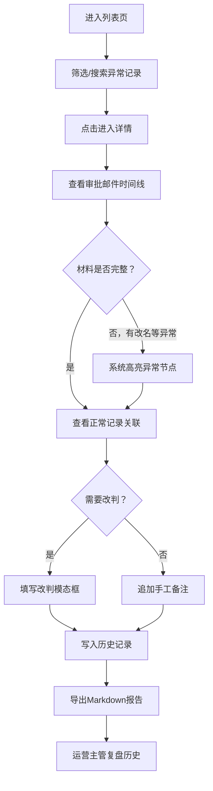

## 1. 产品概述
企业年金缴费异常回放系统，面向产品财务岗处理碎片化的年金缴费异常审批材料。将断续的审批邮件、手工备注、正常缴费记录与最终结论串联成可追溯的完整链路，支持改判、历史审计与Markdown报告导出。

- 目标用户：产品财务（小周）、运营主管
- 核心价值：解决审批邮件硬拼、手工备注不敢删、历史变化说不清的痛点

## 2. 核心功能

### 2.1 用户角色
| 角色 | 登录方式 | 核心权限 |
|------|----------|----------|
| 产品财务 | 模拟登录 | 查看列表/详情、改判、追加备注、导出报告 |
| 运营主管 | 模拟登录 | 查看列表/详情/历史、复盘确认 |

### 2.2 功能模块
1. **异常回放列表页**：分页列表、状态筛选、搜索、跑批标识
2. **异常详情页**：审批邮件时间线、正常缴费记录关联、最终结论展示、手工备注区
3. **改判模态框**：选择新结论、填写改判理由
4. **历史面板**：全量变更审计（创建/改判/备注/确认）、操作人、时间戳、前后值对比
5. **Markdown报告导出**：真实写回后端、可下载、与历史一致

### 2.3 页面详情
| 页面名称 | 模块名称 | 功能描述 |
|----------|----------|----------|
| 异常回放列表页 | 筛选栏 | 状态筛选（待处理/已改判/已确认/全部）、批次号搜索、跑批次数标识 |
| 异常回放列表页 | 数据表格 | 企业名称、批次号、状态标签、跑批次数、最后操作人、最后更新时间、操作列 |
| 异常详情页 | 头部信息卡 | 企业基本信息、批次号、当前状态、最后结论 |
| 异常详情页 | 审批邮件时间线 | 按时间倒序展示审批邮件碎片、支持审批人改名高亮提示、邮件原文折叠/展开 |
| 异常详情页 | 正常记录关联区 | 展示关联的正常缴费记录、可跳转对比 |
| 异常详情页 | 手工备注区 | 追加备注（不可删除历史）、展示全部备注带操作人时间 |
| 异常详情页 | 改判按钮 | 唤起改判模态框 |
| 异常详情页 | 历史侧边栏 | 点击展开全量变更历史 |
| 异常详情页 | 导出报告按钮 | 生成Markdown报告并下载 |
| 改判模态框 | 表单 | 新结论下拉、改判理由文本域、提交/取消 |
| 历史面板 | 时间线 | 每次变更的操作类型、操作人、时间、前后字段值对比diff |

## 3. 核心流程
产品财务从列表进入详情页，查看审批邮件时间线和关联的正常缴费记录。若遇到审批人改名等乱材料，系统在时间线中高亮异常。财务可改判结论、追加备注，所有操作写入历史。导出Markdown报告时，系统从后端读取最新状态与历史并生成文件。运营主管换班前复盘时查看历史面板，解释每次变更。

## 4. 用户界面设计

### 4.1 设计风格
- **主色调**：深海蓝 `#0F2A4A`（专业、金融信赖感）
- **辅色调**：琥珀金 `#D4A24C`（状态高亮、重点操作）
- **强调色**：警示红 `#C0392B`（异常）、确认绿 `#27AE60`（正常）
- **中性色**：石板灰系列 `#1a1a2e` ~ `#F5F6FA`
- **按钮风格**：直角微圆（2px圆角）、32px高度、细边框、hover时有轻微上浮
- **字体**：标题用 Lora（衬线、财务质感），正文用 JetBrains Mono（等宽、数据对齐）
- **布局风格**：左侧导航 + 主内容区，卡片式布局，细分割线，大量留白
- **图标**：Lucide 线性图标，统一 16px/18px

### 4.2 页面设计概览
| 页面名称 | 模块名称 | UI 元素 |
|----------|----------|---------|
| 异常回放列表页 | 筛选栏 | 深色背景条、下拉筛选器圆角2px、搜索框左侧放大镜图标 |
| 异常回放列表页 | 数据表格 | 表头深海蓝底白字、斑马行、状态标签pill形、hover行高亮琥珀金左边框 |
| 异常详情页 | 头部信息卡 | 浅灰卡片、企业名Lora 24px、状态标签大号、右侧导出按钮琥珀金 |
| 异常详情页 | 审批邮件时间线 | 左侧竖线节点、节点圆形图标、异常节点红圈脉冲动画、邮件卡片折叠展开 |
| 异常详情页 | 手工备注区 | 每条备注独立卡片带阴影、操作人名字琥珀金、追加按钮固定底部 |
| 历史面板 | 时间线 | 右侧抽屉滑入、每次变更前后值diff用绿红底色对比 |

### 4.3 响应式
桌面端优先（1440px基准），主内容区最小宽度1024px。历史面板和改判模态框使用固定宽度抽屉/弹窗，不做移动端适配。

### 4.4 动效
- 页面加载：列表行逐个淡入上移（stagger 50ms）
- 异常节点：红圈呼吸脉冲动画（2s循环）
- 抽屉滑入：右侧translateX 300ms ease-out
- 按钮hover：0.2s过渡，背景色变化+轻微translateY(-1px)+阴影
