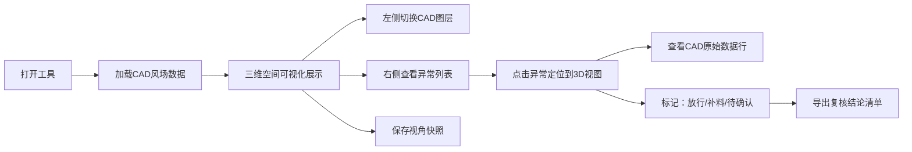

## 1. 产品概述

滨海步道风场空间复核工具，面向运维工程师老何及现场同事，解决CAD图层数据隐藏在二维表中缺乏空间感的问题。工具以三维空间可视化方式呈现风场测点分布，保留CAD原始图层来源，高亮异常对象并支持追溯。

- 目标用户：运维工程师老何、项目经理、现场施工人员
- 核心价值：将CAD二维表数据转化为可交互的三维空间视图，异常一眼可见，来源可追溯
- 输出形式：明确告诉老何"哪条材料该补、哪条可以放行"

## 2. 核心功能

### 2.1 用户角色

| 角色 | 场景 | 核心需求 |
|------|------|----------|
| 运维工程师老何 | 复核数据、判断放行/补料 | 清晰看到异常、知道原始来源、可直接输出结论 |
| 项目经理 | 检查整体质量、截图汇报 | 快速定位异常、保存视图条件、多视角截图 |
| 现场同事 | 对照空间位置找问题 | 不用看CAD图层也能理解空间分布 |

### 2.2 功能模块

1. **三维空间视图**：滨海步道沿线风场测点的三维可视化展示
2. **图层管理面板**：CAD原始图层开关、来源追溯
3. **异常检测面板**：异常对象列表、分类高亮、重叠检测
4. **视图快照管理**：保存视角条件、命名快照、一键恢复
5. **复核结论输出**：按对象标记"放行/补料/待确认"、导出清单

### 2.3 页面详情

| 页面名称 | 模块名称 | 功能描述 |
|----------|----------|----------|
| 主工作台 | 三维场景区 | 可旋转/缩放/平移的滨海步道三维场景，显示风场测点、步道走向、地形参考 |
| 主工作台 | 左侧图层面板 | CAD原始图层列表、开关显隐、查看原始行号/对象ID、图层来源文件显示 |
| 主工作台 | 右侧异常面板 | 异常分类标签（重叠/缺失/越界/脏数据）、异常对象列表、点击定位 |
| 主工作台 | 顶部工具栏 | 视角切换（俯视/侧视/透视）、快照保存/恢复、导出功能 |
| 主工作台 | 底部复核栏 | 选中对象标记放行/补料/待确认、批量操作、导出复核清单 |
| 详情弹窗 | 对象详情 | 显示对象完整属性、CAD原始数据行、所属图层、异常说明、复核标记 |

## 3. 核心流程

用户打开工具后，系统加载模拟的CAD风场数据，在三维空间中展示滨海步道沿线的测点分布。用户通过左侧图层控制显隐，右侧面板查看异常对象并点击定位到三维空间。项目经理保存当前视角为快照。老何对每个对象标记复核结论，最终导出"放行/补料"清单。

## 4. 用户界面设计

### 4.1 设计风格

- **主色调**：深海蓝 (#0B2545) 作为主背景，搭配工业青 (#1B9AAA) 作为功能色
- **异常色**：警示橙 (#FF6B35) 标记异常，放行绿 (#2EC4B6) 标记通过，待确认灰 (#8D99AE)
- **按钮风格**：直角切边的工业风按钮，边框高亮，悬停有发光效果
- **字体**：标题使用 "JetBrains Mono" 等宽工业字体，正文使用 "Noto Sans SC"
- **布局风格**：三栏工作台布局，深色工业仪表盘风格，带扫描线和网格底纹
- **图标风格**：线性工程图标，配合状态颜色标识

### 4.2 页面设计概览

| 页面名称 | 模块名称 | UI 元素 |
|----------|----------|---------|
| 主工作台 | 三维场景区 | 深色网格地面、蓝色步道走向线、测点用圆柱/立方体表示、异常对象有橙色光晕脉冲 |
| 主工作台 | 左侧图层面板 | 可折叠树状结构，每层显示来源文件名、行号范围、异常计数徽标 |
| 主工作台 | 右侧异常面板 | 分类标签页，列表项含对象ID、异常类型、所属图层、定位按钮 |
| 主工作台 | 顶部工具栏 | 半透明玻璃拟态条，视角切换按钮组、快照下拉、导出按钮 |
| 主工作台 | 底部复核栏 | 选中对象计数、三个状态按钮、导出清单按钮 |
| 详情弹窗 | 对象详情 | 左右分栏，左侧属性表格，右侧CAD原始数据，底部复核操作 |

### 4.3 响应式

桌面端优先（1920×1080 起步），三维场景自适应缩放，左右面板可折叠为抽屉式，最低适配 1280×720。

### 4.4 3D 场景指引

- **环境**：深色工业风背景，带雾气和地平线渐变，营造工程指挥室氛围
- **灯光**：顶光为主，辅以蓝色边缘光，异常对象有橙色自发光和脉冲动画
- **相机**：默认45°俯视透视，支持轨道控制、平移、缩放，预设俯视/侧视/透视三个视角
- **构图**：步道沿Z轴延伸，测点分布两侧，异常对象视觉上更突出
- **交互**：点击对象高亮并弹出详情，鼠标悬停显示对象ID标签
- **后处理**：轻微泛光效果，异常对象辉光更强，场景带胶片颗粒感
- **性能**：使用实例化渲染批量处理测点，目标帧率 60fps
