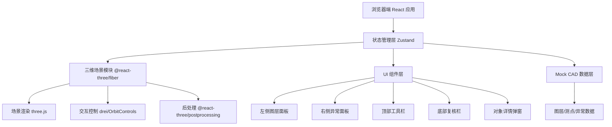
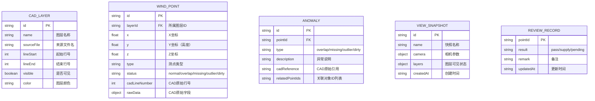

## 1. 架构设计



## 2. 技术说明

- **前端框架**：React@18 + TypeScript + Vite@5
- **样式方案**：TailwindCSS@3（原子化CSS）+ CSS 变量管理主题色
- **三维渲染**：three@0.160 + @react-three/fiber@8 + @react-three/drei@9 + @react-three/postprocessing@2
- **状态管理**：Zustand@4（轻量级状态管理，管理3D场景状态、选中对象、复核标记等）
- **初始化工具**：`npm create vite@latest`（React + TypeScript 模板）
- **后端**：无后端，纯前端工具，数据内置 Mock
- **数据存储**：浏览器 localStorage 存储视图快照和复核结论

## 3. 路由定义

| 路由 | 用途 |
|------|------|
| / | 主工作台（唯一页面，单页应用） |

## 4. 数据模型

### 4.1 数据模型定义



### 4.2 Mock 数据结构

```typescript
// CAD 图层
interface CadLayer {
  id: string;
  name: string;
  sourceFile: string;
  lineStart: number;
  lineEnd: number;
  visible: boolean;
  color: string;
}

// 风场测点
interface WindPoint {
  id: string;
  layerId: string;
  x: number;
  y: number;
  z: number;
  type: '风速仪' | '风向标' | '温湿度' | '气压';
  status: 'normal' | 'overlap' | 'missing' | 'outlier' | 'dirty';
  cadLineNumber: number;
  rawData: Record<string, any>;
}

// 异常记录
interface Anomaly {
  id: string;
  pointId: string;
  type: 'overlap' | 'missing' | 'outlier' | 'dirty';
  description: string;
  cadReference: string;
  relatedPointIds: string[];
}

// 视图快照
interface ViewSnapshot {
  id: string;
  name: string;
  camera: { position: [number, number, number]; target: [number, number, number] };
  layers: Record<string, boolean>;
  createdAt: string;
}

// 复核记录
interface ReviewRecord {
  pointId: string;
  result: 'pass' | 'supply' | 'pending';
  remark: string;
  updatedAt: string;
}
```

## 5. 核心组件结构

```
src/
├── main.tsx                    # 应用入口
├── App.tsx                     # 根组件（布局）
├── store/
│   └── useAppStore.ts          # Zustand 全局状态
├── data/
│   └── mockData.ts             # Mock CAD 风场数据
├── components/
│   ├── Scene3D/
│   │   ├── Scene3D.tsx         # 三维场景容器
│   │   ├── Walkway.tsx         # 滨海步道模型
│   │   ├── WindPoints.tsx      # 风场测点（实例化渲染）
│   │   └── GroundGrid.tsx      # 地面网格
│   ├── LayerPanel/
│   │   └── LayerPanel.tsx      # 左侧图层管理面板
│   ├── AnomalyPanel/
│   │   └── AnomalyPanel.tsx    # 右侧异常面板
│   ├── Toolbar/
│   │   └── Toolbar.tsx         # 顶部工具栏
│   ├── ReviewBar/
│   │   └── ReviewBar.tsx       # 底部复核栏
│   └── PointDetail/
│       └── PointDetail.tsx     # 对象详情弹窗
├── types/
│   └── index.ts                # TypeScript 类型定义
└── styles/
    └── globals.css             # 全局样式 + Tailwind
```

## 6. 异常检测逻辑（内置）

- **重叠检测 (overlap)**：两点坐标距离 < 阈值（0.5m）判定为重叠，记录关联对象
- **缺失检测 (missing)**：按等间距规则检查，缺失序列点标记为缺失
- **越界检测 (outlier)**：坐标超出步道两侧预设范围（±5m）标记为越界
- **脏数据 (dirty)**：CAD原始字段缺失、格式异常（保留原始数据不修正）
