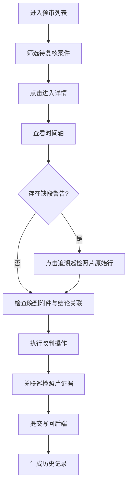

## 1. 产品概述

"滨海步道风场碰撞预审"复核系统，专为运维工程师老何及其团队设计，解决风场设施与滨海步道空间碰撞的复核工作痛点。系统将分散的巡检照片、二维表数据、晚到附件、复核记录进行空间化、时序化整合，让复核过程可追溯、可改判、可留痕。

- 目标用户：运维工程师、现场巡检人员、评审人员
- 核心价值：从"翻照片找数据"到"一屏追溯全链路"，让空间碰撞复核有据可依
- 产品定位：轻量级、专业向的工程复核工作台

## 2. 核心功能

### 2.1 用户角色

| 角色 | 工作方式 | 核心权限 |
|------|----------|----------|
| 运维工程师（老何） | 桌面端浏览器复核 | 查看列表、详情、改判、查看历史、补录记录 |
| 现场同事 | 移动端/桌面端查看 | 查看列表、详情、上传巡检照片、标记异常 |
| 评审人员 | 会议桌面端演示 | 筛选、截图讨论、追溯对象来源 |

### 2.2 功能模块

1. **预审列表页**：按状态筛选的案件列表、快速状态标签、对象来源定位、筛选条件持久化
2. **预审详情页**：时序化时间轴、巡检照片原始追溯、空间碰撞对象可视化、晚到附件与结论关联
3. **改判操作**：改判表单、原因记录、异常标注、与巡检照片行/对象绑定
4. **历史记录页**：全量操作流水、改判对比、操作人追溯、补录记录查询

### 2.3 页面详情

| 页面名称 | 模块名称 | 功能描述 |
|----------|----------|----------|
| 预审列表页 | 顶部筛选区 | 状态筛选（待复核/已通过/已驳回/异常）、对象类型筛选、搜索、筛选条件URL同步 |
| 预审列表页 | 列表表格 | 案件编号、位置、碰撞对象、状态标签、巡检照片张数、晚到附件标记、最后操作时间 |
| 预审列表页 | 行内操作 | 快速查看、跳转详情、标记异常 |
| 预审详情页 | 案件概览卡 | 基础信息、当前状态、空间坐标、碰撞对象简述 |
| 预审详情页 | 时间轴面板 | 按时间排序的事件流，缺段高亮并关联到巡检照片原始行/对象 |
| 预审详情页 | 巡检照片区 | 照片网格、点击查看原图、标注原始行号/对象ID、悬停显示原始说明 |
| 预审详情页 | 晚到附件区 | 附件列表、与结论绑定的视觉连线、上传时间晚于初始预审的标记 |
| 预审详情页 | 改判操作区 | 改判状态选择、原因输入、关联巡检照片行/对象选择、异常标注 |
| 预审详情页 | 对象来源追溯 | 点击截图锚点跳转回对应巡检照片+高亮对象+当前筛选条件还原 |
| 历史记录页 | 时间流水 | 全量操作按时间倒序、操作人、改判前后对比、补录标记 |
| 历史记录页 | 筛选过滤 | 按案件、操作人、操作类型筛选 |

## 3. 核心流程

### 3.1 复核流程（自然语言）

运维工程师老何打开系统进入预审列表 → 按"待复核"筛选 → 点击某案件进入详情 → 查看时间轴发现缺段警告 → 点击缺段警告追溯到对应巡检照片的原始行和对象说明 → 检查晚到附件是否已与结论关联 → 浏览空间碰撞对象信息 → 执行改判操作（选择状态、填写原因、关联巡检照片证据）→ 提交后接口真实写回后端 → 历史记录自动生成操作流水。

### 3.2 评审追溯流程（自然语言）

评审人员围在屏幕前 → 从截图URL直接打开系统 → URL自动还原当时的筛选条件和定位对象 → 系统高亮截图对应的巡检照片和碰撞对象 → 查看对象来源的原始数据行 → 讨论后确认或改判。

## 4. 用户界面设计

### 4.1 设计风格

- **设计基调**：工业风/工程工作台风格，专业、冷静、信息密度高
- **主色**：深海蓝 `#1e3a5f`（专业可信），搭配青蓝 `#3b82f6` 作为交互色
- **辅助色**：琥珀橙 `#f59e0b`（警告/缺段）、翠绿 `#10b981`（通过）、赤红 `#ef4444`（驳回/异常）
- **中性色**：石板灰系 `slate-50 ~ slate-900`，保证长时间阅读舒适度
- **按钮风格**：直角微圆角（rounded-sm），2px描边，工程感按钮，hover时轻微上移+阴影加深
- **字体**：标题使用"JetBrains Mono"等宽字体（工程数据感），正文使用"Noto Sans SC"中文可读性优先
- **布局风格**：左右分栏主工作区+右侧信息面板，时间轴纵向贯穿
- **图标**：lucide-react线性图标，统一1.5px线宽
- **细节纹理**：表格斑马纹、卡片细边框（1px slate-200）、时间轴节点使用工程标记符号

### 4.2 页面设计概述

| 页面名称 | 模块名称 | UI元素 |
|----------|----------|--------|
| 预审列表页 | 顶部筛选区 | 工程感胶囊筛选按钮、搜索框带放大镜、筛选状态Chip |
| 预审列表页 | 列表表格 | 斑马纹行、状态标签带状态色圆点、晚到附件标记为橙色"晚"字徽章 |
| 预审详情页 | 时间轴面板 | 左侧纵向实线+节点圆圈，缺段处虚线+橙色警告三角，节点点击展开事件卡片 |
| 预审详情页 | 巡检照片区 | 响应式网格、hover浮层显示原始行号和说明、点击放大Lightbox |
| 预审详情页 | 晚到附件区 | 卡片右上角"晚到"标记、从附件卡到结论卡的SVG贝塞尔连线动画 |
| 预审详情页 | 改判操作区 | 分组表单、下拉选择关联巡检照片行（带预览缩略图）、异常标注复选框 |
| 历史记录页 | 时间流水 | 改判前后Diff样式对比（绿色新增/红色删除）、操作人头像首字母 |

### 4.3 响应式

- 桌面端优先设计（1440px基准）
- 平板端（768-1024px）：右侧面板折叠为抽屉
- 移动端（<768px）：列表单列卡片化，时间轴简化
- 触摸优化：点击目标≥44px，重要操作双指缩放支持

### 4.4 动效与交互

- 页面加载：时间轴节点从上到下依次淡入（stagger 80ms）
- 缺段警告：橙色三角缓慢呼吸（pulse 2s）
- 改判提交：按钮出现loading状态→成功后绿色勾号弹出→自动跳转历史
- 悬停效果：表格行背景色过渡150ms，照片卡片轻微scale(1.02)
- 连线动画：晚到附件与结论的SVG连线使用stroke-dashoffset从0到完整绘制
