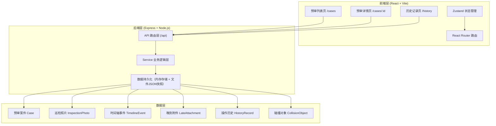
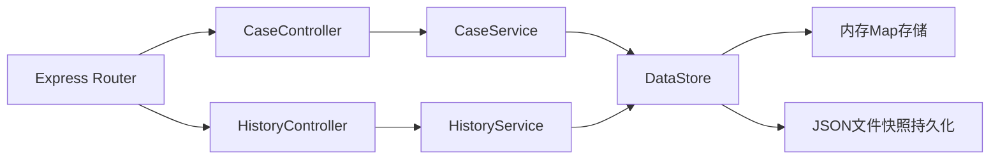
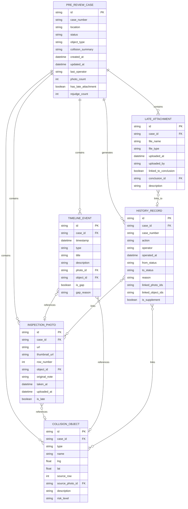

## 1. 架构设计



## 2. 技术描述

- **前端**：React@18 + TypeScript + react-router-dom@6 + zustand@4 + tailwindcss@3 + lucide-react
- **初始化工具**：vite-init（react-express-ts 模板）
- **后端**：Express@4 + TypeScript + ESM
- **数据存储**：内存数据存储 + JSON文件快照持久化（重启不丢失），内置3-4条测试数据
- **HTTP客户端**：fetch API 封装
- **设计系统**：Tailwind CSS 自定义主题（工业风配色方案）

## 3. 路由定义

### 前端路由

| 路由路径 | 页面组件 | 用途 |
|----------|----------|------|
| `/` | 重定向 | 跳转到 /cases |
| `/cases` | CaseListPage | 预审列表页，支持筛选、搜索 |
| `/cases/:id` | CaseDetailPage | 预审详情页，时间轴、照片、改判 |
| `/history` | HistoryPage | 全量操作历史记录 |

### 后端API路由

| Method | 路由路径 | 用途 |
|--------|----------|------|
| GET | `/api/cases` | 获取预审案件列表（支持status、keyword、objectType筛选） |
| GET | `/api/cases/:id` | 获取单个案件详情（含照片、时间轴、附件、碰撞对象） |
| PUT | `/api/cases/:id` | 改判案件状态（写回后端持久化） |
| POST | `/api/cases/:id/photos` | 关联巡检照片到改判记录 |
| GET | `/api/cases/:id/photos` | 获取案件巡检照片列表 |
| GET | `/api/cases/:id/timeline` | 获取案件时间轴事件流 |
| GET | `/api/cases/:id/attachments` | 获取晚到附件列表 |
| GET | `/api/history` | 获取全量操作历史（支持筛选） |
| POST | `/api/history` | 新增操作历史记录（改判时自动调用） |
| GET | `/api/collision-objects/:id` | 获取碰撞对象详情及来源追溯 |

## 4. API 类型定义

```typescript
// 案件状态
type CaseStatus = 'pending' | 'approved' | 'rejected' | 'abnormal';

// 碰撞对象类型
type ObjectType = 'wind_turbine' | 'transmission_tower' | 'cable' | 'access_road';

// 巡检照片
interface InspectionPhoto {
  id: string;
  caseId: string;
  url: string;
  thumbnailUrl: string;
  rowNumber: number;        // 原始二维表行号
  objectId: string | null;  // 关联的碰撞对象ID
  originalNote: string;     // 照片原始说明
  takenAt: string;          // 拍摄时间 ISO
  uploadedAt: string;       // 上传时间 ISO
  isLate: boolean;          // 是否晚到
}

// 时间轴事件
interface TimelineEvent {
  id: string;
  caseId: string;
  timestamp: string;
  type: 'inspection' | 'report' | 'review' | 'rejudge' | 'attachment' | 'gap';
  title: string;
  description: string;
  photoId?: string;         // 关联巡检照片
  objectId?: string;        // 关联碰撞对象
  isGap?: boolean;          // 是否为缺段
  gapReason?: string;       // 缺段原因说明
}

// 晚到附件
interface LateAttachment {
  id: string;
  caseId: string;
  fileName: string;
  fileType: 'image' | 'pdf' | 'excel' | 'other';
  uploadedAt: string;
  uploadedBy: string;
  linkedToConclusion: boolean;  // 是否已与结论绑定
  conclusionId?: string;        // 关联的结论记录
  description: string;
}

// 碰撞对象
interface CollisionObject {
  id: string;
  caseId: string;
  type: ObjectType;
  name: string;
  coordinates: { lng: number; lat: number };
  sourceRow: number;       // 原始二维表行号
  sourcePhotoId: string;   // 来源巡检照片ID
  description: string;
  riskLevel: 'low' | 'medium' | 'high';
}

// 预审案件
interface PreReviewCase {
  id: string;
  caseNumber: string;      // 案件编号
  location: string;        // 位置描述
  status: CaseStatus;
  objectType: ObjectType;
  collisionSummary: string;  // 碰撞简述
  createdAt: string;
  updatedAt: string;
  lastOperator: string;
  photoCount: number;
  hasLateAttachment: boolean;
  rejudgeCount: number;
  photos: InspectionPhoto[];
  timeline: TimelineEvent[];
  attachments: LateAttachment[];
  collisionObjects: CollisionObject[];
}

// 操作历史
interface HistoryRecord {
  id: string;
  caseId: string;
  caseNumber: string;
  action: 'create' | 'review' | 'rejudge' | 'mark_abnormal' | 'supplement';
  operator: string;
  operatedAt: string;
  fromStatus?: CaseStatus;
  toStatus?: CaseStatus;
  reason?: string;
  linkedPhotoIds?: string[];
  linkedObjectIds?: string[];
  isSupplement: boolean;   // 是否为补录记录
}

// 改判请求
interface RejudgeRequest {
  toStatus: CaseStatus;
  reason: string;
  operator: string;
  linkedPhotoIds: string[];
  linkedObjectIds: string[];
  markAbnormal?: boolean;
  abnormalNote?: string;
}

// API响应包装
interface ApiResponse<T> {
  code: number;
  message: string;
  data: T;
  timestamp: string;
}
```

## 5. 服务端架构



- **Controller层**：参数校验、请求响应封装
- **Service层**：业务逻辑（改判校验、时间轴生成、晚到附件关联检查）
- **DataStore层**：统一数据访问、内存+文件双写、初始化Mock数据

## 6. 数据模型

### 6.1 ER图



### 6.2 初始化数据

系统启动时自动写入3-4条测试数据，覆盖以下场景：

1. **案件 BH-2024-001**（待复核）：含3张巡检照片、完整时间轴、1个晚到附件未关联结论、2个碰撞对象
2. **案件 BH-2024-002**（已通过）：含4张巡检照片、时间轴有1处缺段警告、晚到附件已关联结论、1个碰撞对象
3. **案件 BH-2024-003**（异常）：含2张巡检照片、时间轴有2处缺段、无晚到附件、3个碰撞对象、已有改判记录
4. **案件 BH-2024-004**（已驳回）：含5张巡检照片、完整时间轴、有补录记录、2个碰撞对象

所有数据真实可交互，改判操作会真实写回内存并持久化到JSON快照文件。
