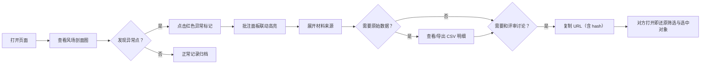

## 1. 产品概述

滨海步道风场剖面讲解评审系统——面向算法值班人与评审会议场景的风场数据核查工具。核心解决「异常点藏在模型堆里难定位」「截图讨论后无法回源」「楼层单位混写影响结果无指引」三大痛点。

- 目标用户：算法值班人（日常核查）、评审助理阿乔（月度汇总）、评审会成员（截图讨论）
- 产品价值：将风场剖面图表、评审批注、原始材料串成一条可追溯链，让异常点「看得见、点得回、说得清」

## 2. 核心功能

### 2.1 用户角色

| 角色 | 说明 | 核心诉求 |
|------|------|----------|
| 算法值班人 | 日常轮值核查风场数据 | 先看图再追明细，异常点一键跳回材料 |
| 评审助理阿乔 | 月底汇总评审批注 | 不要被异常对象拖住，能区分正常/补录/异常 |
| 评审会成员 | 围着截图集体讨论 | 从截图 URL 直接回到当时的筛选与对象 |

### 2.2 功能模块

1. **主页面（风场剖面讲解）**：剖面图表、筛选栏、评审批注面板、操作说明
2. **异常点追溯**：点击图表异常标记 → 高亮对应评审批注 → 展开材料来源
3. **楼层单位混写提示**：检测数据中「米/层/F/楼层」混用，给出人类可读的下一步处理步骤
4. **CSV 明细查看/下载**：弹窗展示当前筛选下的原始明细，支持一键导出
5. **截图回源**：当前筛选与选中对象写入 URL hash，截图附带的 URL 可一键还原场景

### 2.3 页面详情

| 页面名称 | 模块名称 | 功能描述 |
|----------|----------|----------|
| 主页面 | 顶部筛选栏 | 日期段、测站、异常类型筛选；筛选状态写入 URL hash |
| 主页面 | 风场剖面图 | SVG 折线+散点，异常点用红色三角形标记，点击触发追溯 |
| 主页面 | 评审批注面板 | 4 条示例：1 条正常、1 条补录、2 条异常；点击联动图表 |
| 主页面 | 单位混写提示条 | 检测到 m/F/层 混用时显示，展开后列出具体字段和处理步骤 |
| 主页面 | 操作说明卡 | 仅三件事：「放样例」「重跑」「查看CSV明细」，极简说明 |
| CSV 弹窗 | 明细表格 | 当前筛选下的原始数据行，支持复制行、下载 CSV |

## 3. 核心流程

算法值班人日常核查流程：打开页面 → 查看风场剖面图表 → 发现红色异常点 → 点击异常点 → 右侧自动滚动并高亮对应批注 → 展开批注查看材料来源与备注 → 如需原始数据，点击「查看CSV明细」 → 如需和评审讨论，复制当前 URL（含 hash），对方打开即还原。

## 4. 用户界面设计

### 4.1 设计风格

- **主色**：深海蓝 `#0B3D5B`（代表海洋与工程感），辅助色：警示红 `#E5484D`、数据青 `#2DD4BF`
- **视觉基调**：工程评审界面，克制、信息密度适中，留白不空洞
- **字体**：标题用 Noto Serif SC 衬线（正式感），正文用 JetBrains Mono 等宽（数据对齐）
- **按钮风格**：方角小圆角（r=4px），边框实线，hover 时底色加深 10%
- **布局**：左右两栏（左图右批注），顶部固定筛选栏 + 提示条，底部浮动操作说明
- **图标**：Lucide 线性图标，尺寸 16px，与文字基线对齐

### 4.2 页面设计概览

| 页面名称 | 模块名称 | UI 元素与动效 |
|----------|----------|---------------|
| 主页面 | 筛选栏 | 紧凑高度 48px，下拉选择 + 日期范围，hash 变化 200ms 过渡 |
| 主页面 | 风场剖面图 | SVG 绘制，hover 数据点放大 1.5×，异常点点击后高亮闪烁 3 次 |
| 主页面 | 批注面板 | 卡片式，每条 64px，选中卡片左侧 4px 青色竖条，滚动平滑 |
| 主页面 | 单位混写提示条 | 默认折叠高度 36px，展开下滑动画 250ms，黄色边框警示 |
| 主页面 | 操作说明卡 | 右下角浮动，玻璃拟态背景（backdrop-blur），点击展开/收起 |
| CSV 弹窗 | 明细表 | 等宽字体显示数据行，hover 行底色浅青，复制按钮淡入 |

### 4.3 响应式

桌面优先设计（≥1280px），评审场景主要在大屏显示器。
- 1024–1279px：两栏比例由 3:2 调整为 1:1
- <1024px：上下堆叠，图表在上批注在下，操作说明收为悬浮按钮

### 4.4 动效细节

- 页面加载：筛选栏先淡入（150ms）→ 图表折线从左到右绘制（600ms ease-out）→ 批注卡片逐条上浮（间隔 80ms）
- 异常点点击：红色三角形 scale 1→1.4→1 弹跳，对应批注卡片背景色从浅红过渡到选中青（400ms）
- 单位提示展开：高度从 36px 过渡到自适应，内部内容 fade-in 延迟 100ms
