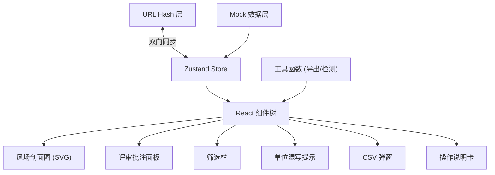

## 1. 架构设计

纯前端单页应用，无后端依赖，所有数据为内置 mock。状态通过 Zustand 管理，URL hash 与状态双向同步。



## 2. 技术描述

- **前端框架**：React@18 + TypeScript
- **构建工具**：Vite@5
- **样式方案**：Tailwind CSS@3（自定义 design token 扩展）
- **状态管理**：Zustand（含 hash 持久化中间件）
- **图标**：lucide-react
- **后端**：无（纯前端演示）
- **数据**：内置 TypeScript mock 数据，约 30 条风场剖面点 + 4 条评审批注

## 3. 路由定义

| 路由 | 目的 |
|------|------|
| / | 主页面（唯一页面），所有状态通过 hash 参数控制 |

Hash 参数格式示例：
```
/#station=A03&date=2025-06-09&filter=anomaly&selected=REC-003
```

## 4. 数据模型

### 4.1 风场剖面数据点

```typescript
interface WindProfilePoint {
  id: string;           // e.g. "P-001"
  height: number;       // 高度值
  heightUnit: 'm' | 'F' | '层';  // 故意混入不同单位，用于演示混写提示
  windSpeed: number;    // 风速 m/s
  windDirection: number;// 风向 0-360°
  station: string;      // 测站编号 e.g. "A03"
  timestamp: string;    // ISO 时间
  isAnomaly: boolean;   // 是否异常点
  linkedRecordId?: string; // 关联评审批注 ID
}
```

### 4.2 评审批注记录

```typescript
type RecordStatus = 'normal' | 'supplement' | 'anomaly';

interface ReviewRecord {
  id: string;           // e.g. "REC-001"
  status: RecordStatus; // normal=正常 supplement=补录 anomaly=异常
  title: string;        // 批注标题
  reviewer: string;     // 评审人
  reviewedAt: string;   // 评审时间
  comment: string;      // 评审内容
  sourceMaterial: {     // 材料来源
    type: 'model' | 'csv' | 'field-photo';
    name: string;
    path: string;       // 模拟路径，展示用
  };
  linkedPointIds: string[]; // 关联的风场数据点 ID
}
```

### 4.3 应用状态（Zustand Store）

```typescript
interface AppState {
  filters: {
    station: string;
    dateFrom: string;
    dateTo: string;
    statusFilter: 'all' | 'anomaly' | 'normal';
  };
  selectedRecordId: string | null;
  selectedPointId: string | null;
  unitWarningExpanded: boolean;
  csvModalOpen: boolean;
  helpExpanded: boolean;

  // actions
  setFilters: (f: Partial<AppState['filters']>) => void;
  selectRecord: (id: string | null) => void;
  selectPoint: (id: string | null) => void;
  toggleUnitWarning: () => void;
  toggleCsvModal: () => void;
  toggleHelp: () => void;
}
```

## 5. 项目结构

```
src/
├── components/
│   ├── FilterBar.tsx           # 顶部筛选栏
│   ├── WindProfileChart.tsx    # 风场剖面 SVG 图
│   ├── ReviewPanel.tsx         # 评审批注面板
│   ├── ReviewCard.tsx          # 单条批注卡片
│   ├── UnitWarningBanner.tsx   # 单位混写提示条
│   ├── CsvModal.tsx            # CSV 明细弹窗
│   └── HelpFloatingCard.tsx    # 浮动操作说明
├── data/
│   ├── windPoints.ts           # 风场 mock 数据（故意混入单位混写）
│   └── reviewRecords.ts        # 4 条评审记录 mock（正常/补录/异常×2）
├── hooks/
│   ├── useHashSync.ts          # URL hash 双向同步 hook
│   └── useUnitDetection.ts     # 单位混写检测 hook
├── store/
│   └── useAppStore.ts          # Zustand store
├── types/
│   └── index.ts                # 类型定义
├── utils/
│   ├── csvExport.ts            # CSV 导出工具
│   └── formatters.ts           # 数据格式化
├── App.tsx
├── main.tsx
└── index.css
```

## 6. 关键实现要点

1. **SVG 图表交互**：风场剖面图用纯 SVG 绘制，不引入图表库以保持轻量。折线用 `<path>`，数据点用 `<circle>` 或 `<polygon>`（异常点三角形），通过 React state 控制高亮。
2. **Hash 同步策略**：初始化时从 `window.location.hash` 解析状态；状态变化时延迟 150ms（debounce）写入 hash，避免频繁历史记录。
3. **单位混写检测**：遍历 `windPoints`，收集所有出现过的 `heightUnit`，若去重后数量 ≥ 2 即触发提示，并列出具体每个单位对应的数据点数量。
4. **演示数据设计**：4 条评审记录 = 1 条正常（REC-001，无异常点关联）+ 1 条补录（REC-002，标记为补录）+ 2 条异常（REC-003/004，关联图表上的红色三角点）。风场数据点中故意混入 `m`、`F`、`层` 三种单位以触发混写提示。
5. **动效实现**：使用 Tailwind 的 `transition` + `animate-*` 类，复杂的图表折线绘制用 CSS `stroke-dasharray` + `stroke-dashoffset` 动画。
