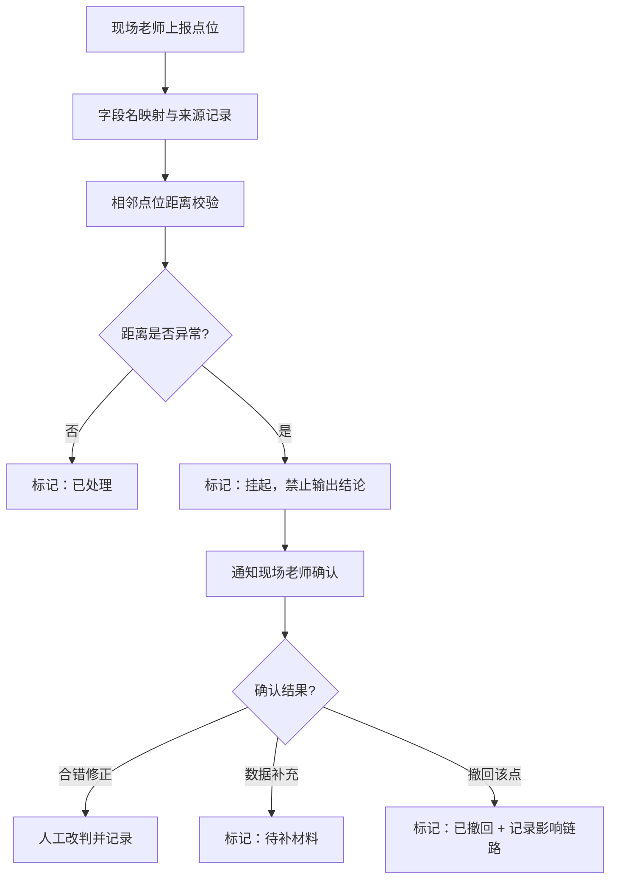

## 1. 产品概述

滨海步道风场方案比选系统，面向风场项目方案经理和现场勘测团队，解决点位坐标靠人工记忆、二维表格缺乏空间感、方案调整历史追溯困难的问题。系统通过空间可视化+数据溯源+异常挂起机制，确保方案比选结论的可解释性和准确性。

- 核心问题：点位坐标字段名前后不一、撤回记录影响结论说不清、相邻点位合错易产生假稳定结论
- 目标用户：方案经理（小赵）、现场勘测老师
- 核心价值：每一条异常结论都能追溯到空间位置、备注、历史时间线，异常数据宁可挂起也不输出错误结论

## 2. 核心功能

### 2.1 用户角色

| 角色 | 注册方式 | 核心权限 |
|------|----------|----------|
| 方案经理 | 系统账号 | 查看全部点位、比选分析、导出异常、审批人工改判 |
| 现场勘测老师 | 系统账号 | 上报点位、补充材料、确认挂起点位、查看历史记录 |

### 2.2 功能模块

1. **点位总览页**：点位列表（含字段来源映射、处理状态标签）、空间可视化地图、异常筛选器
2. **异常详情页**：异常对象空间定位、备注记录、历史时间线（已处理/待补材料/人工改判区分）、导出功能
3. **方案分析页**：方案比选结论、撤回记录对结论的影响链路说明、相邻点位合并风险提示

### 2.3 页面详情

| 页面名称 | 模块名称 | 功能描述 |
|----------|----------|----------|
| 点位总览页 | 点位列表 | 表格展示所有点位，列名旁标注字段来源（原始/映射），每行显示处理状态徽章（正常/挂起/待补/已撤回） |
| 点位总览页 | 空间地图 | Canvas/Leaflet 绘制滨海步道点位，异常点位高亮，点击跳转详情 |
| 点位总览页 | 筛选工具栏 | 按处理状态、方案编号、上报人筛选，支持搜索点位编号 |
| 异常详情页 | 空间定位卡片 | 显示点位坐标、地图小窗高亮、相邻点位关系示意图 |
| 异常详情页 | 历史时间线 | 按时间倒序展示事件，用颜色和图标区分：已处理（绿）、待补材料（橙）、人工改判（紫）、已撤回（红灰） |
| 异常详情页 | 备注与导出 | 展示所有备注记录，支持导出当前异常对象的空间位置、备注、时间线为JSON/PDF |
| 方案分析页 | 结论摘要 | 当前方案比选结论与可信度评分 |
| 方案分析页 | 撤回影响链路 | 可视化展示某条撤回记录如何传导影响最终结论，标注影响节点 |
| 方案分析页 | 挂起风险提示 | 列出当前挂起的相邻点位合错情况，提示"待现场确认，不输出稳定结论" |

## 3. 核心流程

### 3.1 异常点位确认流程

现场老师上报点位坐标（字段名可能不统一）→ 系统自动映射字段并标注来源 → 检测相邻点位距离是否异常 →
- 正常：标记为"已处理"
- 疑似合错：标记为"挂起"，不输出结论，通知现场老师确认
- 已撤回：标记为"已撤回"，在分析页展示对结论的影响

### 3.2 异常对象导出流程

用户在总览页点击异常点位 → 进入详情页 → 查看空间位置、备注、历史时间线 → 点击导出按钮 → 系统打包导出所有关联数据。

## 4. 用户界面设计

### 4.1 设计风格

- **主色调**：深海蓝 `#0A3D62`（专业性）、海雾灰 `#E8EEF2`（背景）
- **强调色**：警示橙 `#F39C12`（挂起/待补）、撤回红灰 `#7F8C8D`、人工改判紫 `#8E44AD`、正常绿 `#27AE60`
- **按钮风格**：直角微圆角（2px），实心按钮有细边框，次要按钮为线框式
- **字体**：标题用思源宋体（工程文档感），正文用思源黑体，等宽数据用 JetBrains Mono
- **布局**：左右分栏（左列表/右地图），卡片式分组，细边框分割信息区块
- **图标**：线性细图标，时间线用圆点+竖线的工程风格

### 4.2 页面设计概览

| 页面名称 | 模块名称 | UI元素 |
|----------|----------|--------|
| 点位总览页 | 点位列表 | 斑马纹表格、状态徽章（圆角色块+文字）、字段来源角标（右上角微标） |
| 点位总览页 | 空间地图 | 深色底图、点位用圆点标记（颜色对应状态）、悬停显示信息浮层 |
| 异常详情页 | 历史时间线 | 左侧竖线、事件节点圆点（颜色区分状态）、右侧事件卡片（含操作人、时间） |
| 异常详情页 | 空间卡片 | 坐标用等宽字体、小尺寸嵌入地图、相邻点位用虚线连接并标注距离 |
| 方案分析页 | 撤回影响链路 | 有向箭头图、被撤回节点用红灰虚线框、影响路径高亮红色 |

### 4.3 响应式

桌面端优先（≥1280px），保证地图和表格同时可见；平板端（≥768px）改为上下分栏；移动端仅保留列表视图。

### 4.4 演示数据要求

系统预置一组演示数据，包含：
- 8个正常点位
- 1条撤回记录（点位BH-05，因坐标偏移撤回，需在分析页展示其对方案A风速估算的影响）
- 1组相邻点位合错（点位BH-07与BH-08距离过近，系统挂起等待确认）
- 至少1次人工改判记录
- 字段名不一致样例（某条数据用"gps_x"/"gps_y"，另一条用"经度"/"纬度"，系统完成映射并标注来源）
