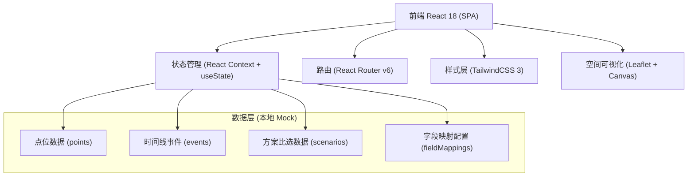
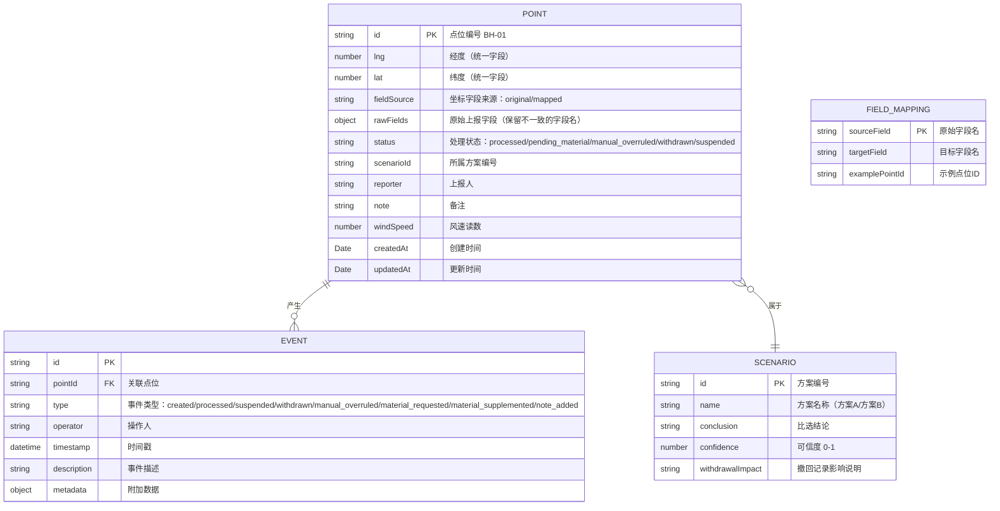

## 1. 架构设计



## 2. 技术说明

- 前端：React@18 + TypeScript + Vite
- 路由：react-router-dom@6
- 样式：tailwindcss@3 + postcss
- 地图：leaflet@1.9 + react-leaflet@4（轻量级空间可视化，适合点位展示）
- 状态管理：React Context（简单场景无需 Redux）
- 数据：本地 Mock 数据（JSON/TS对象），不依赖后端
- 初始化工具：Vite 脚手架 `npm create vite@latest`
- 后端：无（纯前端演示）
- 数据库：无（内存数据 + localStorage 持久化）

## 3. 路由定义

| 路由 | 用途 |
|------|------|
| / | 点位总览页（默认入口，列表+地图） |
| /point/:id | 异常对象详情页（含时间线、导出） |
| /analysis | 方案分析页（撤回影响、挂起提示） |

## 4. 数据模型

### 4.1 实体关系图



### 4.2 核心类型定义（TypeScript）

```typescript
type PointStatus = 'processed' | 'pending_material' | 'manual_overruled' | 'withdrawn' | 'suspended';

interface Point {
  id: string;
  lng: number;
  lat: number;
  fieldSource: 'original' | 'mapped';
  rawFields: Record<string, any>;
  status: PointStatus;
  scenarioId: string;
  reporter: string;
  note: string;
  windSpeed: number;
  createdAt: string;
  updatedAt: string;
  adjacentPoints?: string[];
}

type EventType = 'created' | 'processed' | 'suspended' | 'withdrawn' | 'manual_overruled' | 'material_requested' | 'material_supplemented' | 'note_added';

interface TimelineEvent {
  id: string;
  pointId: string;
  type: EventType;
  operator: string;
  timestamp: string;
  description: string;
  metadata?: Record<string, any>;
}

interface Scenario {
  id: string;
  name: string;
  conclusion: string;
  confidence: number;
  withdrawalImpact: string;
  withdrawnPoints: string[];
  suspendedPointGroups: string[][];
}
```

## 5. 核心模块划分

```
src/
├── data/
│   ├── points.ts          # 点位演示数据（含8正常+1撤回+1组合错）
│   ├── events.ts          # 时间线事件数据
│   ├── scenarios.ts       # 方案比选数据
│   └── fieldMappings.ts   # 字段映射配置
├── types/
│   └── index.ts           # 全局类型定义
├── context/
│   └── AppContext.tsx     # 全局状态（点位、事件、方案）
├── components/
│   ├── layout/
│   │   └── Header.tsx
│   ├── points/
│   │   ├── PointTable.tsx      # 点位列表（含字段来源标记）
│   │   ├── PointMap.tsx        # 空间地图
│   │   └── StatusBadge.tsx     # 状态徽章
│   ├── detail/
│   │   ├── SpaceCard.tsx       # 空间定位卡片
│   │   ├── Timeline.tsx        # 历史时间线
│   │   └── ExportButton.tsx    # 导出按钮
│   └── analysis/
│       ├── ImpactChain.tsx     # 撤回影响链路
│       └── SuspendedAlert.tsx  # 挂起风险提示
├── pages/
│   ├── OverviewPage.tsx        # 点位总览
│   ├── PointDetailPage.tsx     # 异常详情
│   └── AnalysisPage.tsx        # 方案分析
├── utils/
│   ├── export.ts               # 导出工具（JSON导出）
│   └── distance.ts             # 距离计算工具
├── App.tsx
├── main.tsx
└── index.css
```
