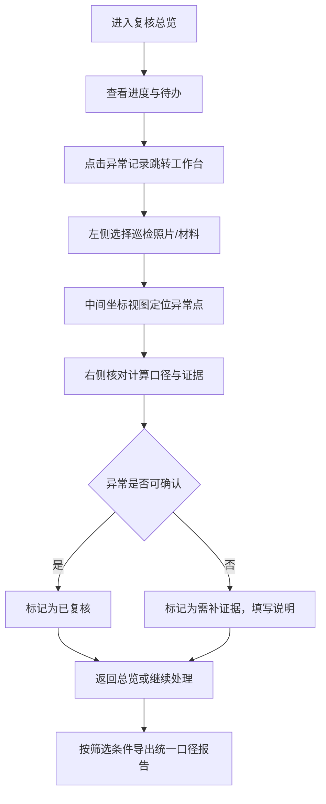

## 1. 产品概述

医院物流机器人空间复核系统，用于解决巡检照片中坐标系混乱导致空间记录不可信的问题。核心目标是让复核人无需追问即可：明确材料存放位置、快速定位异常记录、统一口径导出报告。

- 目标用户：医院物流机器人项目复核人员、现场巡检人员
- 解决痛点：坐标系混用后记录可信度低、异常追溯无来源、三份口径（标注/明细/报告）说法不一

## 2. 核心功能

### 2.1 用户角色

| 角色 | 登录方式 | 核心权限 |
|------|----------|----------|
| 复核人 | 系统账号 | 查看巡检材料、标记异常状态、补充证据、导出复核报告 |
| 巡检员 | 系统账号 | 上传巡检照片、录入坐标与材料记录 |

### 2.2 功能模块

1. **复核总览页**：处理进度看板、待补证据清单、异常分布统计、快速入口
2. **空间复核工作台**：左侧材料/照片列表、中间楼层坐标视图、右侧异常明细面板
3. **报告导出页**：按筛选条件生成统一口径的复核报告

### 2.3 页面详情

| 页面名称 | 模块名称 | 功能描述 |
|----------|----------|----------|
| 复核总览页 | 进度看板 | 已复核/待复核/需补证据数量统计，点击可跳转到对应筛选结果 |
| 复核总览页 | 异常分布图 | 按楼层和异常类型展示异常分布，点击异常点跳转工作台 |
| 复核总览页 | 待办清单 | 列出需补证据和待复核的Top记录，附快捷操作按钮 |
| 复核总览页 | 快速入口区 | 材料上传、查看异常、重新导出报告三个固定入口 |
| 空间复核工作台 | 左侧材料列表 | 巡检照片、材料清单，按楼层分组，异常条目高亮标注 |
| 空间复核工作台 | 中间坐标视图 | 楼层平面图+坐标点标注，异常点红色闪烁，点击关联照片与明细 |
| 空间复核工作台 | 右侧复核明细 | 选中记录的坐标口径、异常类型、处理状态、证据补充区 |
| 空间复核工作台 | 顶部筛选栏 | 按楼层、异常类型、处理状态筛选，切换平面/列表视角 |
| 报告导出页 | 筛选配置 | 楼层、异常类型、时间范围、处理状态筛选 |
| 报告导出页 | 报告预览 | 统一口径展示复核结论，与标注/明细面板文案完全一致 |
| 报告导出页 | 导出操作 | 导出PDF/Excel，附截图按钮 |

## 3. 核心流程

复核人进入系统后，先在总览页查看进度与待办，点击异常记录跳转到工作台。在工作台中通过左侧选择材料，中间视图定位坐标点，右侧面板核查异常口径并标记处理状态（待复核→需补证据→已复核）。确认完成后从报告导出页按筛选条件生成统一口径报告。

## 4. 用户界面设计

### 4.1 设计风格

- 主色：深青蓝 `#0D3B4C`，辅色：警示橙 `#E07A3F`、通过绿 `#3DA36F`、异常红 `#D9414E`
- 布局：三栏工作台结构，卡片式信息承载，强调异常状态的视觉层级
- 字体：标题用 Noto Serif SC（稳重可追溯），正文用 Noto Sans SC（清晰可读）
- 按钮：圆角 8px，异常操作带明显色彩区分，悬停有阴影过渡
- 风格定位：工业级严谨复核界面，避免活泼装饰，强调可信度与可追溯感

### 4.2 页面设计概览

| 页面名称 | 模块名称 | UI 元素 |
|----------|----------|---------|
| 复核总览页 | 进度看板 | 三张状态卡（已复核/待复核/需补证据），数字大字号，附趋势箭头 |
| 复核总览页 | 异常分布图 | 楼层堆叠柱状图，异常类型用颜色区分，柱子可点击 |
| 复核总览页 | 待办清单 | 表格样式，异常类型标签、楼层、处理按钮，行悬停高亮 |
| 复核总览页 | 快速入口区 | 三个图标卡片（材料柜/异常台/导出站），大图标+说明文字 |
| 空间复核工作台 | 左侧材料列表 | 楼层折叠面板，照片缩略图，异常徽章（红/橙） |
| 空间复核工作台 | 中间坐标视图 | SVG 楼层平面图，坐标点带标注，异常点脉冲动画 |
| 空间复核工作台 | 右侧复核明细 | 计算口径说明、异常原因、状态切换按钮、证据上传区 |
| 空间复核工作台 | 顶部筛选栏 | 下拉筛选器、视角切换（平面/列表）、导出截图按钮 |
| 报告导出页 | 筛选配置 | 横向排布的筛选表单，实时预览筛选计数 |
| 报告导出页 | 报告预览 | 模拟A4纸张样式，分段复核结论，附异常列表 |
| 报告导出页 | 导出操作 | 固定底部操作栏，PDF/Excel/截图三个主按钮 |

### 4.3 响应式

桌面端优先（最小宽度 1440px），工作台三栏布局；平板端左侧材料列表可折叠；移动端仅保留总览与异常清单视图，坐标视图改为横向滚动列表。

### 4.4 异常样本设计（演示用）

系统内置以下小样例（非干净数据）：

1. **名称不一致**：材料清单写"一次性输液器"，巡检照片标注写"输液器"，系统识别为名称不一致异常，状态显示为"待复核"（不得显示为正常通过）
2. **楼层单位混写**：坐标记录写"3F"，照片EXIF标注写"3层"，系统识别为楼层单位混写异常，状态显示为"需补证据"（不得显示为正常通过）
3. **坐标偏移**：同一巡检点两次记录坐标偏差超过阈值，系统识别为坐标系混乱异常，状态显示为"待复核"
