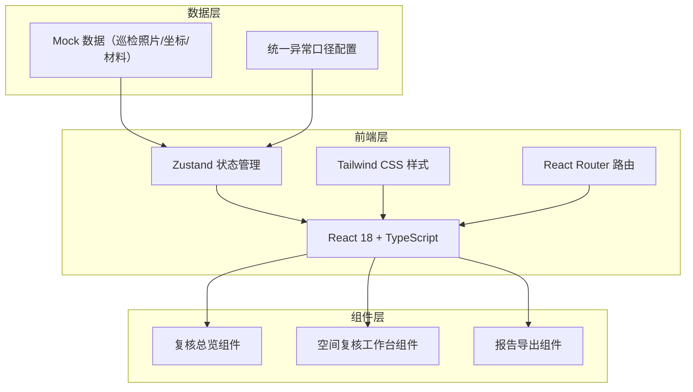
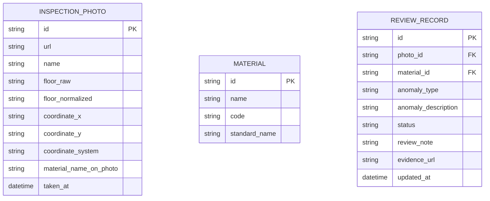

## 1. 架构设计



## 2. 技术说明

- 前端：React@18 + TypeScript@5 + Vite@5 + Tailwind CSS@3
- 状态管理：Zustand，管理复核记录、筛选条件、选中状态
- 路由：React Router DOM，三个主路由页面
- 数据：前端 Mock 数据（JSON/TS 对象），无需后端
- 图表：原生 SVG 绘制楼层平面图与异常分布图，不引入重型图表库
- 图标：Lucide React

## 3. 路由定义

| 路由 | 用途 |
|------|------|
| / | 复核总览页（默认首页） |
| /workbench | 空间复核工作台 |
| /report | 报告导出页 |

## 4. 数据模型

### 4.1 数据模型定义



### 4.2 核心类型定义

```typescript
type AnomalyType = 'name_mismatch' | 'floor_unit_mix' | 'coordinate_offset' | 'none';
type ReviewStatus = 'pending' | 'need_evidence' | 'reviewed';

interface InspectionPhoto {
  id: string;
  url: string;
  name: string;
  floorRaw: string;      // 原始记录，如 "3F"、"3层"
  floorNormalized: string; // 归一化后，如 "3"
  coordinateX: number;
  coordinateY: number;
  coordinateSystem: 'A' | 'B'; // 坐标系标识
  materialNameOnPhoto: string;  // 照片上的标注
  takenAt: string;
}

interface Material {
  id: string;
  name: string;         // 清单名称
  code: string;
  standardName: string; // 标准名称
}

interface ReviewRecord {
  id: string;
  photoId: string;
  materialId: string;
  anomalyType: AnomalyType;
  anomalyDescription: string;  // 统一口径描述
  status: ReviewStatus;
  reviewNote: string;
  evidenceUrl?: string;
  updatedAt: string;
}
```

### 4.3 统一口径配置

为保证标注、侧边明细、报告三处说法一致，异常描述统一从配置读取：

```typescript
const ANOMALY_CALIBER = {
  name_mismatch: {
    label: '名称不一致',
    description: '材料清单名称与巡检照片标注名称不匹配，需核对实际物品名称',
    reportText: '经复核，材料清单与照片标注名称存在差异，待现场确认'
  },
  floor_unit_mix: {
    label: '楼层单位混写',
    description: '坐标记录与照片EXIF的楼层单位格式不一致（如"3F"与"3层"），需统一口径',
    reportText: '经复核，楼层标识单位存在混用，需补充统一标准说明'
  },
  coordinate_offset: {
    label: '坐标偏移',
    description: '同一巡检点多次记录坐标偏差超过阈值，疑似坐标系混用导致',
    reportText: '经复核，坐标记录存在异常偏移，建议重新校准坐标系'
  }
};
```

## 5. 项目目录结构

```
src/
├── components/
│   ├── overview/         # 总览页组件
│   │   ├── ProgressBoard.tsx
│   │   ├── AnomalyChart.tsx
│   │   ├── TodoList.tsx
│   │   └── QuickEntry.tsx
│   ├── workbench/        # 工作台组件
│   │   ├── MaterialList.tsx
│   │   ├── FloorPlanView.tsx
│   │   ├── ReviewDetail.tsx
│   │   └── FilterBar.tsx
│   ├── report/           # 报告页组件
│   │   ├── ReportFilter.tsx
│   │   ├── ReportPreview.tsx
│   │   └── ExportActions.tsx
│   └── common/           # 通用组件
│       ├── StatusBadge.tsx
│       └── AnomalyTag.tsx
├── pages/
│   ├── Overview.tsx
│   ├── Workbench.tsx
│   └── Report.tsx
├── store/
│   └── reviewStore.ts    # Zustand 状态管理
├── data/
│   ├── mockPhotos.ts     # Mock 巡检照片数据（含异常样本）
│   ├── mockMaterials.ts  # Mock 材料数据
│   ├── mockReviews.ts    # Mock 复核记录
│   └── caliber.ts        # 统一口径配置
├── types/
│   └── index.ts
├── App.tsx
├── main.tsx
└── index.css
```
