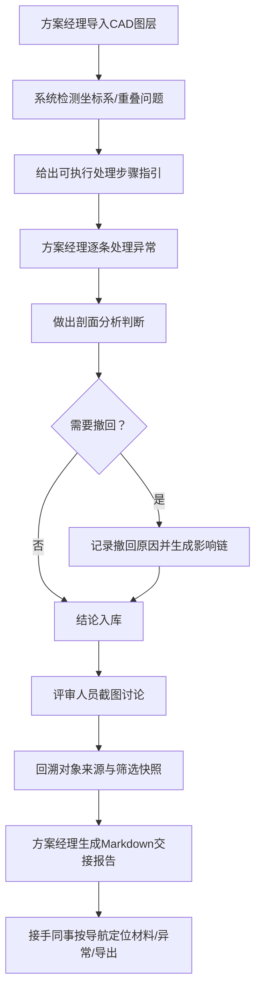

## 1. 产品概述

医院物流机器人剖面讲解分析系统，用于解决CAD图层混杂、撤回记录影响不透明、后补材料无声覆盖、对象重叠处理无指引、评审无法回溯来源、交接信息散落等核心痛点。目标用户为方案经理、评审人员和接手同事。

- 核心价值：让每一次判断变更都可追溯，让后补材料不覆盖历史，让异常处理有人人能执行的步骤指引
- 市场价值：将高度依赖个人经验的剖面分析工作，转化为可交接、可审计、可复现的标准化流程

## 2. 核心功能

### 2.1 用户角色

| 角色 | 进入方式 | 核心权限 |
|------|----------|----------|
| 方案经理 | 直接登录 | 导入CAD图层、记录撤回原因、标记人工改判、生成交接报告 |
| 评审人员 | 通过评审链接/截图入口 | 查看影响链、回溯对象来源、查看当前筛选条件 |
| 接手同事 | 通过报告链接 | 查看已处理/待补材料/人工改判分区、定位材料存放位置、查看异常位置、执行重新导出 |

### 2.2 功能模块

1. **分析主页**：撤回记录影响链可视化、CAD图层版本时间轴、当前结论面板
2. **对象重叠处理面板**：重叠检测列表、逐步可执行处理指引、处理状态追踪
3. **评审回溯面板**：截图关联对象高亮、筛选条件快照还原、图层版本定位
4. **交接报告生成器**：已处理/待补材料/人工改判三分栏、Markdown格式导出、接手导航锚点
5. **接手导航面板**：材料存放位置索引、异常标注位置一览、重新导出操作入口

### 2.3 页面详情

| 页面名称 | 模块名称 | 功能描述 |
|----------|----------|----------|
| 分析主页 | 撤回影响链 | 以时间线+因果箭头展示每条撤回记录如何传导至当前结论，点击节点查看细节 |
| 分析主页 | CAD图层版本时间轴 | 分批导入的图层按时间排列，高亮显示后补材料与早先判断的冲突，不允许静默覆盖 |
| 分析主页 | 当前结论面板 | 展示最终结论，附带来源标注（来自哪次判断、是否被撤回、是否为人工改判） |
| 对象重叠处理 | 重叠检测列表 | 列出所有检测到的对象重叠，按严重程度分级 |
| 对象重叠处理 | 可执行处理指引 | 每条重叠问题给出步骤化操作指引（例如：1. 打开A图层 2. 定位B对象 3. 调整至坐标X/Y），人可直接照着执行 |
| 对象重叠处理 | 处理状态追踪 | 标记已处理/处理中/待处理，处理后自动重新校验是否仍重叠 |
| 评审回溯 | 截图关联视图 | 评审截图上标注热点区域，点击可跳转到对应对象来源和当前图层筛选 |
| 评审回溯 | 筛选快照还原 | 一键还原评审时使用的图层筛选、坐标系统、显示参数 |
| 交接报告 | 三栏分区展示 | 已处理（附处理人时间）/待补材料（附缺失项清单）/人工改判（附改判原因和人） |
| 交接报告 | Markdown导出 | 一键生成结构清晰的Markdown报告，含锚点链接便于接手人跳转 |
| 接手导航 | 材料位置索引 | 明确列出"材料存放路径"、"补充材料上传入口"、"历史版本归档位置" |
| 接手导航 | 异常位置一览 | 列出所有异常标注所在图层、坐标、关联对象，点击可直接定位 |
| 接手导航 | 重新导出面板 | 提供按当前筛选、按历史版本快照、按评审版本三种导出模式 |

## 3. 核心流程

方案经理导入CAD图层 → 系统检测坐标系/对象重叠问题并给出可执行步骤 → 方案经理做出判断，若需撤回则记录原因并生成影响链 → 评审人员查看截图并回溯来源和筛选条件 → 方案经理生成Markdown交接报告 → 接手同事通过导航面板定位材料、查看异常、执行重新导出

## 4. 用户界面设计

### 4.1 设计风格

- 主色：工程蓝 `#1e3a5f`（专业、可信），辅助色：警示橙 `#d97706`（撤回/异常），成功绿 `#059669`（已处理）
- 按钮风格：方角微圆（2px圆角），实线边框，按下时有明确下沉反馈
- 字体：标题使用 Noto Sans SC Bold，正文使用 JetBrains Mono（数字和坐标对齐清晰），字号层次为 20/16/14/12px
- 布局风格：左导航 + 主内容区双栏布局，时间轴/影响链使用横向流式布局，数据面板使用栅格卡片
- 图标风格：Lucide React 线性图标，异常和警告使用带边框的三角形/圆形警示图标

### 4.2 页面设计概述

| 页面名称 | 模块名称 | UI元素 |
|----------|----------|--------|
| 分析主页 | 撤回影响链 | 左侧时间轴节点（撤回记录用橙色边框），右侧因果箭头连接至受影响的结论节点，节点悬停展开详情气泡 |
| 分析主页 | CAD图层版本时间轴 | 横向卡片排列，每张卡片显示导入时间、图层名称、坐标系校验状态，后补材料卡片有橙色"后补"标签并与早先判断用虚线冲突连线 |
| 分析主页 | 当前结论面板 | 大字号结论标题，下方附带来源徽章（如"来自v3判断 · 人工改判"），点击徽章展开影响链 |
| 对象重叠处理 | 重叠检测列表 | 表格布局，严重程度用色条区分（红/橙/黄），每行展开后显示可执行步骤指引 |
| 对象重叠处理 | 可执行处理指引 | 有序列表 + 代码块样式的坐标/图层名称，每步有"已执行"复选框 |
| 评审回溯 | 截图关联视图 | 截图作为底图，热点区域用半透明蓝色方框标记，悬停显示对象名称，点击跳转 |
| 评审回溯 | 筛选快照还原 | 筛选条件以标签形式展示，右侧"一键还原"按钮，还原后显示绿色对勾 |
| 交接报告 | 三栏分区展示 | 三列等宽卡片，顶部标题带状态色条（绿/橙/灰），卡片内为条目列表 |
| 接手导航 | 材料位置索引 | 文件夹树形结构，节点可点击复制路径或直接跳转 |
| 接手导航 | 重新导出面板 | 三个并排卡片式按钮，每个卡片描述导出模式差异，点击后进入导出参数配置 |

### 4.3 响应式

桌面端优先设计（最小宽度1280px），影响链时间轴在平板端可横向滚动，手机端简化为纵向列表视图。触控操作区域不小于44×44px。

