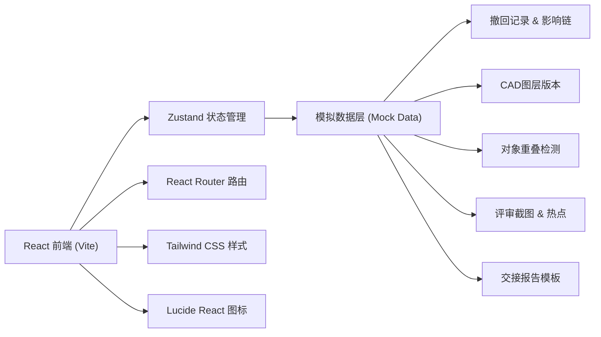
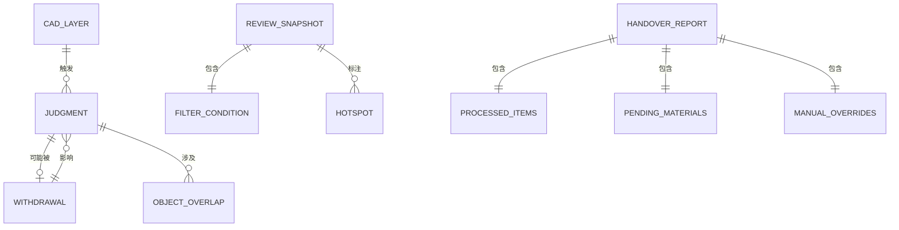

## 1. 架构设计



本项目为纯前端演示系统，使用Mock数据模拟完整业务流程，不依赖后端服务。

## 2. 技术描述

- 前端框架：React 18 + TypeScript
- 构建工具：Vite 5
- 样式方案：Tailwind CSS 3
- 状态管理：Zustand 4
- 路由管理：React Router DOM 6
- 图标库：Lucide React
- Markdown 渲染：react-markdown
- 初始化工具：vite-init（使用 react-ts 模板）

## 3. 路由定义

| 路由路径 | 页面名称 | 用途 |
|----------|----------|------|
| `/` | 分析主页 | 撤回影响链、CAD图层版本时间轴、当前结论 |
| `/overlap` | 对象重叠处理 | 重叠检测列表、可执行步骤指引、处理状态 |
| `/review` | 评审回溯 | 截图热点、筛选快照还原、图层版本定位 |
| `/report` | 交接报告 | 三栏分区展示、Markdown导出预览 |
| `/handover` | 接手导航 | 材料位置、异常位置、重新导出面板 |

## 4. 数据模型

### 4.1 数据模型定义



### 4.2 核心数据类型

```typescript
// CAD图层
interface CadLayer {
  id: string;
  name: string;
  importedAt: string;
  isSupplement: boolean;          // 是否为后补材料
  coordinateSystem: string;       // 坐标系名称
  coordinateValid: boolean;       // 坐标系是否有效
  objects: LayerObject[];
  conflictsWith?: string[];       // 与哪些早先判断冲突
}

interface LayerObject {
  id: string;
  name: string;
  type: 'robot' | 'wall' | 'door' | 'elevator' | 'station';
  x: number;
  y: number;
  width: number;
  height: number;
  layerId: string;
}

// 判断记录
interface Judgment {
  id: string;
  version: string;
  content: string;
  madeAt: string;
  madeBy: string;
  basedOnLayers: string[];        // 基于哪些图层
  isWithdrawn: boolean;
  isManualOverride: boolean;
  overrideReason?: string;
  overriddenBy?: string;
}

// 撤回记录
interface Withdrawal {
  id: string;
  judgmentId: string;
  reason: string;
  withdrawnAt: string;
  withdrawnBy: string;
  impacts: string[];              // 影响到哪些后续判断
}

// 对象重叠
interface ObjectOverlap {
  id: string;
  severity: 'critical' | 'warning' | 'minor';
  objectA: string;
  objectB: string;
  layerA: string;
  layerB: string;
  steps: OverlapStep[];
  status: 'pending' | 'processing' | 'resolved';
}

interface OverlapStep {
  order: number;
  instruction: string;
  codeHint?: string;              // 图层名/坐标等
  completed: boolean;
}

// 评审快照
interface ReviewSnapshot {
  id: string;
  name: string;
  createdAt: string;
  screenshotUrl: string;
  hotspots: Hotspot[];
  filterCondition: FilterCondition;
}

interface Hotspot {
  id: string;
  x: number;                      // 相对截图百分比
  y: number;
  width: number;
  height: number;
  targetObjectId: string;
  label: string;
}

interface FilterCondition {
  visibleLayers: string[];
  coordinateSystem: string;
  showGrid: boolean;
  zoomLevel: number;
}

// 交接报告
interface HandoverReport {
  projectName: string;
  generatedAt: string;
  generatedBy: string;
  processed: ProcessedItem[];
  pendingMaterials: PendingMaterial[];
  manualOverrides: ManualOverride[];
  navigation: HandoverNavigation;
}

interface ProcessedItem {
  id: string;
  title: string;
  processedAt: string;
  processedBy: string;
  note: string;
}

interface PendingMaterial {
  id: string;
  title: string;
  description: string;
  expectedDate?: string;
  contact?: string;
}

interface ManualOverride {
  id: string;
  originalJudgment: string;
  overrideJudgment: string;
  reason: string;
  overriddenBy: string;
  overriddenAt: string;
}

interface HandoverNavigation {
  materialPaths: MaterialPath[];
  anomalyLocations: AnomalyLocation[];
  exportModes: ExportMode[];
}

interface MaterialPath {
  id: string;
  label: string;
  path: string;
  description: string;
}

interface AnomalyLocation {
  id: string;
  layerName: string;
  coordinates: string;
  relatedObject: string;
  description: string;
}

interface ExportMode {
  id: string;
  name: string;
  description: string;
  params: Record<string, string>;
}
```

## 8. 快速开始

### 环境要求
- Node.js >= 18
- npm >= 9

### 安装依赖
```bash
npm install
```

### 开发模式（热重载）
```bash
npm run dev
```
启动后访问 http://localhost:5173

### 类型检查
```bash
npm run check
```

### 生产构建
```bash
npm run build
```
构建产物输出到 `dist/` 目录

### 预览生产构建
```bash
npm run preview
```

### 核心验证路径
1. 启动开发服务器后访问 `/overlap`，点击「重新检测重叠」按钮
2. 确认检测报告显示检测到 **5组** 空间重叠，新增 **3项**（B1-电梯井A ⟷ 风管-西段、B1-电梯井A ⟷ AGV转弯半径修正、机器人停靠站#3 ⟷ 风管-西段）
3. 页面统计卡片应从「共3项」变为「共6项」，新增项自动生成4步可执行处理步骤
4. 访问 `/handover`，测试「在访达中打开」（复制路径到剪贴板）和「开始导出」（Blob下载PNG/PDF/DXF）功能
5. 浏览器控制台可查看完整检测报告和调试信息
