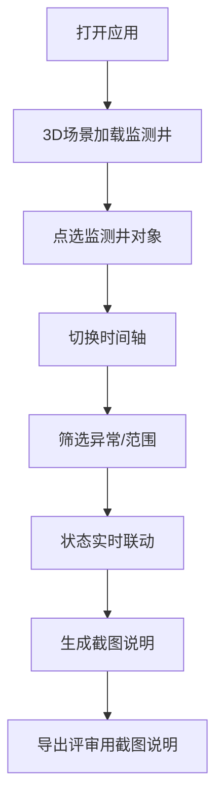

## 1. 产品概述
面向地下水环境监测评审场景的Web3D时序回放工具。

- 服务教学评审场景：围绕"地下水监测井时序回放"为核心判断场景。面向林姐等教学老师、评审专家，核心产出是可直接用于沟通的截图说明。
- 解决问题：巡检照片不齐整、数据断断续续、异常对象藏在模型堆里难以定位、时间轴缺段被误判为正常、截图无法回溯来源与筛选条件。

## 2. 核心功能

### 2.1 用户角色

| 角色 | 说明 | 核心权限 |
|------|------|----------|
| 教学老师/评审专家 | 围绕截图进行讨论与判断 | 点选监测井、切时间轴、筛选异常、导出截图说明 |

### 2.2 功能模块

1. **主场景页**：Web3D 监测井场景、时间轴控制、筛选面板、截图说明面板

### 2.3 页面详情

| 页面名称 | 模块名称 | 功能描述 |
|----------|----------|----------|
| 主场景页 | Web3D监测井场景 | 三维展示地下水监测井模型，支持点选高亮，原始数据痕迹保留（脏数据不修） |
| 主场景页 | 时间轴控制器 | 时间轴切分播放，缺段异常标记（不伪装成正常通过） |
| 主场景页 | 筛选面板 | 按异常类型、监测井、时间范围筛选，与3D场景和时间轴联动 |
| 主场景页 | 截图说明面板 | 实时联动当前状态，支持导出截图来源回溯，截图与页面状态一致 |

## 3. 核心流程

用户打开应用 → 在3D场景中点选监测井对象 → 切换时间轴查看时序变化 → 使用筛选面板过滤异常/时间范围 → 3D场景、时间轴、筛选状态实时同步 → 生成截图说明（包含对象来源、当前筛选条件） → 导出截图说明文件用于评审沟通。

## 4. 用户界面设计

### 4.1 设计风格
- 主色调：深青灰+琥珀警示色
- 配色：深灰背景 #0f1419，监测井正常青 #2dd4bf，异常琥珀 #f59e0b，异常深红警示 #ef4444
- 字体：标题用 Space Grotesk，正文用 JetBrains Mono
- 按钮：半透明毛玻璃圆角，选中态琥珀描边
- 布局：左侧3D大场景，右侧筛选面板，底部时间轴，右下截图说明
- 视觉：工业审片风格，带扫描线和暗角，保留原始数据质感

### 4.2 页面设计概览

| 页面名称 | 模块名称 | UI元素 |
|----------|----------|--------|
| 主场景页 | Web3D场景 | 暗调景深+扫描线，监测井模型带原始数据标签，点选高亮琥珀描边，异常对象脉冲 |
| 主场景页 | 时间轴 | 深色条带，缺段用虚线+警告标记，当前时间游标，可拖动 |
| 主场景页 | 筛选面板 | 毛玻璃卡片，多选标签，异常类型带红色标识 |
| 主场景页 | 截图说明 | 半透明浮层，联动当前状态，可导出 |

### 4.3 响应式

桌面端优先，触控适配。

### 4.4 3D场景指导
- 环境：暗色调工业环境，弱HDRI扫描质感
- 灯光：冷色补光+琥珀异常点光
- 相机：轨道控制器，点选自动聚焦
- 动画：异常监测井脉冲，时间切换淡入淡出
- 后期：暗角、扫描线、胶片颗粒
- 性能：单体模型控制在合理面数内
