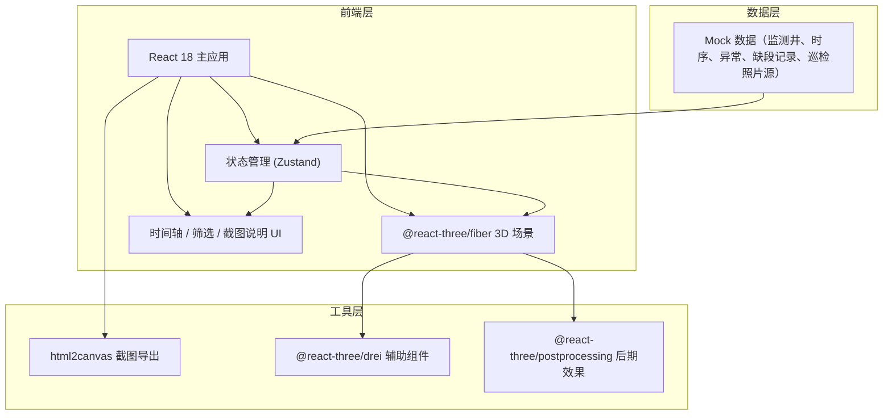
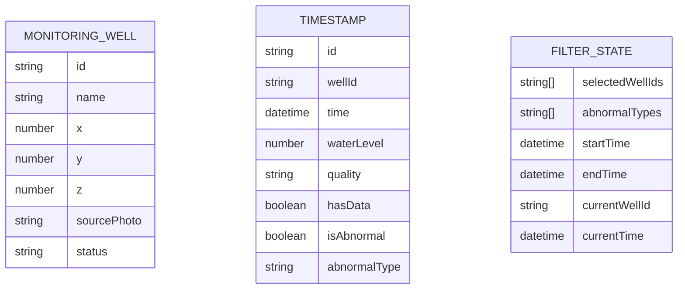

## 1. 架构设计

## 2. 技术描述

- 前端框架：React 18 + TypeScript + Vite
- 样式：TailwindCSS 3
- 3D：three + @react-three/fiber + @react-three/drei + @react-three/postprocessing
- 状态管理：Zustand
- 截图导出：html2canvas
- 数据：前端 Mock 数据，模拟不完整巡检照片源、缺段时间轴、异常监测井

## 3. 路由定义

| 路由 | 用途 |
|------|------|
| / | 主场景页（3D场景 + 时间轴 + 筛选 + 截图说明） |

## 4. 数据模型

### 4.1 数据模型定义

### 4.2 Mock 数据说明

包含：
- 6-8 口监测井，其中 2-3 口带异常状态
- 时间轴：2024-01 至 2024-06 月度时间点，中间故意设置 2 处缺段记录
- 巡检照片源字段保留原始引用，不修脏数据
- 异常类型：水位异常、水质异常、数据缺失
