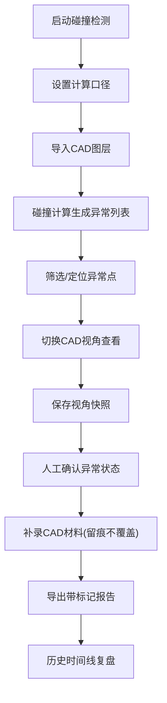

## 1. 产品概述
地下水监测井碰撞预审系统，用于解决评审中CAD图层手工核对效率低、视角复原困难、材料覆盖无记录、截图条件易丢失等问题。目标用户为评审助理和负责人，核心价值是让异常复核有据可依、历史可追溯、视角可复原。

## 2. 核心功能

### 2.1 用户角色
| 角色 | 核心权限 |
|------|----------|
| 评审助理 | 启动碰撞检测、上传CAD图层、标记异常、导出报告 |
| 负责人 | 复核异常、切换视角截图、查看历史时间线、审核结论 |

### 2.2 功能模块
1. **预审启动页**：启动碰撞检测、重跑历史任务、查看计算口径
2. **碰撞分析工作台**：CAD图层画布、异常点列表、筛选面板、详情面板
3. **历史时间线**：人工确认前后变化、材料补录记录、视角快照
4. **导出中心**：带标记的筛选结果、异常详情报告

### 2.3 页面详情
| 页面名称 | 模块名称 | 功能描述 |
|-----------|-------------|---------------------|
| 预审启动页 | 任务卡片 | 展示历史任务，支持启动新任务和重跑历史任务 |
| 预审启动页 | 计算口径 | 显示本次检测的参数和规则，支持切换版本 |
| 碰撞分析工作台 | CAD图层画布 | 显示监测井和障碍物，支持缩放平移，保存/恢复视角 |
| 碰撞分析工作台 | 异常筛选 | 按类型、等级、确认状态筛选，保留筛选标记 |
| 碰撞分析工作台 | 异常详情 | 显示异常信息、关联材料、视角快照、计算口径 |
| 碰撞分析工作台 | 材料补录 | 上传后补CAD图层，不覆盖原判断，留痕记录 |
| 历史时间线 | 时间线视图 | 按时间展示异常确认、材料补录、视角快照等所有变更 |
| 导出中心 | 报告导出 | 导出带筛选条件标记和异常标记的报告 |

## 3. 核心流程
负责人在预审中先找异常对象，切换视角保存视图条件，人工确认的变化进入历史。社区公示前复盘时，通过历史时间线向负责人解释每一步判断。

## 4. 用户界面设计

### 4.1 设计风格
- **主色**：深蓝色 #0F3460（专业稳重）
- **辅助色**：橙红色 #E94560（异常警示）、青绿色 #16C79A（已确认正常）
- **字体**：标题用思源宋体（专业感），正文用思源黑体（可读性）
- **布局**：三栏式工作区（左侧筛选、中间画布、右侧详情），顶栏全局操作
- **图标**：Lucide线性图标，保持简洁专业

### 4.2 页面设计概述
| 页面名称 | 模块名称 | UI元素 |
|-----------|-------------|-------------|
| 预审启动页 | 任务卡片 | 深色卡片、渐变边框、悬停上浮动画 |
| 碰撞分析工作台 | CAD画布 | 深色底、网格纹、异常点脉冲光晕、十字准星 |
| 碰撞分析工作台 | 异常列表 | 斑马纹行、状态色标、悬停高亮画布对应点 |
| 历史时间线 | 时间线 | 垂直时间轴、节点圆点、节点间渐变线、展开详情 |

### 4.3 响应式
桌面端优先设计，最小支持1280px宽度。三栏布局在小屏可折叠为抽屉式面板。
