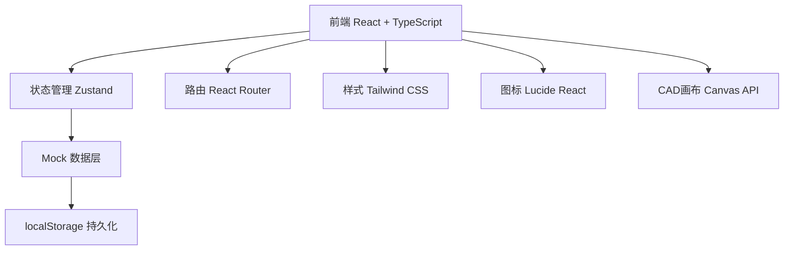
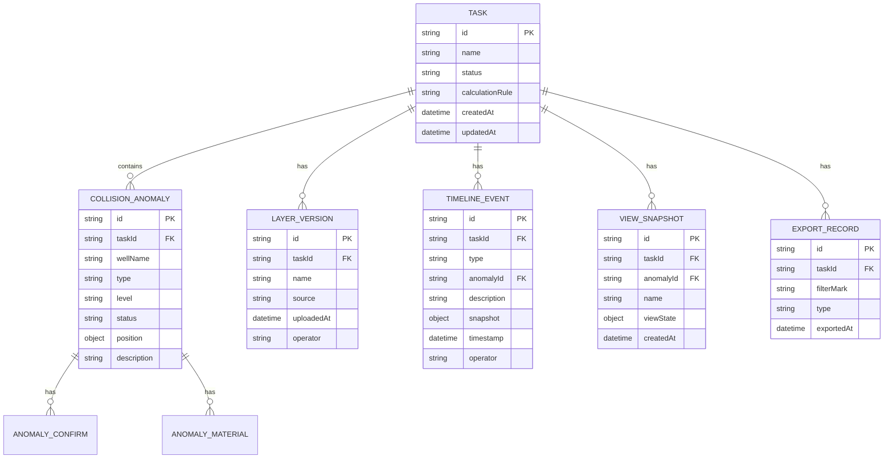

## 1. 架构设计



## 2. 技术描述
- **前端**：React@18 + TypeScript + Tailwind CSS@3 + Vite
- **初始化工具**：vite-init（react-ts 模板）
- **后端**：无后端，使用 Mock 数据 + localStorage 模拟持久化
- **状态管理**：Zustand
- **路由**：React Router DOM
- **图标**：Lucide React

## 3. 路由定义
| 路由 | 用途 |
|-------|---------|
| / | 预审启动页（任务列表、启动新任务、重跑） |
| /workbench/:taskId | 碰撞分析工作台（CAD画布、筛选、详情） |
| /workbench/:taskId/history | 历史时间线页面 |
| /workbench/:taskId/export | 导出中心 |

## 4. 数据模型

### 4.1 数据模型定义



### 4.2 类型定义

```typescript
export interface Task {
  id: string;
  name: string;
  status: 'pending' | 'running' | 'completed' | 'archived';
  calculationRule: string;
  createdAt: string;
  updatedAt: string;
}

export interface CollisionAnomaly {
  id: string;
  taskId: string;
  wellName: string;
  type: 'distance_violation' | 'overlap' | 'depth_conflict';
  level: 'high' | 'medium' | 'low';
  status: 'unconfirmed' | 'confirmed_abnormal' | 'confirmed_normal';
  position: { x: number; y: number };
  description: string;
}

export interface TimelineEvent {
  id: string;
  taskId: string;
  type: 'status_change' | 'material_upload' | 'view_saved' | 'rule_changed';
  anomalyId?: string;
  description: string;
  snapshot: Record<string, unknown>;
  timestamp: string;
  operator: string;
}

export interface ViewSnapshot {
  id: string;
  taskId: string;
  anomalyId?: string;
  name: string;
  viewState: {
    scale: number;
    offsetX: number;
    offsetY: number;
  };
  createdAt: string;
}
```

## 5. 核心目录结构

```
src/
├── components/          # 通用组件
│   ├── AppHeader.tsx
│   ├── StatusBadge.tsx
│   └── TimelineNode.tsx
├── pages/
│   ├── HomePage.tsx          # 预审启动页
│   ├── WorkbenchPage.tsx     # 碰撞分析工作台
│   ├── HistoryPage.tsx       # 历史时间线
│   └── ExportPage.tsx        # 导出中心
├── store/
│   ├── taskStore.ts          # 任务状态
│   └── workbenchStore.ts     # 工作台状态
├── data/
│   └── mockData.ts           # Mock数据
├── utils/
│   ├── canvasUtils.ts        # CAD画布工具
│   └── exportUtils.ts        # 导出工具
├── types/
│   └── index.ts              # 类型定义
├── App.tsx
├── main.tsx
└── index.css
```
