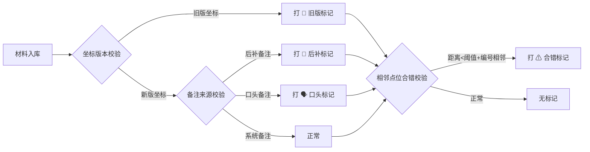

## 1. 产品概述

地下水监测井剖面讲解复核工具，面向现场调度阿宁和现场复核老师，解决二维表格缺乏空间感、数据来源混杂难追溯、视图条件刷新丢失三大痛点。

- 核心价值：让点位坐标以剖面空间形式呈现，自动标记异常材料（旧版坐标、后补备注、口头备注、相邻点位合错），筛选/备注/CSV明细联动持久化
- 目标用户：现场调度人员、复核老师

---

## 2. 核心功能

### 2.1 用户角色

| 角色 | 使用方式 | 核心需求 |
|------|---------|---------|
| 现场调度（阿宁） | 日常复核使用 | 快速定位异常、筛选条件不丢失、导出带标记 |
| 复核老师 | 现场讲解、截图留档 | 空间视图、异常先看、视图条件可保存 |

### 2.2 功能模块

1. **主页面（剖面讲解视图）**：点位剖面可视化、筛选面板、详情面板、CSV明细、备注区、操作栏
2. **异常标记系统**：四类异常（旧版坐标/后补备注/口头备注/相邻合错）贯穿筛选、详情、导出
3. **持久化状态**：筛选条件、人工备注、视图快照均存入 localStorage，刷新不丢
4. **视图快照**：保存当前视角（筛选+缩放+选中点位），命名后可一键恢复

### 2.3 页面详情

| 页面名称 | 模块名称 | 功能描述 |
|---------|---------|---------|
| 主页面 | 剖面可视化区 | SVG 绘制监测井剖面，标注点位坐标，异常点用不同色/边框标记，支持缩放平移 |
| 主页面 | 筛选面板 | 按点位编号、深度、异常类型筛选，条件实时同步到 URL hash 和 localStorage |
| 主页面 | 详情面板 | 展示选中点位的坐标（区分新旧版）、水位数据、来源标记 |
| 主页面 | 备注区 | 支持三类备注录入（系统备注/后补备注/口头备注），每条备注带时间和来源标签 |
| 主页面 | CSV 明细 | 表格展示当前筛选结果，异常行高亮，支持导出 CSV（含异常标记列） |
| 主页面 | 操作栏 | 放样例、重跑、保存视图、切换视角、导出 CSV、查看说明 |
| 主页面 | 说明弹层 | 极简三行说明：放样例→重跑→查看CSV明细 |

---

## 3. 核心流程

### 主流程：复核一份材料

1. 打开页面→自动加载上次筛选条件和视图
2. 筛选面板优先勾选「异常类型」→剖面和表格同步过滤
3. 点击异常点位→详情面板展开新旧坐标对比+备注历史
4. 补充备注→选择备注类型（后补/口头）→自动打标签
5. 保存当前视图（命名）→后续截图可一键恢复视角
6. 导出 CSV→异常标记列自动写入

### 异常材料识别流程

---

## 4. 用户界面设计

### 4.1 设计风格

- **主色**：深青 `#0F4C5C`（专业地质感）
- **强调色**：琥珀橙 `#E36414`（异常标记）、锈红 `#9A031E`（严重异常）、苔绿 `#5F8D4E`（正常）
- **中性色**：石灰白 `#FBF7F4` 背景、炭灰 `#2D2D2D` 文字
- **按钮风格**：圆角 sm、hover 上移 1px + 阴影、active 下压
- **字体**：标题用 "Noto Serif SC"（宋体衬线，严谨感），正文用 "Noto Sans SC"
- **布局**：三栏式（左筛选、中剖面、右详情+备注+CSV），顶栏操作区
- **图标**：Lucide 线性图标，异常标记加 emoji 增强辨识度（📜旧版 📝后补 🗣口头 ⚠合错）

### 4.2 页面设计概览

| 页面 | 模块 | UI 元素 |
|-----|-----|---------|
| 主页面 | 顶部操作栏 | 左：标题"地下水监测井剖面讲解"；中：放样例/重跑按钮；右：保存视图下拉、说明、导出CSV |
| 主页面 | 左侧筛选面板 | 卡片式，异常类型筛选置顶，带计数气泡 |
| 主页面 | 中间剖面区 | SVG 画布，井壁为深灰竖线，点位为圆点，异常点描边加粗+emoji 标注 |
| 主页面 | 右侧面板 | Tab 切换：详情 / 备注 / CSV明细，各 tab 内内容独立滚动 |
| 主页面 | 说明弹层 | 半透明遮罩，中央卡片三行大字+示例按钮 |

### 4.3 响应式

- Desktop-first（≥1280px 三栏并排）
- ≤1024px：左右面板改为抽屉式，剖面区全宽
- ≤768px：Tab 改为底部导航

### 4.4 动效

- 剖面点位加载：从下往上逐个淡入（stagger 50ms）
- 异常点位：缓慢呼吸式缩放（pulse 2s infinite）
- 筛选切换：剖面区整体淡入淡出（300ms）
- 保存视图：顶部出现 toast 提示，1.5s 后消失
