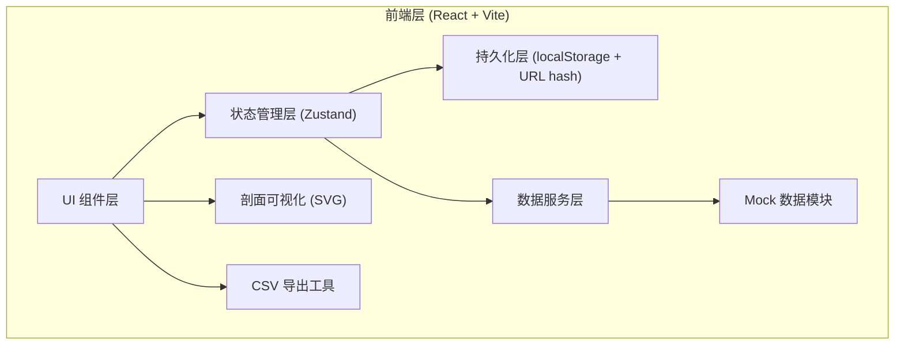
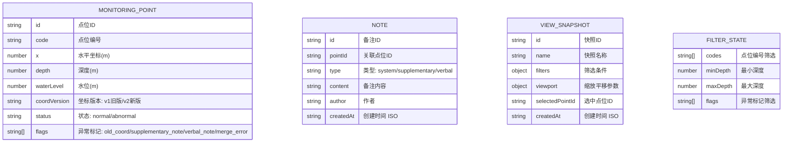

## 1. 架构设计

---

## 2. 技术描述

- **前端**：React@18 + TypeScript + Vite
- **样式**：TailwindCSS@3
- **状态管理**：Zustand（含 persist 中间件做 localStorage 持久化）
- **图标**：lucide-react
- **后端**：无（纯前端，所有数据内置 Mock，备注/视图快照存 localStorage）
- **初始化工具**：vite-init

---

## 3. 路由定义

| Route | 用途 |
|-------|------|
| `/` | 主页面（剖面讲解视图，唯一页面） |

说明：单页应用，筛选条件通过 URL hash 同步，刷新后自动恢复。

---

## 4. 数据模型

### 4.1 类型定义

### 4.2 Mock 数据规范

- 内置 15 个监测点位，分布在 0-50m 深度
- 其中 5 个点位带异常标记：2 个旧版坐标、1 个后补备注、1 个口头备注、1 个相邻合错
- 每个点位至少 1 条系统备注，异常点位额外加对应类型备注

---

## 5. 模块划分

| 目录 | 职责 |
|-----|-----|
| `src/pages/MainPage.tsx` | 主页面，三栏布局容器 |
| `src/components/TopBar.tsx` | 顶部操作栏 |
| `src/components/FilterPanel.tsx` | 左侧筛选面板 |
| `src/components/ProfileView.tsx` | 中间剖面 SVG 可视化 |
| `src/components/DetailPanel.tsx` | 右侧 Tab：详情/备注/CSV |
| `src/components/PointDetail.tsx` | 点位详情子组件 |
| `src/components/NoteList.tsx` | 备注列表+录入子组件 |
| `src/components/CsvTable.tsx` | CSV 明细表+导出子组件 |
| `src/components/HelpModal.tsx` | 说明弹层 |
| `src/components/ViewSnapshotMenu.tsx` | 视图快照保存/恢复下拉 |
| `src/store/useAppStore.ts` | Zustand 全局状态（筛选/选中/备注/快照） |
| `src/data/mockPoints.ts` | Mock 点位数据 |
| `src/utils/csv.ts` | CSV 生成/导出工具 |
| `src/utils/flagDetector.ts` | 异常标记检测逻辑 |
| `src/types/index.ts` | TypeScript 类型定义 |

---

## 6. 核心实现要点

### 6.1 持久化方案
- Zustand `persist` 中间件将 `filterState`、`notes`、`viewSnapshots` 存入 localStorage，key 为 `gw-profile-state-v1`
- 筛选条件变化时同步写入 `window.location.hash`（base64 编码），方便链接分享

### 6.2 剖面可视化
- 纯 SVG 实现，不引入第三方图表库
- 纵向深度轴（上浅下深），横向按 x 坐标排布
- 点位 `<circle>` + hover 放大 + click 选中
- 异常点位附加 `<text>` emoji 标注 + stroke 加粗 + CSS `animate-pulse`

### 6.3 CSV 导出
- 前端生成 CSV 文本，BOM 头确保 Excel 中文不乱码
- 导出列包含：点位编号、X坐标、深度、水位、坐标版本、异常标记、备注摘要
- 异常标记列用 `|` 连接多个 flag

### 6.4 异常检测
- `flagDetector.ts` 封装：坐标版本判断、备注类型判断、相邻点位距离计算
- 相邻合错判定：编号连续且 x 坐标差 < 阈值（默认 2m）
