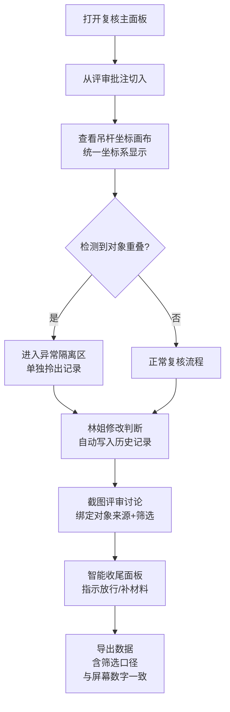

## 1. 产品概述

剧院吊杆阵列空间复核系统，服务于舞台机械设备安装验收场景。解决教学老师林姐复核时坐标混乱、批注散落、重叠对象混入正常结果等痛点，同时满足项目经理对异常数据隔离的要求，以及多班次评审时的历史追溯需求。

## 2. 核心功能

### 2.1 用户角色

| 角色 | 核心权限 |
|------|----------|
| 教学老师（林姐） | 复核批注、修改判断、查看历史、导出数据、标记材料状态 |
| 项目经理 | 查看复核结果、关注重叠对象异常、筛选口径追踪 |

### 2.2 功能模块

1. **复核主面板**：评审批注列表、吊杆坐标可视化、筛选条件与实时结果
2. **异常隔离区**：对象重叠记录单独展示，不混入正常结果
3. **历史追溯**：林姐修改判断的完整时间线与前后对比
4. **截图回溯**：从评审截图定位到对象来源与当时筛选条件
5. **智能收尾面板**：指示哪条材料该补、哪条可放行（非技术说明）
6. **导出功能**：导出数据与屏幕数字一致，筛选口径随接口返回

### 2.3 页面详情

| 页面名称 | 模块名称 | 功能描述 |
|----------|----------|----------|
| 复核主面板 | 评审批注侧栏 | 从批注切入复核，支持按批注状态筛选，含一条晚到附件测试记录 |
| 复核主面板 | 吊杆坐标画布 | X/Y/Z 三维坐标可视化，坐标系统一显示，悬停高亮对应批注 |
| 复核主面板 | 筛选条件栏 | 筛选条件实时生效，条件值出现在接口返回结构中 |
| 异常隔离区 | 重叠对象列表 | 独立卡片展示空间重叠的吊杆对，标注重叠量与风险等级 |
| 历史追溯面板 | 修改时间线 | 林姐每次修改的操作人、时间、前后值对比、修改原因 |
| 截图回溯模块 | 截图定位 | 点击截图热区跳转至对应吊杆对象并恢复当时筛选条件 |
| 智能收尾面板 | 放行指示 | 以自然语言列出：可放行清单 / 需补材料清单 / 待定项 |
| 导出功能 | 数据导出 | 导出 CSV/JSON，包含筛选口径字段，数字与屏幕显示完全一致 |

## 3. 核心流程

林姐打开系统 → 从评审批注侧栏选取待复核项 → 查看吊杆坐标画布，确认坐标系一致 → 发现重叠对象自动进入异常隔离区 → 林姐修改判断（自动记录历史） → 截取当前画面（自动绑定筛选条件与对象） → 复核完成后查看智能收尾面板（哪些放行、哪些补材料） → 导出含筛选口径的复核结果

## 4. 用户界面设计

### 4.1 设计风格

- 主色调：深青蓝 `#0F3B4A`（工业专业感），搭配琥珀橙 `#D97706` 高亮异常
- 辅助色：浅灰蓝 `#E0F2FE` 画布底，森林绿 `#059669` 标记放行，红橙 `#DC2626` 标记待补
- 按钮风格：直角微倒角 4px，实心填充为主，次要操作用描边
- 字体：标题使用思源宋体增强工程文档感，正文使用思源等宽保证数字对齐
- 布局：左侧固定批注侧栏 + 中央画布 + 右侧筛选/详情，异常区以丝带标签置顶
- 图标风格：Lucide 线性图标，重叠异常用交叉双环图标强调

### 4.2 页面设计概览

| 页面名称 | 模块名称 | UI 元素 |
|----------|----------|---------|
| 复核主面板 | 批注侧栏 | 深灰底卡片、时间戳、状态徽章（待复核/已通过/需修改）、悬停联动画布 |
| 复核主面板 | 坐标画布 | 网格底、吊杆用竖线+圆点、悬停放大 tooltip 显示 XYZ、重叠区红框闪烁 |
| 复核主面板 | 筛选栏 | 顶部横条、多条件 Chip、当前条件同步显示在画布左上角水印 |
| 异常隔离区 | 重叠卡片 | 琥珀橙边框、风险标签（高/中/低）、并排显示两个吊杆坐标对比 |
| 历史追溯面板 | 时间线 | 竖线连接节点、节点显示操作人头像+时间、展开显示前后对比 Diff |
| 智能收尾面板 | 放行指示 | 三色分组卡片：绿=放行、橙=补材料、灰=待定，每条用自然语言说明 |

### 4.3 响应式

桌面优先设计，最小宽度 1280px。侧栏可折叠，画布自适应剩余空间。
