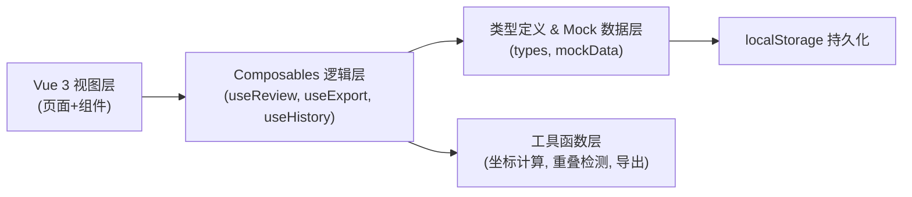
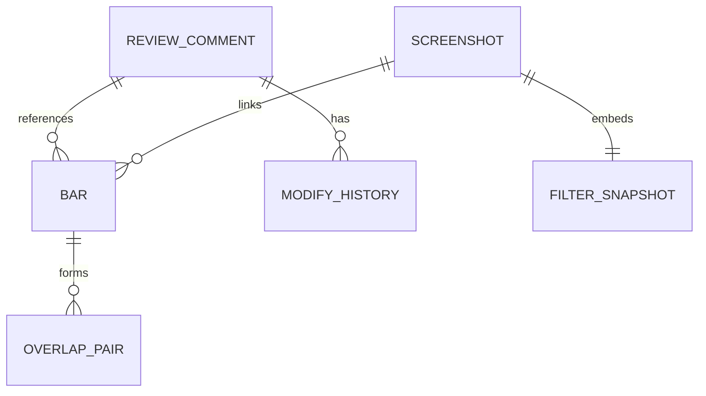

## 1. 架构设计



## 2. 技术描述

- **前端框架**：Vue 3.4 + TypeScript + Vite 5
- **路由**：Vue Router 4（单页应用，主视图 + 详情抽屉）
- **样式方案**：Tailwind CSS 3.4，CSS 变量定义主题色
- **状态管理**：Vue Composition API + reactive/ref，跨组件共享用 Pinia 轻量 store
- **数据持久化**：localStorage，封装 `useStorage` composable
- **图标**：lucide-vue-next
- **导出**：前端原生 Blob 导出 CSV/JSON，无需后端

## 3. 路由定义

| 路由 | 用途 |
|------|------|
| `/` | 复核主面板（默认路由，集成所有功能模块） |

## 4. 数据模型

### 4.1 实体关系



### 4.2 核心类型定义

```typescript
// 吊杆对象
interface Bar {
  id: string
  name: string
  x: number
  y: number
  z: number
  length: number
  status: 'pending' | 'passed' | 'need-fix' | 'overlap'
  commentIds: string[]
  coordinateSystem: 'stage-local'  // 统一坐标系标识
}

// 评审批注
interface ReviewComment {
  id: string
  barId: string
  author: string
  content: string
  status: '待复核' | '已通过' | '需修改'
  createdAt: number
  hasLateAttachment: boolean  // 晚到附件标识
  attachmentName?: string
}

// 重叠对象对
interface OverlapPair {
  id: string
  barIdA: string
  barIdB: string
  overlapDistance: number  // 重叠量（mm）
  riskLevel: '高' | '中' | '低'
  detectedAt: number
}

// 修改历史
interface ModifyHistory {
  id: string
  commentId: string
  barId: string
  operator: string
  modifiedAt: number
  beforeValue: string
  afterValue: string
  reason: string
  field: 'status' | 'coordinate' | 'comment'
}

// 截图记录
interface ScreenshotRecord {
  id: string
  imageUrl: string
  capturedAt: number
  filterSnapshot: FilterCriteria
  linkedBarIds: string[]
  hotspotAreas: Hotspot[]
}

interface Hotspot {
  barId: string
  x: number  // 热区相对坐标 0-1
  y: number
  width: number
  height: number
}

// 筛选条件（需保留在接口返回中）
interface FilterCriteria {
  status?: string[]
  zone?: string
  keyword?: string
  riskLevel?: string[]
  appliedAt: number
}

// 导出响应结构
interface ExportResponse {
  bars: Bar[]
  comments: ReviewComment[]
  overlapPairs: OverlapPair[]
  summary: {
    passed: number
    needFix: number
    overlap: number
    pending: number
  }
  filterCriteria: FilterCriteria  // 筛选口径保留
  exportAt: number
}

// 收尾面板项
interface FinalizationItem {
  barId: string
  barName: string
  action: 'pass' | '补材料' | '待定'
  reason: string  // 自然语言说明，非技术术语
}
```

## 5. 模块目录结构

```
src/
├── types/
│   └── index.ts              # 所有类型定义
├── mock/
│   └── data.ts               # Mock 数据（含晚到附件、重叠对）
├── composables/
│   ├── useReview.ts          # 复核主逻辑
│   ├── useOverlap.ts         # 重叠检测
│   ├── useHistory.ts         # 修改历史
│   ├── useScreenshot.ts      # 截图回溯
│   ├── useExport.ts          # 导出（含筛选口径）
│   └── useStorage.ts         # localStorage 封装
├── utils/
│   ├── coordinate.ts         # 坐标计算
│   └── finalize.ts           # 收尾决策
├── components/
│   ├── CommentSidebar.vue    # 批注侧栏
│   ├── BarCanvas.vue         # 吊杆坐标画布
│   ├── FilterBar.vue         # 筛选栏
│   ├── OverlapIsolation.vue  # 异常隔离区
│   ├── HistoryTimeline.vue   # 历史时间线
│   ├── ScreenshotGallery.vue # 截图回溯
│   ├── FinalizationPanel.vue # 智能收尾面板
│   └── ExportDialog.vue      # 导出对话框
├── pages/
│   └── ReviewPanel.vue       # 复核主面板
├── App.vue
├── main.ts
└── router/
    └── index.ts
```
