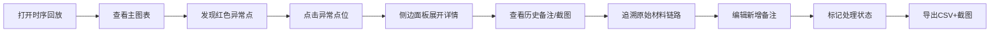
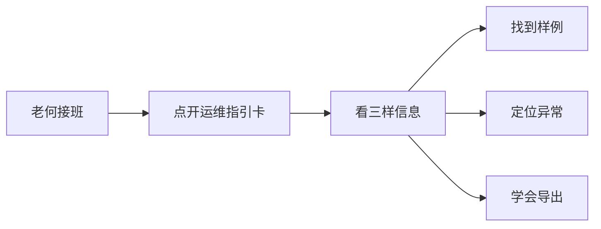
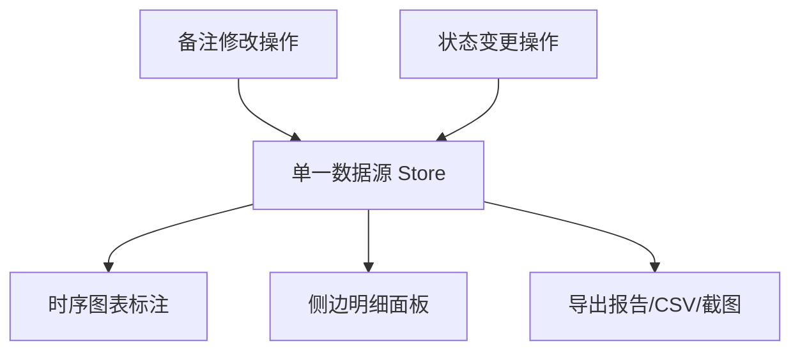

# 剧院吊杆阵列时序回放 - 产品需求文档

## 1. 产品概述

剧院吊杆阵列时序回放系统是面向剧院运维与算法值班人员的专业数据可视化工具，用于回放吊杆阵列的运行时序数据，快速定位异常点，追溯历史版本，并隔离单位混写等问题数据。系统核心价值在于让异常"看得见、追得到、分得清"，大幅降低运维排查成本。

- **目标用户**：算法值班人（深度使用者）、运维工程师老何（快速接班使用者）
- **核心问题**：异常对象藏在海量模型数据中难以发现，历史备注丢失，单位混写污染正常结果
- **产品价值**：异常一键追溯、历史全程留痕、脏数据自动隔离、数据三端一致

## 2. 核心功能

### 2.1 用户角色

| 角色 | 使用场景 | 核心诉求 |
|------|----------|----------|
| 算法值班人 | 周一早会前查看时序回放，追异常明细 | 图表直观、异常可点、历史可查、数据一致 |
| 运维工程师老何 | 接班时快速了解状态 | 三样：样例在哪、异常在哪、怎么导出 |

### 2.2 功能模块

1. **时序回放入口页**：吊杆阵列时序图表、异常点高亮、视角切换、筛选控制
2. **侧边明细面板**：点位详情、当前备注、历史版本列表、材料追溯入口
3. **单位混写隔离区**：独立展示楼层单位混写的记录，不混入正常结果
4. **导出中心**：CSV 明细导出、截图导出、报告生成（三数据同源）
5. **运维指引卡**：极简接班指引，三样信息一目了然

### 2.3 页面详情

| 页面名称 | 模块名称 | 功能描述 |
|----------|----------|----------|
| 时序回放入口页 | 顶部工具栏 | 视角切换（全部/异常/正常）、筛选条件（吊杆编号、时间范围）、导出按钮、运维指引入口 |
| 时序回放入口页 | 主时序图表 | ECharts 折线图展示多吊杆时序数据，异常点红色高亮可点击，支持缩放拖拽 |
| 时序回放入口页 | 异常统计条 | 异常总数、单位混写数、待处理数，点击可快速筛选 |
| 时序回放入口页 | 单位混写隔离区 | 独立卡片区域，列出所有楼层单位混写的记录，带"迁移到正常"操作 |
| 侧边明细面板 | 点位基本信息 | 吊杆编号、时间戳、数值、单位、楼层、是否异常 |
| 侧边明细面板 | 备注编辑区 | 当前备注编辑，保存后自动生成历史版本 |
| 侧边明细面板 | 历史版本时间线 | 备注修改历史、旧截图缩略图，可点击查看对比 |
| 侧边明细面板 | 材料追溯链 | 从异常点一路回连到原始材料数据的链路展示 |
| 导出中心 | CSV 导出 | 导出当前筛选结果的完整明细，含历史备注 |
| 导出中心 | 截图导出 | 导出当前图表视图的高清截图，标注自动附带 |
| 导出中心 | 报告生成 | 基于同一数据源生成简要报告，与图表、明细一致 |
| 运维指引卡 | 三样指引 | 样例位置、异常位置、导出方式，三行说完 |

## 3. 核心流程

### 3.1 算法值班人排查流程

算法值班人打开系统 → 查看时序图表发现红色异常点 → 点击异常点 → 侧边面板显示详情 → 查看备注历史和旧截图 → 追溯材料链路 → 编辑备注→ 确认/标记处理 → 导出CSV和截图作为早会材料

### 3.2 运维接班流程

老何接班 → 点开运维指引卡 → 看三样（样例位置、异常位置、导出方式）→ 快速上手

### 3.3 数据一致性保障

所有展示层（图表标注、侧边明细、导出报告）均从同一状态数据源读取，修改备注后统一更新，确保三套说法完全一致。

## 4. 用户界面设计

### 4.1 设计风格

**工业科技风 + 专业数据可视化**

- **主色调**：深空蓝灰背景（#0a0e17）+ 科技蓝主色（#00d4ff）+ 警戒红异常色（#ff4757）
- **辅色**：成功绿（#2ed573）、警告黄（#ffa502）、信息紫（#a55eea）
- **字体**：JetBrains Mono 等宽字体用于数据展示，Inter 用于界面文字
- **卡片风格**：半透明玻璃拟态 + 细微边框发光
- **图表风格**：暗色主题 ECharts，线条细腻，异常点脉冲动画
- **动效**：数据加载流式动画、异常点呼吸光效、面板滑入过渡

### 4.2 页面设计概述

| 页面/模块 | 设计要点 |
|-----------|----------|
| 整体布局 | 左侧主图表区（70%）+ 右侧明细面板（30%），顶部工具栏，底部状态栏 |
| 主时序图表 | 多折线叠加，异常点红色脉冲标记，hover 显示详情，点击选中高亮 |
| 侧边明细面板 | 从上到下：点位标题 → 基本信息网格 → 备注编辑 → 历史时间线 → 材料追溯链 |
| 单位混写隔离区 | 黄色警告边框的独立区域，列表展示混写记录，带"去混写"操作按钮 |
| 运维指引卡 | 悬浮卡片，深色背景+霓虹边框，三行大字+图标，极简清晰 |
| 历史版本时间线 | 垂直时间线，每个节点有备注摘要、时间、操作人，旧截图缩略图 |

### 4.3 响应式

- 桌面端为主要设计目标（1280px 以上）
- 平板端：侧面板变为底部抽屉
- 移动端：简化展示，只保留核心图表和异常列表
- 触控优化：异常点点击区域扩大，手势缩放支持

### 4.4 视觉细节

- 背景使用深色渐变 + 细微网格纹理，营造专业监控氛围
- 数据数字使用等宽字体，确保对齐易读
- 异常点有呼吸式发光动画，视觉优先级最高
- 历史时间线节点 hover 时轻微放大 + 光晕效果
- 玻璃拟态卡片背景使用 backdrop-filter 实现毛玻璃效果
- 顶部工具栏有 subtle 的底部边框发光，增强科技感
